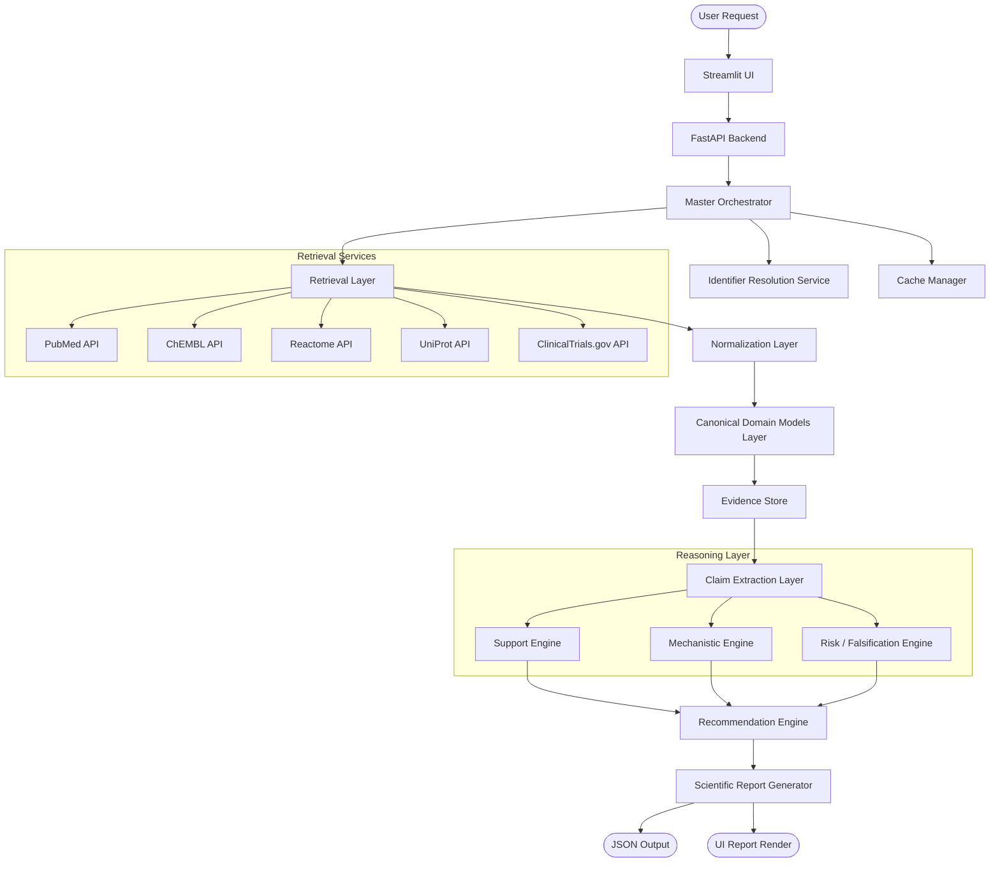
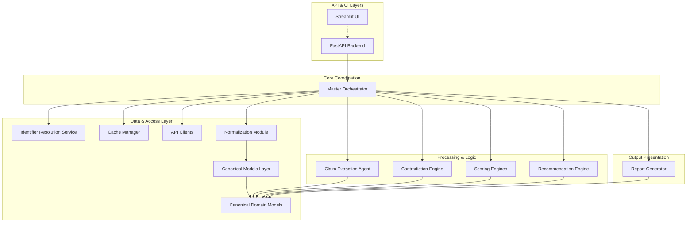
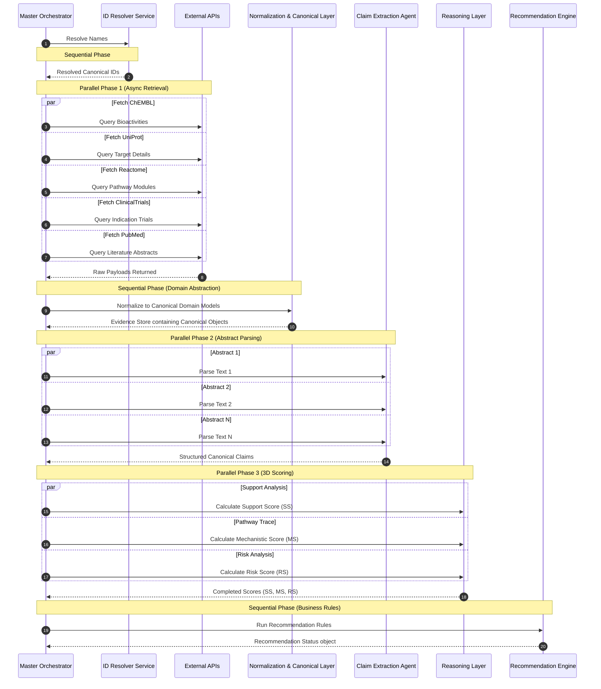

# CYNTHERA: System Architecture Blueprint
## Reference Identifier: 01_SYSTEM_ARCHITECTURE.md

---

## 1. Architecture Philosophy

The architectural design of CYNTHERA is guided by strict software engineering principles optimized for biomedical reasoning and scientific integrity.

```
┌────────────────────────────────────────────────────────────────────────┐
│                        ARCHITECTURAL PILLARS                           │
├───────────────────┬───────────────────┬────────────────────────────────┤
│    Separation     │   Determinism &   │      Explainability &          │
│    of Concerns    │  Reproducibility  │         Traceability           │
└───────────────────┴───────────────────┴────────────────────────────────┘
```

*   **Separation of Concerns (SoC)**: The system separates data retrieval, identifier resolution, data normalization, claim extraction, reasoning, scoring, recommendation decision-making, and report formatting. Each is isolated into its own layer with clear, unidirectional data contracts.
*   **Deterministic Reasoning Over Stochastic Inference**: Large Language Models (LLMs) are notorious for stochastic, non-reproducible outputs. CYNTHERA confines LLM usage strictly to the extraction of claims and stances from unstructured text. Once qualitative claims are extracted, all scoring, target-path tracing, contradiction detection, and recommendation rules are handled by deterministic, mathematical formulas and rule engines.
*   **Explainability-First (Provenance-Aware Design)**: Every entity, node, relation, or value in the system maintains a metadata object containing its exact provenance. A confidence value or recommendation cannot exist in isolation; it is programmatically bound to its source publications, databases, and associated experimental evidence weights.
*   **Unidirectional and Stateless Event Flow**: Requests travel in a clean, unidirectional pathway from input validation through identifier resolution, retrieval, normalization to canonical objects, claim extraction, scoring, recommendation, and report generation. The core logic contains no global state, ensuring that identical inputs and external data snapshots guarantee identical output reports.
*   **Single Responsibility Principle (SRP)**: Each agent and engine in the system owns one discrete biological or analytical responsibility. No agent is allowed to execute tasks outside its explicit domain.
*   **Loose Coupling and Strong Typing**: Interfaces between components are defined using strict, static schemas. Data validation is enforced at the boundary of every layer, preventing malformed external database responses from polluting downstream reasoning algorithms.
*   **Canonical Data Abstraction**: The reasoning, scoring, and recommendation layers have zero awareness of external API formats. Downstream code operates exclusively on canonical domain models, decoupling the core scientific logic from external API schema drift.

---

## 2. High-Level Architecture

The system is organized into a modular layered architecture. The diagram below illustrates the path of a request and the interactions between layers:



### Architectural Component Overview
*   **Streamlit UI**: A responsive, web-based presentation layer displaying target-disease query interfaces, interactive pathway visualizations, and audit reports.
*   **FastAPI Backend**: The service gateway, providing input sanitization, rate-limiting, and async request routing.
*   **Master Orchestrator**: The core workflow manager. It coordinates the initialization of agents, manages the parallel retrieval pipeline, handles timeouts, and passes structured canonical data between layers.
*   **Identifier Resolution Service**: Resolves drug and disease name strings into standardized cross-referenced IDs (ChEMBL, PubChem, DrugBank, MeSH, UniProt) *before* any database client is called, ensuring all downstream agents operate on standardized keys.
*   **Cache Manager**: A key-value persistence store that caches raw external API responses and normalized evidence to bypass external network calls for identical queries.
*   **Retrieval Layer**: A series of specialized HTTP clients that query public biological databases using async connections.
*   **Normalization Layer**: A parser that maps raw, heterogeneous JSON payloads from external sources into a unified, type-safe format.
*   **Canonical Domain Models Layer**: Transforms normalized data structures into standardized domain entities (`Drug`, `Disease`, `Target`, `Protein`, `Pathway`, `Evidence`, `Claim`, and `ClinicalTrial`), hiding API-specific formats from downstream algorithms.
*   **Evidence Store**: An in-memory data collection that holds active canonical entities for the duration of a single execution cycle.
*   **Claim Extraction Layer**: An agent-based parser that uses language models to process unstructured literature abstracts into structured subject-predicate-object claims.
*   **Support Engine**: Evaluates the quantity and quality of evidence confirming the drug's therapeutic relevance, yielding the Support Score (SS).
*   **Mechanistic Engine**: Traces biological pathways in Reactome to calculate the Mechanistic Score (MS).
*   **Risk & Falsification Engine**: Searches for clinical trials with failed or terminated outcomes, compensatory biological feedback loops, and directionally contradictory assertions to yield the Risk Score (RS).
*   **Recommendation Engine**: A deterministic rule processor representing core business logic that evaluates the three-dimensional scores (SS, MS, RS) to determine the recommendation status.
*   **Scientific Report Generator**: Compiles scores, evidence logs, recommendation decisions, and contradiction trees into structured presentation formats (JSON and Markdown).

---

## 3. Layered Architecture Reference

This section details the operational requirements, boundaries, and failure behaviors of each architectural layer.

```
┌────────────────────────────────────────────────────────┐
│                   PRESENTATION LAYER                   │
├────────────────────────────────────────────────────────┤
│                      API LAYER                         │
├────────────────────────────────────────────────────────┤
│                  ORCHESTRATION LAYER                   │
├────────────────────────────────────────────────────────┤
│             IDENTIFIER RESOLUTION SERVICE              │
├────────────────────────────────────────────────────────┤
│                   RETRIEVAL LAYER                      │
├────────────────────────────────────────────────────────┤
│            CANONICAL DOMAIN MODELS LAYER               │
├────────────────────────────────────────────────────────┤
│                   KNOWLEDGE LAYER                      │
├────────────────────────────────────────────────────────┤
│                   REASONING LAYER                      │
├────────────────────────────────────────────────────────┤
│                RECOMMENDATION LAYER                    │
├────────────────────────────────────────────────────────┤
│                   REPORTING LAYER                      │
└────────────────────────────────────────────────────────┘
```

### 3.1 Presentation Layer
*   **Purpose**: Render inputs and visually display the audit reports and pathway structures.
*   **Responsibilities**:
    *   Accept text inputs for drugs and diseases.
    *   Render hierarchical tables displaying supporting and contradicting claims.
    *   Display structural details of traced biological pathways.
    *   Format recommendations using clean visual cues (color-coded status widgets).
*   **Inputs**: User input strings, system state flags, and final JSON/Markdown presentation objects.
*   **Outputs**: Sanitized query parameters passed to the API layer.
*   **Components**: Search forms, score dashboards, contradiction list panels, and interactive tree displays.
*   **Failure Cases**: If backend services time out, the UI must show a friendly error card with retry instructions rather than hanging or displaying raw stack traces.

### 3.2 API Layer
*   **Purpose**: Provide an entry point for requests and govern system access.
*   **Responsibilities**:
    *   Sanitize and validate input parameters (checking for SQL characters, extreme string lengths, or invalid query formats).
    *   Route requests to the Master Orchestrator.
    *   Provide status updates for long-running queries.
    *   Enforce rate-limiting constraints per user session or IP.
*   **Inputs**: HTTP requests (JSON parameters containing drug and disease strings).
*   **Outputs**: Standardized JSON response payloads or HTTP error codes.
*   **Failure Cases**: Return `422 Unprocessable Entity` for validation errors, and `504 Gateway Timeout` if orchestrator execution exceeds system limits.

### 3.3 Orchestration Layer
*   **Purpose**: Coordinate the sequential and parallel execution of retrieval, reasoning, and report generation.
*   **Responsibilities**:
    *   Manage task lifecycle, initiating async workers for data fetching.
    *   Allocate system execution limits (timeouts) to each query step.
    *   Recover gracefully from single-connector failures.
    *   Provide runtime logging and telemetry metrics.
*   **Inputs**: Raw drug and disease query strings.
*   **Outputs**: Compiled canonical objects and final score packages handed to the recommendation engine.
*   **Components**: Master Orchestrator, Async Worker Pool, and Error Recovery Handler.
*   **Failure Cases**: If a core step fails (such as identifier resolution), the Orchestrator stops the execution pipeline and returns a structured failure state.

### 3.4 Identifier Resolution Service
*   **Purpose**: Map ambiguous input terms into a standardized set of database keys.
*   **Responsibilities**:
    *   Query cross-reference mapping tables to translate a drug name to ChEMBL ID, PubChem CID, and DrugBank ID.
    *   Translate disease strings to MeSH IDs and UMLS concept identifiers.
    *   Establish canonical representations of the subject drug and disease.
*   **Inputs**: Raw query strings (e.g., "Aspirin", "Alzheimer's").
*   **Outputs**: Canonical IDs mapped across standard target taxonomies.
*   **Failure Cases**: If a name cannot be mapped, return `400 Bad Request` with details about the unresolved entity.

### 3.5 Retrieval Layer
*   **Purpose**: Ingest raw biological data from external public API endpoints.
*   **Responsibilities**:
    *   Query UniProt, ChEMBL, PubMed, Reactome, and ClinicalTrials.gov asynchronously using standard identifiers.
    *   Manage API rate-limit buckets and implement exponential backoff.
*   **Inputs**: Standard database identifiers (e.g., ChEMBL ID, MeSH ID).
*   **Outputs**: Raw JSON payloads from target APIs.
*   **Components**: Client Connectors (PubMed Client, ChEMBL Client, etc.), Cache Interface, and Rate Limiter.
*   **Failure Cases**: In the event of network timeouts, retry the request. If retries fail, return a structured "Source Unavailable" error payload.

### 3.6 Canonical Domain Models Layer
*   **Purpose**: Strip API-specific JSON formats and translate raw payloads into a clean, core system domain representation.
*   **Responsibilities**:
    *   Extract fields from disparate API structures (e.g., mapping ChEMBL binding values and UniProt assays to a single `Evidence` model).
    *   Validate all fields against strict canonical constraints.
*   **Inputs**: Raw JSON payloads from Retrieval Layer.
*   **Outputs**: Strongly typed canonical instances (`Drug`, `Disease`, `Target`, `Protein`, `Pathway`, `Evidence`, `ClinicalTrial`).
*   **Failure Cases**: Discard records containing malformed data and raise parsing errors if mandatory canonical properties (such as target identifier or citation link) are missing.

### 3.7 Knowledge Layer
*   **Purpose**: Build the relational structure of claims and evidence records for the query.
*   **Responsibilities**:
    *   Maintain the active `EvidenceStore`.
    *   Extract structured subject-predicate-object claims from literature text via the Claim Extraction Agent.
    *   Establish connection relationships between canonical domain objects.
*   **Inputs**: Normalized canonical objects.
*   **Outputs**: Relational collection of annotated claims, evidence records, and mapped pathways.
*   **Components**: Evidence Store and Claim Extraction Agent.

### 3.8 Reasoning Layer
*   **Purpose**: Evaluate the hypothesis across three independent dimensions: Support, Mechanism, and Risk.
*   **Responsibilities**:
    *   Calculate **Support Score (SS)** based on literature and assay evidence weights.
    *   Trace pathways in Reactome to calculate the **Mechanistic Score (MS)**.
    *   Detect directional conflicts and failed clinical trials to calculate the **Risk Score (RS)**.
*   **Inputs**: Collection of canonical Evidence, Claim, and ClinicalTrial objects.
*   **Outputs**: Three separate scores (SS, MS, RS) and a list of identified contradictions.
*   **Components**: Support Calculation Engine, Mechanistic Pathway Tracer, Risk / Falsification Engine.
*   **Failure Cases**: If data is insufficient to compute a specific dimension, set its score to `0` and append a warning to the audit trace explaining the data sparsity.

### 3.9 Recommendation Layer
*   **Purpose**: Execute the business logic rules to determine the therapeutic indication status.
*   **Responsibilities**:
    *   Apply threshold logic and logical vetoes over the (SS, MS, RS) tuple.
    *   Generate a structured recommendation decision (`Promising`, `Uncertain`, `Not Recommended`) with clear scientific reasons.
*   **Inputs**: Support Score (SS), Mechanistic Score (MS), Risk Score (RS), and identified contradictions.
*   **Outputs**: Standardized recommendation objects.
*   **Components**: Rule engine, threshold check validators.

### 3.10 Reporting Layer (Presentation Compilation)
*   **Purpose**: Transform recommendation states and evidence stores into presentation artifacts.
*   **Responsibilities**:
    *   Compile the final JSON audit report.
    *   Format human-readable markdown summaries.
*   **Inputs**: Mapped pathways, contradictions, recommendation objects, and original references.
*   **Outputs**: Structured JSON and Markdown presentation reports.
*   **Components**: Markdown Compiler and JSON Serializer.

---

## 4. Component Responsibilities

To prevent tight coupling and maintain a clean separation of concerns, the boundaries of each system component are strictly defined below:

| Component | Primary Domain Ownership | Strictly Forbidden Operations |
| :--- | :--- | :--- |
| **Retrieval clients** | Initiating HTTP connections to external APIs, handling network retries, and returning raw payloads. | Performing entity normalization, resolving identifiers, or executing reasoning logic. |
| **Identifier Resolver** | Mapping text inputs to standardized database keys. | Executing literature search queries or building causal pathway chains. |
| **Cache Manager** | Reading and writing keys to short-term or long-term data caches. | Making structural decisions, scoring hypotheses, or modifying records. |
| **Normalization Module**| Transforming raw JSON payloads into structured, schema-validated models. | Interacting with external networks, calling LLM services, or generating reasoning flags. |
| **Canonical Models Layer**| Initializing standardized domain entities (Drug, Target, Pathway, etc.). | Making database queries, calculating scores, or interfacing with presentation templates. |
| **Claim Extractor** | Extracting semantic triplets (subject, predicate, object) and stances from text. | Assigning final reliability scores, resolving contradictions, or determining clinical viability. |
| **Support Engine** | Summing weighted evidence objects to determine the baseline scientific support. | Executing API calls, tracing pathway networks, or formatting report templates. |
| **Mechanistic Engine** | Navigating Reactome pathway networks to evaluate physical link plausibility between drug targets and disease pathways. | Assessing clinical trial failures or running recommendation business rules. |
| **Risk & Falsification Engine** | Mining clinical trial states and identifying feedback loops and contradictory directions. | Calculating positive support metrics or formatting audit files. |
| **Recommendation Engine** | Running deterministic rules over (SS, MS, RS) to determine final recommendation status. | Performing LLM inference, calling APIs, formatting Markdown, or altering scores. |
| **Report Generator** | Transforming data structures into formatted Markdown, JSON, and visual interactive structures. | Changing scores, verifying claims, or performing scientific reasoning. |

---

## 5. End-to-End Data Flow

The lifecycle of a single hypothesis evaluation request is mapped out below:

```text
User Input Query (Drug: D, Disease: T)
  │
  ▼
Validation (FastAPI Router validates string shapes & constraints)
  │
  ▼
Identifier Resolution Service (Resolve name strings D and T to standardized ID sets)
  │
  ▼
Parallel Data Retrieval (Fetch PubMed papers, ChEMBL bioactivities, Reactome pathways, ClinTrials records via resolved IDs)
  │
  ▼
Data Normalization (Parse raw outputs into schema-validated payloads)
  │
  ▼
Canonical Domain Models Layer (Initialize Drug, Target, Pathway, Evidence, and ClinicalTrial models)
  │
  ▼
Claim Extraction (LLM parses literature abstracts into structured Claims and direction stances)
  │
  ▼
Contradiction Detection (Engine compares claims to identify opposing stances or trial outcomes)
  │
  ▼
Three-Dimensional Scoring (Simultaneously compute Support Score, Mechanistic Score, and Risk Score over canonical objects)
  │
  ▼
Recommendation Engine (Run business logic rules and vetoes over the [SS, MS, RS] tuple)
  │
  ▼
Scientific Report Generator (Format recommendation, scores, pathways, and references into JSON & MD)
```

1.  **User Input Submission**: A researcher submits a query containing a drug name and a target disease name through the web interface or CLI.
2.  **Input Sanitization & Schema Validation**: The API layer intercepts the request, sanitizes special characters, and validates parameters against input constraints.
3.  **Identifier Resolution**: The Identifier Resolution Service maps the input names to standardized database identifiers (e.g., mapping "Imatinib" to `CHEMBL941` and "Leukemia" to `D007938`).
4.  **Parallel Data Retrieval**: The Orchestrator initiates concurrent async tasks to search for evidence across all API clients, checking the Cache Manager before making network calls.
5.  **Normalization and Canonical Object Creation**: The Normalization Module parses raw response payloads. The Canonical Models layer converts them to standard domain models (`Drug`, `Disease`, `Target`, `Protein`, `Pathway`, `Evidence`, `ClinicalTrial`).
6.  **Claim Extraction and Stance Tagging**: The Claim Extractor extracts subject-predicate-object relationships from the titles and abstracts of fetched literature, tagging them with directionality (e.g., `activates`, `inhibits`, `has_no_effect`).
7.  **Contradiction Mapping**: The Contradiction Engine compares claims and bioactivities. It maps opposing assertions and stores them as active contradiction objects.
8.  **Three-Dimensional Scoring**: The scoring engines run calculations over the canonical objects:
    *   *Support Engine* computes the **Support Score (SS)** by aggregating evidence weights.
    *   *Mechanistic Engine* computes the **Mechanistic Score (MS)** by calculating pathway intersections.
    *   *Risk Engine* computes the **Risk Score (RS)** based on failed trial records, negative literature reports, and pathway feedback loops.
9.  **Recommendation Processing**: The Recommendation Engine executes rules using (SS, MS, RS) as inputs, determining the final indicator status.
10. **Report Assembly**: The Report Generator compiles metadata, pathway trees, contradiction lists, and recommendation decisions into presentation-ready JSON and Markdown reports.

---

## 6. Execution Order

This section details the explicit, sequential pipeline steps executed by the Master Orchestrator.

```
                  ┌─────────────────────────────────────┐
                  │          Step 1: Ingestion          │
                  └──────────────────┬──────────────────┘
                                     │
                  ┌──────────────────┴──────────────────┐
                  │         Step 2: ID Resolution       │
                  └──────────────────┬──────────────────┘
                                     │
                  ┌──────────────────┴──────────────────┐
                  │      Step 3: Parallel Retrieval     │
                  │   [ChEMBL, UniProt, ClinTrials...]  │
                  └──────────────────┬──────────────────┘
                                     │
                  ┌──────────────────┴──────────────────┐
                  │        Step 4: Normalization        │
                  └──────────────────┬──────────────────┘
                                     │
                  ┌──────────────────┴──────────────────┐
                  │      Step 5: Canonical Mapping      │
                  └──────────────────┬──────────────────┘
                                     │
                  ┌──────────────────┴──────────────────┐
                  │        Step 6: Claim Extraction     │
                  │        (Loop over literature)       │
                  └──────────────────┬──────────────────┘
                                     │
                  ┌──────────────────┴──────────────────┐
                  │        Step 7: Contradiction Check   │
                  └──────────────────┬──────────────────┘
                                     │
                  ┌──────────────────┴──────────────────┐
                  │      Step 8: 3D Score Computation   │
                  └──────────────────┬──────────────────┘
                                     │
                  ┌──────────────────┴──────────────────┐
                  │         Step 9: Recommendation      │
                  └──────────────────┬──────────────────┘
                                     │
                  ┌──────────────────┴──────────────────┐
                  │         Step 10: Report Formatting   │
                  └─────────────────────────────────────┘
```

*   **Step 1: Request Ingestion**: Orchestrator receives the query `(drug_query_string, disease_query_string)` from the FastAPI boundary.
*   **Step 2: Identifier Resolution**:
    *   Call Identifier Resolution Service to resolve input strings to standardized IDs.
    *   If any ID cannot be resolved, terminate and throw an entity resolution error.
*   **Step 3: Parallel Retrieval**:
    *   Initialize async fetchers for `PubMed`, `ChEMBL`, `Reactome`, `UniProt`, and `ClinicalTrials`.
    *   Execute concurrent requests using `asyncio.gather`.
    *   Collect raw response payloads into a structured memory dictionary.
*   **Step 4: Normalization**:
    *   Loop over collected payloads and validate against source Pydantic models.
*   **Step 5: Canonical Domain Mapping**:
    *   Instantiate `Drug`, `Disease`, `Target`, `Protein`, `Pathway`, `Evidence`, and `ClinicalTrial` canonical objects.
    *   Compile them into an in-memory `EvidenceStore` collection.
*   **Step 6: Claim Extraction**:
    *   Filter the `EvidenceStore` to isolate literature-level records.
    *   For each literature item, extract abstract text.
    *   Pass texts to the Claim Extraction Agent in parallel batches.
    *   Parse the structured JSON outputs into canonical `Claim` objects.
*   **Step 7: Contradiction Evaluation**:
    *   For every `Claim` object, match it against database records and other literature assertions targeting the same protein/pathway.
    *   If directionality conflict is detected, instantiate a `Contradiction` object.
*   **Step 8: Score Calculation**:
    *   Compute the **Support Score (SS)**.
    *   Compute the **Mechanistic Score (MS)**.
    *   Compute the **Risk Score (RS)**.
*   **Step 9: Recommendation Selection**:
    *   Pass the score tuple `(SS, MS, RS)` to the Recommendation Engine.
    *   Apply threshold rules and safety vetoes to determine the recommendation status.
*   **Step 10: Serialization and Presentation Compilation**:
    *   Construct the report metadata.
    *   Generate JSON output and Markdown files.
    *   Return output to the Presentation Layer.

---

## 7. Dependency Graph

The compile-time and structural dependencies of the system are defined below:



---

## 8. Parallel Execution Flow

To optimize latency, CYNTHERA parallelizes data retrieval and claim processing tasks. The execution pipeline is divided into clear parallel and sequential boundaries:



### Execution Rules
*   **Permitted Concurrent Processes**:
    *   External API queries execute concurrently using non-blocking connection sockets.
    *   Claim extraction calls to LLMs run concurrently using worker pools.
    *   The calculations for the three scores (SS, MS, RS) are mathematically independent and run in parallel.
*   **Strict Sequential Synchronizations**:
    *   *ID Resolution* must complete before any API calls are executed.
    *   *Normalization to Canonical Domain Models* must complete before claims can be extracted or reasoning begins.
    *   *Recommendation Rules* must wait until all three scoring engines have returned values.

---

## 9. Failure Strategy & Graceful Degradation

Public biological databases frequently experience downtime, scheme modifications, or rate-limiting. CYNTHERA mitigates these failures using a structured degradation hierarchy:

```
                  ┌─────────────────────────────────────┐
                  │         EXTERNAL DATABASE DIED      │
                  └──────────────────┬──────────────────┘
                                     │
           ┌─────────────────────────┴─────────────────────────┐
           ▼                                                   ▼
┌──────────────────────┐                           ┌──────────────────────┐
│  Reactome / PubMed   │                           │  UniProt / ChEMBL    │
│       Non-Core       │                           │      Core API        │
└──────────┬───────────┘                           └──────────┬───────────┘
           │                                                  │
           ▼                                                  ▼
┌──────────────────────┐                           ┌──────────────────────┐
│ Flag as Unavailable  │                           │ Raise System Error   │
│ Use Fallback Rules   │                           │ Log Trace & Halt     │
└──────────────────────┘                           └──────────────────────┘
```

### 9.1 Reactome API Failure (Non-Core Data Source)
*   *Behavior*: If Reactome is down, the system cannot map pathways.
*   *Degradation*:
    *   The system flags pathway data as `Unavailable` in the audit logs.
    *   The **Mechanistic Score (MS)** skips the pathway overlap calculation, setting that specific sub-component to `0`.
    *   The final report displays a warning banner stating: *"Pathway verification could not be performed due to Reactome API downtime."*

### 9.2 PubMed / Europe PMC API Failure (Non-Core Data Source)
*   *Behavior*: Literature abstracts cannot be searched or extracted.
*   *Degradation*:
    *   The system falls back entirely to structured databases (ChEMBL and UniProt).
    *   **Support Score (SS)** calculations are limited to bioactivity database values.
    *   The report flags literature claims as `Undetermined` and adds a warning to the audit report.

### 9.3 ClinicalTrials.gov API Failure (Critical Safety Source)
*   *Behavior*: Negative clinical trials cannot be detected.
*   *Degradation*:
    *   The system cannot calculate the clinical trial component of the **Risk Score (RS)**.
    *   The Risk Score flags clinical trials as `Unverified`.
    *   **Safety Lock Constraint**: The Recommendation Engine is forbidden from outputting a `Promising` recommendation, capping the maximum status to `Uncertain` even if support and mechanistic scores are high.

### 9.4 UniProt / ChEMBL API Failure (Core Data Source)
*   *Behavior*: Primary target information or binding bioactivity data cannot be retrieved.
*   *Degradation*:
    *   Because targets are required to evaluate mechanisms, the Orchestrator halts execution, logs a critical error, and returns a `503 Service Unavailable` response to the user.

---

## 10. State Management

CYNTHERA processes evaluations in a stateless execution environment to ensure reproducibility and system safety.

*   **Stateless Operations**: The backend processes each evaluation request independently. No session details, memory context, or prior scores are stored in system state variables.
*   **Immutability of Data Structures**: Once a canonical model is instantiated, it is read-only. This prevents data pollution during downstream reasoning.
*   **Cache Management Policies**:
    *   *Raw Response Cache*: Stores external API responses using the query parameters as the key.
    *   *Cache TTL (Time-To-Live)*: Standard cache entries have a TTL of 7 days, balancing data accuracy with API load reduction.
    *   *Cache Bypassing*: The system can accept a force-refresh header to bypass the cache and fetch fresh data from public servers.

---

## 11. Logging & Observability Strategy

The system logs telemetry and execution events across all layers, routing logs to distinct logging channels:

```
[System Layer]   -->   [Logged Variable]               -->   [Observer Output]

Retrieval Layer  -->   Latencies, URL queries, Hit%   -->   Performance Dashboard
Knowledge Layer  -->   Schema violations, drops        -->   Security & Data Health
Reasoning Layer  -->   Contradictions, Score metrics   -->   Scientific Audit Logs
```

### 11.1 Log Specifications
*   **API / Retrieval Level**:
    *   Log API request execution time (latencies in milliseconds).
    *   Log HTTP status codes, retries, and network timeout triggers.
    *   Log Cache Hit/Miss events.
*   **Data Integrity Level**:
    *   Log terms or fields that fail schema validation.
    *   Log instances where LLM output formats do not match target JSON structures.
*   **Reasoning Level**:
    *   Log identifiers for detected contradictions.
    *   Log calculated values for (SS, MS, RS).
    *   Log instances where veto rules are triggered by the Recommendation Engine.

---

## 12. Configuration Strategy

To prevent hardcoded values and enable clean configuration changes, all environment variables, thresholds, and weights are governed by a central YAML configuration file:

```yaml
system:
  timeout_seconds: 30
  max_retries: 3
  backoff_factor: 1.5

caching:
  enabled: true
  ttl_seconds: 604800 # 7 Days

models:
  extraction_model: "gemini-1.5-flash"
  temperature: 0.0

scoring_weights:
  support:
    clinical_trial_weight: 1.0
    observational_study_weight: 0.75
    animal_model_weight: 0.5
    cell_line_weight: 0.3
    computational_weight: 0.15
  mechanism:
    primary_target_weight: 0.6
    pathway_overlap_weight: 0.4
  risk:
    clinical_failure_penalty: 1.0
    contradiction_penalty: 0.5
    feedback_loop_penalty: 0.8

recommendation_thresholds:
  promising:
    min_support: "MEDIUM"           # Enum level (mapped from 0.40–1.00 numeric)
    min_mechanism: "MEDIUM"         # Enum level (mapped from 0.40–1.00 numeric)
    max_risk: "LOW"                 # Enum level (mapped from 0.00–0.39 numeric)
  not_recommended:
    max_support: "LOW"              # Enum level (mapped from 0.00–0.39 numeric)
    max_mechanism: "LOW"            # Enum level (mapped from 0.00–0.39 numeric)
    min_risk: "HIGH"                # Enum level (mapped from 0.70–1.00 numeric)
```

---

## 13. Security Considerations

The system implements several security guards to protect both the application and the integrity of scientific results:

*   **API Credentials Control**: API keys for external services (NCBI, LLM providers) are injected at runtime via environment variables and are never stored in source code or configuration files.
*   **Query Input Sanitization**: User inputs are validated using Pydantic models. String length is capped at 100 characters, and inputs containing database commands or execution sequences are rejected.
*   **Structured LLM Output Assurances**: When querying LLMs for claim extraction, the system forces output validation against a defined JSON schema. Free-form text outputs are rejected, eliminating prompt injection attacks.
*   **Safe JSON Parsing**: Custom deserialization limits block complex, recursive JSON structures or payloads larger than 5MB.
*   **Rate-Limiting Safeguards**: The API layer implements token-bucket rate limiters to protect the server from automated scrape scripts.

---

## 14. Scalability Roadmap

As CYNTHERA transitions from an MVP to a high-concurrency research platform, the system architecture scales through three distinct phases:

```
MVP (Current)             Distributed (Phase 2)        Knowledge Graph (Phase 3)
┌──────────────────────┐  ┌──────────────────────┐     ┌──────────────────────┐
│  Stateless Web App   │  │  Async Worker Tasks  │     │  Local Graph Store   │
│  In-Memory Storage   │  │  Redis Cache Pool    │     │  Neo4j DB Traversal  │
│  Live API Queries    │  │  Vector DB Store     │     │  Enterprise Scale    │
└──────────────────────┘  └──────────────────────┘     └──────────────────────┘
```

*   **Phase 1: Stateless Web Application (MVP)**:
    *   Single-instance FastAPI server.
    *   In-memory data structures.
    *   Local key-value cache.
*   **Phase 2: Distributed Task Architecture**:
    *   *Message Broker*: Introduce Celery and RabbitMQ to manage long-running evaluation queries.
    *   *Distributed Caching*: Transition from local key-value cache to a shared Redis cluster.
    *   *Vector Database*: Save extracted claims to a vector database, allowing the system to query historical literature claims without re-running LLM extraction scripts.
*   **Phase 3: Local Graph Database Integration**:
    *   *Local Graph Store*: Replace live API queries with a localized Neo4j database populated with multimodal precision medicine knowledge graphs like PrimeKG or Hetionet.
    *   *High-Throughput Traversal*: Run pathway analysis directly inside the graph database using Cypher queries, reducing query latencies to milliseconds.

---

## 15. Technology Mapping

The table below defines the technology choices selected for the CYNTHERA implementation, mapping each choice to its architectural justification:

| Architectural Layer | Technology Choice | Engineering Justification |
| :--- | :--- | :--- |
| **Presentation Layer** | Streamlit | Rapid UI prototyping, native support for Python data structures, and interactive dashboard rendering. |
| **API Layer** | FastAPI | Async performance, automated OpenAPI documentation, and native Pydantic validation. |
| **Data Validation** | Pydantic | High-performance type validation, type-safe data modeling, and schema consistency. |
| **Async Operations** | Asyncio | Non-blocking execution of parallel network requests, optimizing retrieval speeds. |
| **Database (Future)** | PostgreSQL | Relational consistency for storing audit trails combined with JSONB support for unstructured payloads. |
| **ORM (Future)** | SQLAlchemy | Mature object-relational mapping with support for async query execution. |
| **Distributed Cache** | Redis | High-speed key-value cache for rate-limit management and database payload caching. |
| **Task Queue** | Celery + RabbitMQ | Decoupling long-running evaluation tasks from user request threads. |
| **Text Extraction** | Gemini / OpenAI APIs | Stance detection and structured claim extraction from unstructured text. |
| **Testing Suite** | Pytest | Native support for unit tests, parameterization, and integration tests. |
