# CYNTHERA: Retrieval Subsystem Specification
## Reference Identifier: 03_RETRIEVAL_SPECIFICATION.md

---

## 1. Retrieval Philosophy

The Retrieval Layer is the foundation upon which all scientific reasoning in CYNTHERA rests. Its quality determines the quality of every upstream output — scores, contradictions, and recommendations are only as trustworthy as the evidence they are built upon.

The retrieval layer is governed by the following core principles:

*   **Completeness Over Speed**: The layer must prioritize retrieving all relevant, available evidence for a hypothesis before returning. An incomplete retrieval that misses a failed clinical trial or a contradictory bioactivity record is more dangerous than a slow one.
*   **Traceability as a First-Class Requirement**: Every piece of evidence produced by the retrieval layer must carry its full provenance metadata — origin source, version, timestamp, retrieval URL, and license. Evidence without provenance is not evidence; it is data noise.
*   **Identifier Consistency**: All entities retrieved across disparate sources must be mapped to standardized canonical identifiers before they leave the retrieval boundary. Downstream components operate exclusively on canonical keys; they never see raw API-specific identifiers.
*   **Reproducibility**: Given the same canonical input identifiers and a fixed external database version, the retrieval layer must produce an identical set of canonical evidence objects. This requires deterministic query construction, structured cache keys, and database version recording.
*   **Source Authority Respect**: Each external database is recognized as the authoritative record for its domain. ChEMBL is authoritative for small-molecule bioactivity; UniProt is authoritative for protein biology; Reactome is authoritative for pathway topology. Data from one source is never used to override authoritative fields of another.
*   **Hard Separation from Reasoning**: The retrieval layer does not score, rank, reason, or interpret. It collects, validates, normalizes, and packages. Every act of scientific judgment is deferred to the Reasoning Layer.
*   **Immutability of Output**: The `RetrievalPackage` produced by this layer is a sealed, immutable record. No downstream agent may modify the canonical objects it contains. Reasoning agents may only append new derived objects; they may never mutate source evidence.

---

## 2. Retrieval Architecture

The retrieval subsystem operates as a self-contained pipeline. It accepts a fully resolved `Hypothesis` entity and returns a `RetrievalPackage` containing all canonical domain objects required by downstream reasoning engines.

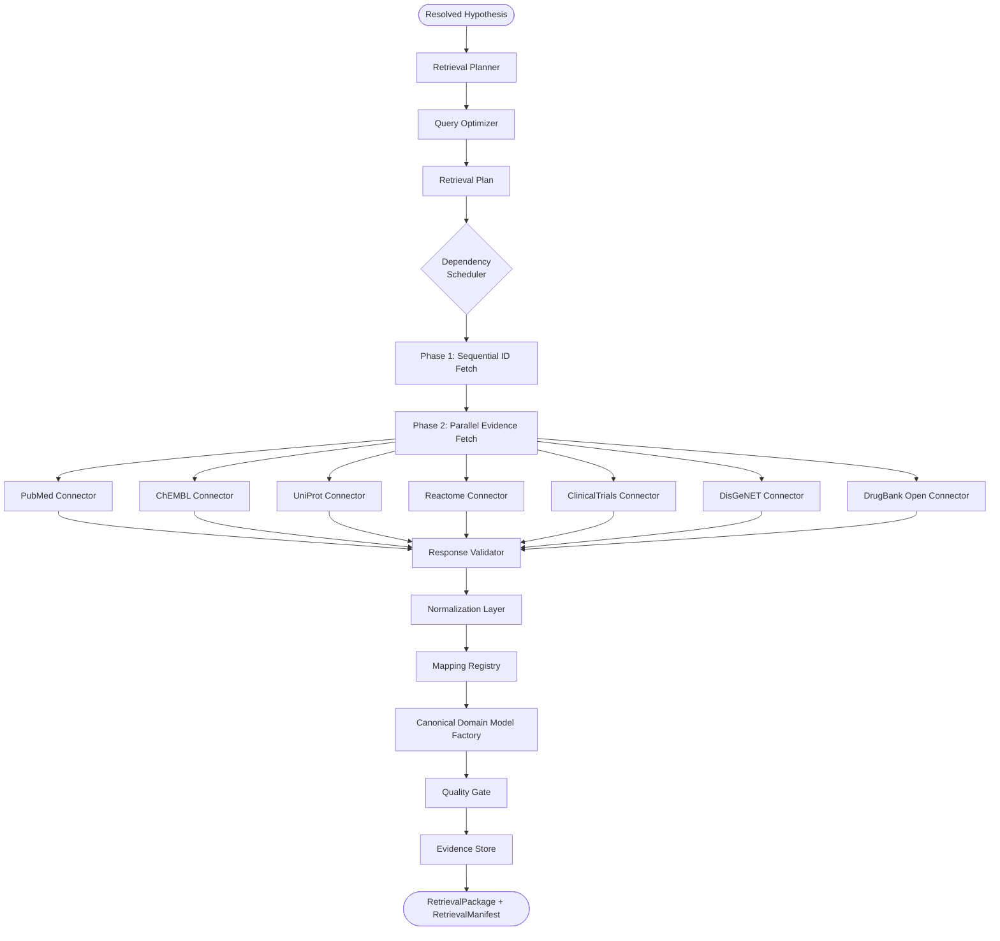

---

## 3. Source Registry

### 3.1 Philosophy

Every external data source integrated into CYNTHERA is not treated as a hardcoded client. It is a registered entry in the **Source Registry** — a structured catalog that defines the complete operational contract for each source. Adding a new database to CYNTHERA is, by design, an act of registration, not re-engineering.

The Source Registry is the single source of truth for all source configuration. It eliminates implicit assumptions scattered across connector code and makes every policy visible, versionable, and auditable.

### 3.2 Source Registry Structure

```
Source Registry
│
├── Source Definition [PubMed]
├── Source Definition [ChEMBL]
├── Source Definition [UniProt]
├── Source Definition [Reactome]
├── Source Definition [ClinicalTrials.gov]
├── Source Definition [DisGeNET]
├── Source Definition [DrugBank Open]
├── Source Definition [Europe PMC]
│
└── ... [Future: KEGG, OpenTargets, STRING, PharmGKB]
```

### 3.3 Source Definition Contract

Each Source Definition exposes a uniform interface. Every registered source must implement every field of this contract:

```
SourceDefinition
│
├── name               (String)       — Unique registry key (e.g., "ChEMBL")
├── authority          (String)       — Institutional owner (e.g., "EMBL-EBI")
├── priority           (Enum)         — CRITICAL | HIGH | MEDIUM | LOW
├── connector          (Reference)    — The HTTP client implementation for this source
├── parser             (Reference)    — Transforms raw API payload into source-typed records
├── validator          (Reference)    — Validates schema conformance of parsed records
├── mapper             (Reference)    — Projects source-typed records onto canonical domain objects
├── retry_policy       (RetryPolicy)  — Max retries, backoff strategy, delay cap
├── cache_policy       (CachePolicy)  — TTL, invalidation strategy, version-keyed bypass
├── license            (String)       — Data license (e.g., "CC BY-SA 3.0")
└── version            (String)       — Currently configured API/DB version (e.g., "ChEMBL v33")
```

### 3.4 Source Lifecycle

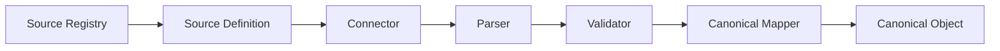

Each stage is independently replaceable. If a source changes its API schema, only its `Parser` and `Validator` change — the registry entry, connector, and mapper contract remain stable.

### 3.5 Future Source Plug-In Example

Adding KEGG to CYNTHERA requires only:

| Step | Action |
| :--- | :--- |
| 1 | Write a `KEGGConnector` implementing the `Connector` interface |
| 2 | Write a `KEGGParser` for pathway compound JSON |
| 3 | Write a `KEGGValidator` for required pathway fields |
| 4 | Write a `KEGGMapper` projecting KEGG pathways to canonical `Pathway` objects |
| 5 | Register a `SourceDefinition` entry in the Source Registry |

No other component in the system requires modification. The Retrieval Planner reads the Source Registry at runtime.

**Planned future sources**: KEGG, OpenTargets, STRING, PharmGKB, OMIM, GTEx, ClinVar.

---

## 4. Mapping Registry

### 4.1 Philosophy

All transformations from source-native identifiers and field names to canonical domain model fields are governed by a centralized **Mapping Registry**. This eliminates the fragmentation of mapping logic across individual connector modules and creates a single, auditable, version-controlled translation layer.

### 4.2 Mapping Registry Architecture

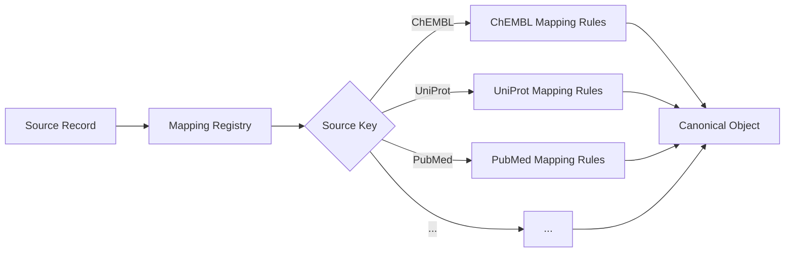

Each mapping rule set declares:

*   **Field projections**: Which source field maps to which canonical field.
*   **Type coercions**: Numeric conversions (e.g., IC50 unit normalization), date format normalization, enum string-to-value mappings.
*   **Default values**: What canonical fields are populated with when the source does not provide them.
*   **Null handling**: Whether missing source fields cause record rejection or field-level degradation.
*   **Mapping version**: The version of the mapping rules, independent of source version. Enables detection of mapping drift.

### 4.3 Mapping Governance

Mapping rules are versioned independently of source versions. A `MAPPING_DRIFT_ALERT` is raised when:

*   A source API returns a field name that has no defined mapping rule.
*   A source API removes a previously mapped field.
*   A canonical field is left `null` in more than 5% of records from a given source over a rolling 24-hour window.

---

## 5. Canonical Retrieval Pipeline

The execution sequence from raw user query to a validated, packaged `RetrievalPackage` follows these ordered steps:

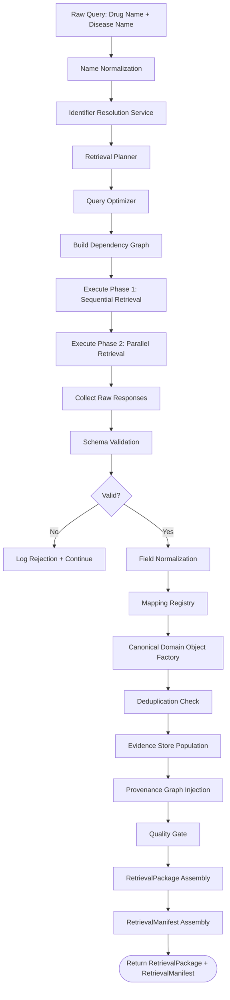

### Step Descriptions

1.  **Name Normalization**: Input strings are sanitized. Unicode characters are normalized, case is folded to lowercase, common synonyms are expanded (e.g., "aspirin" → "acetylsalicylic acid"), and abbreviations are resolved using a static synonym map.
2.  **Identifier Resolution**: The Identifier Resolution Service translates normalized names to canonical cross-reference ID sets.
3.  **Retrieval Planning**: The Retrieval Planner inspects the resolved IDs and determines exactly which sources must be queried, in which order, and which can be parallelized.
4.  **Query Optimization**: The Query Optimizer inspects the current Retrieval Plan against the cache, source health metrics, and active policy mode. It reorders, merges, or skips calls before execution begins.
5.  **Dependency Graph Construction**: A directed acyclic graph of API call dependencies is built. Calls that require outputs from prior calls are placed in subsequent phases.
6.  **Phase 1 Execution (Sequential)**: Source-of-truth identifier fetches that other clients depend upon are executed sequentially first (e.g., ChEMBL target IDs before UniProt can be called).
7.  **Phase 2 Execution (Parallel)**: All independent evidence sources are queried concurrently using async HTTP sessions.
8.  **Response Collection**: Raw payloads are aggregated into a source-keyed memory structure.
9.  **Schema Validation**: Each payload is validated against the source-specific expected schema. Records failing validation are dropped and logged.
10. **Field Normalization**: Numeric values are standardized (units, precision), strings are trimmed, and date formats are unified to ISO-8601.
11. **Mapping Registry Projection**: Source-native fields are translated to canonical field names via the Mapping Registry. No direct field assignment occurs outside of this stage.
12. **Canonical Object Factory**: Mapped fields are used to instantiate canonical domain model objects as defined in `02_DOMAIN_MODEL.md`.
13. **Deduplication**: Records with identical canonical identifiers are merged, preserving the highest-authority source and collecting all reference URLs.
14. **Provenance Graph Injection**: A structured `ProvenanceNode` is constructed for each canonical object, recording the full chain from original identifier through normalization to canonical form.
15. **Quality Gate**: Before the Evidence Store is sealed, the Quality Gate verifies structural completeness of the retrieval output. If the gate fails, the package is either degraded or the pipeline terminates, depending on failure severity.
16. **Package Assembly**: All canonical objects are assembled into a single `RetrievalPackage` entity.
17. **Manifest Assembly**: The `RetrievalManifest` is populated with all engineering-level session metadata and attached to the package.

---

## 6. Identifier Resolution

Identifier resolution is the most critical prerequisite step in the pipeline. No retrieval client is called until stable, standardized identifiers are established for both the drug and disease entities.

### 6.1 Drug Identifier Resolution

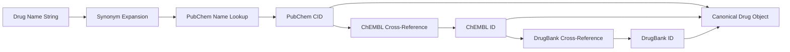

**Resolution Sequence**:
1.  Query PubChem Name-to-CID service using the normalized string.
2.  Use the PubChem CID to retrieve cross-reference IDs from the PubChem CID-Property endpoint.
3.  Use the ChEMBL molecule search endpoint to confirm the ChEMBL compound ID.
4.  Use ChEMBL's cross-reference data to confirm the DrugBank ID.
5.  Assemble the `Drug` canonical object carrying `pubchem_cid`, `chembl_id`, and `drugbank_id`.

### 6.2 Disease Identifier Resolution

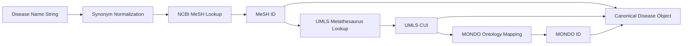

**Resolution Sequence**:
1.  Query NCBI MeSH via E-utilities to retrieve the primary MeSH Descriptor ID.
2.  Use the MeSH ID to query the UMLS REST API for the UMLS Concept Unique Identifier (CUI).
3.  Map the CUI to a MONDO disease ontology identifier.
4.  Assemble the `Disease` canonical object carrying `mesh_id`, `umls_cui`, and `mondo_id`.

### 6.3 Protein Identifier Resolution

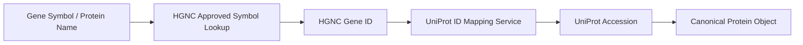

**Resolution Sequence**:
1.  Validate and normalize gene symbols against the HGNC approved symbol list.
2.  Use the UniProt ID Mapping API to convert HGNC symbols to UniProt accessions.
3.  Assemble the `Protein` canonical object.

### 6.4 Ambiguity Handling

| Scenario | Handling |
| :--- | :--- |
| Input matches multiple identifiers | Select the highest-ranked match by source priority score; log all alternatives. |
| Input matches no identifiers | Terminate pipeline with an `ENTITY_NOT_FOUND` error and return a structured error payload. |
| Input contains a deprecated synonym | Map to the current preferred term via synonym expansion table before querying. |
| Input is an abbreviation | Expand using a curated biomedical abbreviation dictionary before querying. |
| Identifier mismatch across sources | Prefer the authoritative source (e.g., UniProt over ChEMBL for protein accession). |

---

## 7. Retrieval Planner & Query Optimizer

### 7.1 Retrieval Planner Responsibilities

The Retrieval Planner is a dedicated subsystem responsible for determining what evidence is needed, from which sources, and in what order. It separates retrieval decision-making from retrieval execution.

*   Inspect the resolved `Drug`, `Disease`, and `Protein` canonical IDs.
*   Determine which sources are required given the current hypothesis and active Policy Mode.
*   Build a dependency graph defining which source calls must precede others.
*   Produce a `RetrievalPlan` consumed by the Dependency Scheduler.
*   Avoid calling sources that have already been served from cache.
*   Consult Source Health Monitor and avoid sources currently flagged as degraded.

### 7.2 Planning Logic


### 7.3 RetrievalPlan Object

The `RetrievalPlan` is an ordered, structured manifest defining:

*   **Phase 1 tasks**: Sequential calls (e.g., ChEMBL target IDs → UniProt accessions).
*   **Phase 2 tasks**: Parallel calls that have no inter-dependencies (e.g., PubMed literature + ClinicalTrials + DisGeNET).
*   **Cache bypass flags**: Per-source flags specifying whether the planner detected stale cache records.
*   **Source priority order**: In the event of a timeout, which sources are non-negotiable vs. optional.
*   **Active policy mode**: The retrieval policy (FAST / STANDARD / COMPREHENSIVE) governing which sources are included.

### 7.4 Query Optimizer

The Query Optimizer is interposed between the Retrieval Planner and the Dependency Scheduler. It receives the `RetrievalPlan` and applies a set of optimization rules before any network call is made.

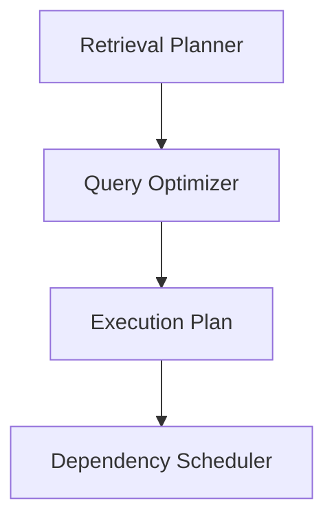

**Optimization Rules**:

| Rule | Description |
| :--- | :--- |
| **Cache Reuse** | If a valid cache entry exists for a planned call, remove it from the execution plan and substitute the cached result. |
| **Request Deduplication** | If two planned calls would query the same source with identical parameters (e.g., a shared protein target across multiple drugs), merge into a single call with combined result distribution. |
| **Source Reordering** | If a non-critical source is currently flagged as degraded by the Health Monitor, move it to the end of the parallel execution queue to reduce blocking. |
| **Redundant Call Elimination** | If a planned call would retrieve data already present from a prior Phase 1 result (e.g., UniProt accession already extracted from ChEMBL cross-reference), skip the call entirely. |
| **Batch Consolidation** | Where a source's API supports batch endpoints (e.g., UniProt multi-accession lookup), consolidate individual calls into a single batch call. |

---

## 8. Retrieval Policies

### 8.1 Philosophy

The Retrieval Layer supports multiple execution policies that govern the scope of source coverage for a given retrieval session. Policies enable trade-offs between latency, cost, and coverage without requiring code changes.

The active policy is specified in the `RetrievalPlan` and enforced by the Query Optimizer.

### 8.2 FAST Policy

Intended for low-latency scenarios, rapid hypothesis screening, and benchmarking baselines. Only the three highest-priority mechanistic sources are queried.

| Source | Included |
| :--- | :--- |
| ChEMBL | Yes |
| UniProt | Yes |
| Reactome | Yes |
| PubMed | No |
| ClinicalTrials.gov | No |
| DisGeNET | No |
| DrugBank Open | No |
| Europe PMC | No |

**Limitations**: Support Score and Risk Score will be incomplete. Recommendation Engine vetoes `PROMISING` output under FAST policy. Result is explicitly marked `FAST_MODE — INCOMPLETE EVIDENCE`.

### 8.3 STANDARD Policy

Intended for standard research queries. Covers all mechanistic sources plus clinical trials and primary literature.

| Source | Included |
| :--- | :--- |
| ChEMBL | Yes |
| UniProt | Yes |
| Reactome | Yes |
| PubMed | Yes |
| ClinicalTrials.gov | Yes |
| DisGeNET | Yes |
| DrugBank Open | Yes |
| Europe PMC | No |

### 8.4 COMPREHENSIVE Policy

Intended for full scientific evaluation. All registered sources, including supplemental literature and future registered sources, are queried.

| Source | Included |
| :--- | :--- |
| ChEMBL | Yes |
| UniProt | Yes |
| Reactome | Yes |
| PubMed | Yes |
| ClinicalTrials.gov | Yes |
| DisGeNET | Yes |
| DrugBank Open | Yes |
| Europe PMC | Yes |
| Future sources | Yes (all registered) |

**Default policy**: STANDARD.

---

## 9. Source Health Monitoring

### 9.1 Philosophy

The Retrieval Layer maintains a continuously updated health record for each registered source. The Query Optimizer and Retrieval Planner consult these records before generating an execution plan. Unstable or degraded sources are handled proactively rather than reactively.

### 9.2 Health Metrics per Source

```
SourceHealthRecord
│
├── source_name              (String)       — Registry key
├── last_successful_call     (ISO-8601)     — Timestamp of the last successful response
├── average_latency_ms       (Float)        — Rolling 1-hour average latency
├── p95_latency_ms           (Float)        — 95th percentile latency over the last hour
├── availability_ratio       (Float 0-1)    — Fraction of calls returning HTTP 200 in the last 24 hours
├── failure_rate             (Float 0-1)    — Fraction of calls failing with 4xx/5xx in the last 24 hours
├── average_response_size_kb (Float)        — Rolling average response payload size
├── schema_drift_detected    (Boolean)      — Whether a MAPPING_DRIFT_ALERT has been raised
├── circuit_open             (Boolean)      — Whether the circuit breaker is currently open
└── health_status            (Enum)         — HEALTHY | DEGRADED | UNAVAILABLE
```

### 9.3 Health Status Thresholds

| Status | Condition |
| :--- | :--- |
| **HEALTHY** | availability_ratio >= 0.95 and failure_rate < 0.05 and schema_drift_detected = false |
| **DEGRADED** | availability_ratio >= 0.70 or failure_rate < 0.20 or p95_latency_ms > 3x historical average |
| **UNAVAILABLE** | availability_ratio < 0.70 or circuit_open = true |

### 9.4 Planner Responses to Health Status

| Health Status | Planner Action |
| :--- | :--- |
| `HEALTHY` | Source included per active policy. |
| `DEGRADED` | Source deprioritized in execution queue; extended timeout applied; result marked `DEGRADED_SOURCE`. |
| `UNAVAILABLE` | Source excluded from execution plan; completeness flag set to false; downstream engines notified. |

### 9.5 Circuit Breaker

A circuit breaker pattern governs per-source suspension. When a source generates more than 5 consecutive failures within a 60-second window:

1.  The circuit **opens**. The source is suspended from all retrieval plans.
2.  After 120 seconds, the circuit enters a **half-open** state. One probe request is issued.
3.  If the probe succeeds, the circuit **closes** and the source is restored.
4.  If the probe fails, the suspension window is extended by 120 seconds.

---

## 10. Source Inventory

The following subsections define every external data source registered in the Source Registry.

---

### 10.1 PubMed (NCBI E-utilities)

| Property | Value |
| :--- | :--- |
| **Authority** | National Center for Biotechnology Information (NCBI / NIH) |
| **Purpose** | Scientific literature retrieval for claim extraction and evidence grounding. |
| **Unique Contribution** | Provides published experimental results, human clinical study findings, and observational research. |
| **Canonical Output** | `LiteratureRecord` -> `Evidence` (type: `META_ANALYSIS`, `RCT`, `OBSERVATIONAL`) |
| **Consumed By** | Claim Extraction Agent, Support Engine |
| **Priority** | High — literature is the primary source of human-level evidence |
| **Input Required** | Normalized drug name, disease MeSH ID, gene symbols |
| **Dependencies** | None (independent call in Phase 2) |
| **Rate Limit** | 3 req/sec (unauthenticated), 10 req/sec (with NCBI API key) |
| **Timeout** | 15 seconds per request |
| **Retry Policy** | 3 retries with exponential backoff starting at 2 seconds |
| **Cache TTL** | 24 hours |
| **License** | Public domain (NLM/NCBI) |
| **Failure Policy** | Non-critical. Flag literature claims as `Unavailable`; degrade Support Score accordingly. |

---

### 10.2 ChEMBL (EMBL-EBI)

| Property | Value |
| :--- | :--- |
| **Authority** | European Molecular Biology Laboratory – European Bioinformatics Institute (EMBL-EBI) |
| **Purpose** | Drug-target bioactivity data and binding affinity records. |
| **Unique Contribution** | Provides Ki, IC50, Kd, and percentage inhibition values with assay metadata, and maps drugs to their protein targets. |
| **Canonical Output** | `BioActivity` -> `Target`, `Evidence` (type: `IN_VITRO`) |
| **Consumed By** | MoA Enumerator, Mechanistic Engine, Support Engine |
| **Priority** | Critical — required to identify drug protein targets |
| **Input Required** | ChEMBL compound ID |
| **Dependencies** | Identifier Resolution must provide ChEMBL ID before this call executes |
| **Rate Limit** | No hard limit documented; practical limit is ~5 req/sec to avoid server 429 responses |
| **Timeout** | 20 seconds per request |
| **Retry Policy** | 3 retries with exponential backoff starting at 3 seconds |
| **Cache TTL** | 30 days |
| **License** | CC BY-SA 3.0 |
| **Failure Policy** | Critical. If ChEMBL is unavailable, the pipeline halts with `CORE_SOURCE_FAILURE`. |

---

### 10.3 UniProt (UniProt Consortium)

| Property | Value |
| :--- | :--- |
| **Authority** | UniProt Consortium (EMBL-EBI, SIB, PIR) |
| **Purpose** | Protein biological function, sequence, and gene mapping data. |
| **Unique Contribution** | Authoritative source for protein accession numbers, subcellular locations, functional annotations, and cross-reference mapping across databases. |
| **Canonical Output** | UniProt Entry -> `Protein` |
| **Consumed By** | Mechanistic Engine, Disease Relevance Agent, Causal Path Agent |
| **Priority** | Critical — required for pathway-level reasoning |
| **Input Required** | Gene symbols or ChEMBL target UniProt cross-references |
| **Dependencies** | ChEMBL must execute first (provides initial gene symbols for lookup) |
| **Rate Limit** | No hard documented rate limit; practical limit is ~5 req/sec |
| **Timeout** | 15 seconds per request |
| **Retry Policy** | 3 retries with exponential backoff starting at 2 seconds |
| **Cache TTL** | 30 days |
| **License** | CC BY 4.0 |
| **Failure Policy** | Critical. If UniProt is unavailable, Reactome and Mechanistic Engine cannot execute. Pipeline halts with `CORE_SOURCE_FAILURE`. |

---

### 10.4 Reactome

| Property | Value |
| :--- | :--- |
| **Authority** | Reactome Consortium (EMBL-EBI, ORCID, Ontario Institute for Cancer Research) |
| **Purpose** | Biological pathway topology and reaction cascade data. |
| **Unique Contribution** | Provides curated, peer-reviewed hierarchical pathway networks that enable mechanistic path tracing from drug target to disease biology. |
| **Canonical Output** | Reactome Pathway Event -> `Pathway`, `MechanisticChain` edges |
| **Consumed By** | Causal Path Agent, Mechanistic Engine |
| **Priority** | High — essential for mechanistic scoring |
| **Input Required** | UniProt accession numbers |
| **Dependencies** | UniProt must execute first (provides accessions for pathway mapping) |
| **Rate Limit** | No documented hard limit; conservative practice is ~3 req/sec |
| **Timeout** | 20 seconds per request |
| **Retry Policy** | 3 retries with exponential backoff starting at 3 seconds |
| **Cache TTL** | 30 days |
| **License** | CC BY 4.0 |
| **Failure Policy** | Non-critical. Mechanistic Score pathway component is set to 0; report warns of pathway data unavailability. |

---

### 10.5 ClinicalTrials.gov (NLM)

| Property | Value |
| :--- | :--- |
| **Authority** | National Library of Medicine (NLM / NIH) |
| **Purpose** | Human clinical trial records including phase, outcome, and trial status. |
| **Unique Contribution** | The sole authoritative registry for discovering terminated, failed, and safety-halted clinical trials involving the drug-disease pair. |
| **Canonical Output** | ClinicalTrials Study -> `ClinicalTrial` |
| **Consumed By** | Risk / Falsification Engine, Recommendation Engine |
| **Priority** | High — critical safety source |
| **Input Required** | Drug name/synonyms, Disease MeSH ID |
| **Dependencies** | None (independent Phase 2 call) |
| **Rate Limit** | Formally undocumented; practical limit is ~5 req/sec |
| **Timeout** | 20 seconds per request |
| **Retry Policy** | 3 retries with exponential backoff starting at 3 seconds |
| **Cache TTL** | 7 days (trial statuses change more frequently than biological data) |
| **License** | Public domain (NLM/NIH) |
| **Failure Policy** | Safety-critical. If unavailable, clinical trial component of Risk Score is marked `Unverified`; Recommendation Engine vetoes `PROMISING` output. |

---

### 10.6 DisGeNET

| Property | Value |
| :--- | :--- |
| **Authority** | Research Programme on Biomedical Informatics (GRIB), Hospital del Mar Research Institute |
| **Purpose** | Gene-disease association records linking specific genes to clinical phenotypes. |
| **Unique Contribution** | Provides score-ranked gene-disease association data sourced from curated databases and text mining, enabling disease pathway mapping when structured disease gene lists are unavailable. |
| **Canonical Output** | GDA (Gene-Disease Association) -> `GeneAssociation` -> `Evidence` (type: `COMPUTATIONAL`) |
| **Consumed By** | Disease Relevance Agent, Mechanistic Engine |
| **Priority** | Medium — primary mechanism for identifying disease-implicated proteins |
| **Input Required** | Disease UMLS CUI |
| **Dependencies** | Disease entity must be fully resolved before this call executes |
| **Rate Limit** | API key required for higher access; rate limited at 1 req/sec (free tier) |
| **Timeout** | 15 seconds per request |
| **Retry Policy** | 2 retries with fixed 5-second backoff |
| **Cache TTL** | 14 days |
| **License** | CC BY-NC 4.0 (academic use) |
| **Failure Policy** | Non-critical. If unavailable, disease gene mapping falls back to MeSH-annotated pathway data. Report notes DisGeNET as unavailable. |

---

### 10.7 DrugBank Open Data

| Property | Value |
| :--- | :--- |
| **Authority** | DrugBank (OMx Personal Health Analytics, University of Alberta) |
| **Purpose** | Drug mechanism of action (MoA) descriptions, pharmacology annotations, and target lists. |
| **Unique Contribution** | Provides human-curated, text-level mechanism of action descriptions enabling LLM claim extraction of known pharmacological effects. |
| **Canonical Output** | DrugBank Entry -> supplementary field in `Drug` canonical object |
| **Consumed By** | Claim Extraction Agent (MoA text), MoA Enumerator |
| **Priority** | Medium — enriches drug canonical object |
| **Input Required** | DrugBank ID |
| **Dependencies** | DrugBank ID must be resolved in Identifier Resolution phase |
| **Rate Limit** | Open data downloads; no real-time API rate limit formally documented |
| **Timeout** | 10 seconds |
| **Retry Policy** | 2 retries with exponential backoff starting at 2 seconds |
| **Cache TTL** | 30 days |
| **License** | CC BY-NC 4.0 (open data subset) |
| **Failure Policy** | Non-critical. MoA text field is left empty in `Drug` canonical object if unavailable. |

---

### 10.8 Europe PMC

| Property | Value |
| :--- | :--- |
| **Authority** | European Molecular Biology Laboratory – European Bioinformatics Institute (EMBL-EBI) |
| **Purpose** | Supplemental scientific literature source capturing preprints, full-text papers, and non-English studies not indexed in PubMed. |
| **Unique Contribution** | Covers preprint servers (bioRxiv, medRxiv), open-access full-text articles, and international clinical findings missing from PubMed's index. |
| **Canonical Output** | Europe PMC Article -> `LiteratureRecord` -> `Evidence` |
| **Consumed By** | Claim Extraction Agent |
| **Priority** | Low — supplemental to PubMed |
| **Input Required** | Drug name, disease name, gene symbols |
| **Dependencies** | None (optional Phase 2 call) |
| **Rate Limit** | No formally documented hard limit |
| **Timeout** | 15 seconds |
| **Retry Policy** | 2 retries with exponential backoff starting at 2 seconds |
| **Cache TTL** | 24 hours |
| **License** | CC BY (open access content) |
| **Failure Policy** | Non-critical. If unavailable, PubMed covers the primary literature corpus. |

---

## 11. Source Dependency Graph

API calls are not independent. Some sources require outputs from prior calls. This dependency graph determines the execution phases and prevents race conditions:

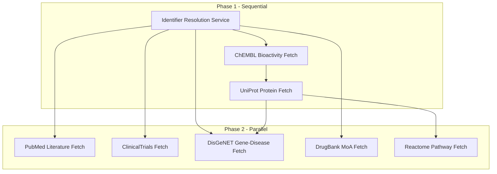

**Rationale for ordering**:
*   ChEMBL must precede UniProt because ChEMBL target records contain the initial UniProt accession cross-references.
*   UniProt must precede Reactome because Reactome's pathway analysis service requires UniProt accessions as inputs.
*   PubMed, ClinicalTrials, DisGeNET, DrugBank, and Europe PMC operate independently and can execute concurrently.

---

## 12. Parallel vs Sequential Execution

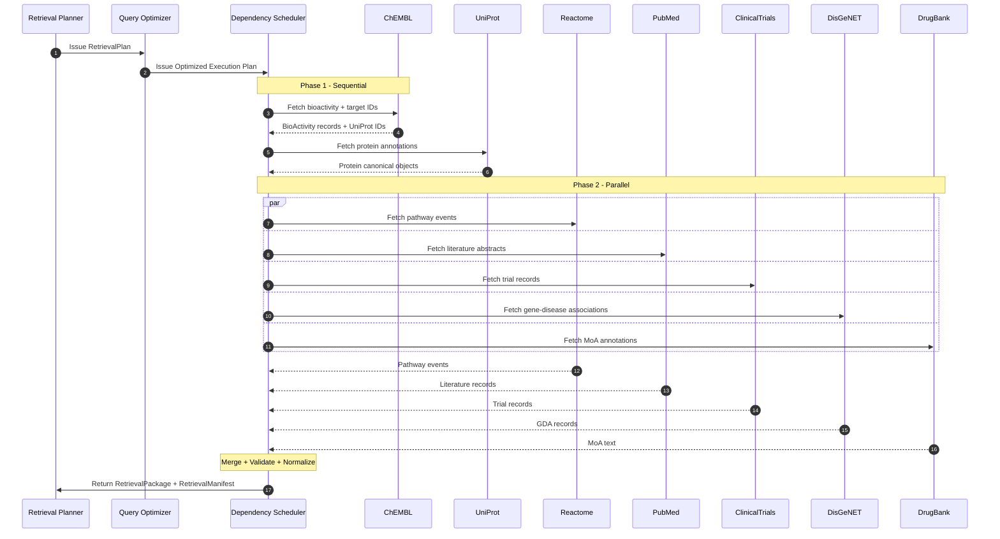

### Execution Rules Summary

| Phase | Tasks | Execution Mode |
| :--- | :--- | :--- |
| Phase 0 | Identifier Resolution | Sequential — must precede all retrieval |
| Phase 0.5 | Query Optimization | Sequential — applied to plan before execution |
| Phase 1a | ChEMBL bioactivity + target fetch | Sequential |
| Phase 1b | UniProt protein annotation fetch | Sequential (depends on ChEMBL output) |
| Phase 2 | Reactome, PubMed, ClinicalTrials, DisGeNET, DrugBank, Europe PMC | Parallel (asyncio.gather) |
| Phase 3 | Validation, normalization, canonical mapping, deduplication | Sequential |
| Phase 4 | Quality Gate, Package Assembly, Manifest Assembly | Sequential |

---

## 13. Response Validation

The Retrieval Layer applies a structured validation protocol to every API response before it enters the normalization pipeline. Invalid records are never silently discarded — they are logged with a reason code and excluded from the Evidence Store.

### 13.1 Validation Checks

| Check | Description | Action on Failure |
| :--- | :--- | :--- |
| **HTTP Status Code** | Verify response is 200. | Trigger retry policy; log if all retries fail. |
| **Non-Empty Body** | Verify response body is not null or empty. | Log `EMPTY_RESPONSE`; mark source as partial. |
| **Content-Type** | Verify response is `application/json`. | Log `UNEXPECTED_CONTENT_TYPE`; discard payload. |
| **JSON Parse Validity** | Verify payload parses without error. | Log `MALFORMED_JSON`; discard payload. |
| **Required Fields Presence** | Verify mandatory fields for the source type exist. | Log `MISSING_REQUIRED_FIELD`; drop individual record. |
| **Identifier Format** | Verify identifiers conform to expected regex patterns. | Log `INVALID_IDENTIFIER_FORMAT`; drop record. |
| **Numeric Range Plausibility** | Verify assay values (e.g., IC50, Ki) fall within physically plausible ranges. | Log `IMPLAUSIBLE_VALUE`; drop record and flag for review. |
| **Duplicate Detection** | Verify same-key records are not duplicated across source pages. | Merge duplicates; keep highest-quality source copy. |

### 13.2 Validation Error Severity Levels

*   **CRITICAL**: A core source is completely unreachable or returns a structurally invalid response. Triggers pipeline halt.
*   **WARNING**: Individual records fail validation but the source returned sufficient valid data.
*   **INFO**: Edge cases flagged for observability (e.g., deprecated identifiers automatically remapped).

---

## 14. Retrieval Quality Gates

### 14.1 Philosophy

Before the Evidence Store is sealed and the `RetrievalPackage` is returned, the output passes through a **Quality Gate** — a structural checkpoint that verifies the retrieval session produced evidence sufficient for meaningful scientific reasoning. Evidence that escapes this gate cannot be trusted.

The Quality Gate is the boundary between retrieval and reasoning. Reasoning agents never receive a package that has not been gate-checked.

### 14.2 Quality Gate Architecture

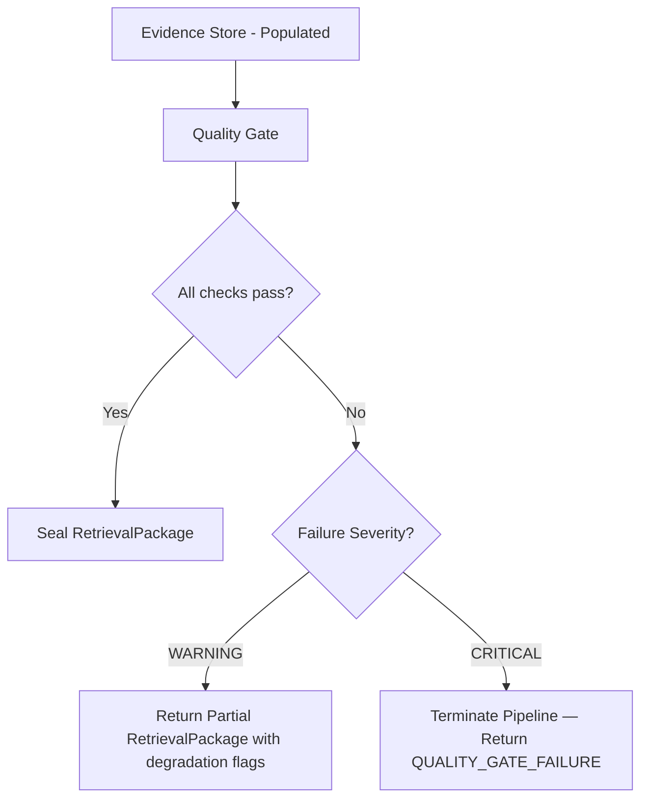

### 14.3 Quality Gate Checks

| Check | Condition | Severity on Failure |
| :--- | :--- | :--- |
| **Required Sources Present** | ChEMBL and UniProt must both be available. | CRITICAL |
| **Required Identifiers Resolved** | Drug must carry `chembl_id`; Disease must carry `mesh_id`. | CRITICAL |
| **Minimum Evidence Count** | Total canonical Evidence objects must exceed the configured minimum threshold (default: 3). | WARNING |
| **No Duplicate Explosion** | Deduplication must not have reduced the evidence count by more than 60% (indicates an identifier collision bug). | WARNING |
| **Provenance Completeness** | Every Evidence object must carry a fully populated ProvenanceNode. Objects with null provenance are removed and counted. | WARNING |
| **Mandatory Metadata Present** | `Drug.chembl_id`, `Drug.name`, `Disease.mesh_id`, `Disease.name` must all be non-null. | CRITICAL |
| **Target Resolution** | At least one `Target` canonical object must be present. | CRITICAL |

### 14.4 Gate Failure Behavior

*   **CRITICAL failure**: The pipeline terminates. A `QUALITY_GATE_FAILURE` error is returned to the Master Orchestrator with a machine-readable failure code and a human-readable explanation.
*   **WARNING failure**: The pipeline continues. The `RetrievalPackage` is marked `PARTIAL`. Each failed check is recorded in the `RetrievalManifest.quality_gate_warnings` list. Downstream engines receive the manifest and adjust their scoring accordingly.

---

## 15. Retrieval Confidence

### 15.1 Philosophy

Retrieval Confidence is a session-level metadata signal that summarizes the completeness and trustworthiness of a retrieval session's output. It is distinct from scientific evidence confidence, which is a property of individual claims and is assessed by the Reasoning Layer.

Retrieval Confidence answers the engineering question: *How complete and reliable is this retrieval package?*

### 15.2 Confidence Levels

| Level | Meaning |
| :--- | :--- |
| **HIGH** | All planned sources returned data. All identifiers resolved. No Quality Gate warnings. Evidence count above threshold. All ProvenanceNodes complete. |
| **MEDIUM** | One or more non-critical sources failed. Minor identifier gaps present. Quality Gate issued warnings but not CRITICAL failures. Evidence count above minimum. |
| **LOW** | Multiple sources failed or were excluded due to health status. Significant identifier gaps. Evidence count near or at minimum threshold. Quality Gate issued multiple warnings. |

### 15.3 Confidence Computation Inputs

| Input Factor | Contribution |
| :--- | :--- |
| Source coverage ratio | Fraction of planned sources that returned data |
| Identifier completeness | Fraction of expected identifiers successfully resolved across all entities |
| Missing critical sources | Binary penalty: any CRITICAL source missing means confidence cannot be HIGH |
| Successful normalization rate | Fraction of parsed records that passed the Mapping Registry without error |
| Evidence completeness | Whether evidence counts meet STANDARD thresholds for literature, bioactivity, and clinical data |
| Quality Gate warning count | Each warning reduces confidence level by one tier |

### 15.4 Usage by Reasoning Layer

The Reasoning Layer receives the `RetrievalConfidence` level as part of the `RetrievalManifest`. It uses this signal to:

*   Adjust the prior uncertainty weight in the Uncertainty Model.
*   Include a confidence caveat in the Scientific Audit Report.
*   Veto `PROMISING` recommendations if confidence is `LOW`.

---

## 16. Retrieval Manifest

### 16.1 Philosophy

The `RetrievalManifest` is an engineering-level metadata document attached to every `RetrievalPackage`. While the `RetrievalPackage` contains biomedical domain objects (canonical drugs, proteins, evidence), the `RetrievalManifest` contains everything needed to understand, reproduce, and debug the retrieval session that produced it.

The manifest enables full session reproducibility. Given a manifest, a developer can reconstruct the exact execution context of any historical retrieval.

### 16.2 RetrievalManifest Structure

```
RetrievalManifest
│
├── session_id               (UUID)         — Unique identifier for this retrieval session
├── hypothesis_id            (UUID)         — Links to the parent Hypothesis entity
├── started_at               (ISO-8601)     — Retrieval pipeline start timestamp
├── completed_at             (ISO-8601)     — Retrieval pipeline end timestamp
├── duration_ms              (Integer)      — Total wall-clock time from plan start to package seal
│
├── active_policy            (Enum)         — FAST | STANDARD | COMPREHENSIVE
├── retrieval_confidence     (Enum)         — HIGH | MEDIUM | LOW
│
├── sources_planned          (List)         — Source names scheduled by Retrieval Planner
├── sources_executed         (List)         — Source names that received a network call
├── sources_succeeded        (List)         — Source names that returned valid data
├── sources_failed           (List)         — Source names that failed (with error code)
├── sources_skipped          (List)         — Source names skipped (cache hit or health exclusion)
│
├── retry_counts             (Dict)         — Per-source retry attempt count
├── cache_hits               (Dict)         — Per-source cache hit count
├── execution_order          (List)         — Ordered list of source execution sequence
│
├── api_versions             (Dict)         — Source name to DB version string at retrieval time
│
├── quality_gate_passed      (Boolean)      — Whether the Quality Gate passed without CRITICAL failure
├── quality_gate_warnings    (List)         — Human-readable descriptions of each Quality Gate warning
│
└── warnings                 (List)         — Free-text engineering warnings logged during the session
```

### 16.3 Manifest Use Cases

| Use Case | Relevant Manifest Fields |
| :--- | :--- |
| Reproducing a retrieval session | `session_id`, `api_versions`, `active_policy`, `sources_planned` |
| Debugging a failed retrieval | `sources_failed`, `quality_gate_warnings`, `warnings` |
| Auditing a recommendation | `sources_succeeded`, `retrieval_confidence`, `api_versions` |
| Performance profiling | `duration_ms`, `retry_counts`, `cache_hits`, `execution_order` |
| Regulatory submission | Full manifest attached to Scientific Audit Report |

---

## 17. Provenance Graph

### 17.1 Philosophy

Standard provenance metadata records *where* a piece of evidence came from. A **Provenance Graph** records the *full transformation chain* from original identifier to canonical object — every normalization step, every mapping decision, and every version in play at the time of retrieval.

Every canonical `Evidence` object produced by the Retrieval Layer carries a `ProvenanceNode` rather than a flat provenance metadata dict. This enables structural audit traversal, not just field lookup.

### 17.2 ProvenanceNode Structure

```
ProvenanceNode
│
├── source_name              (String)       — Registry key of the originating database
├── source_version           (String)       — Database version at retrieval time
├── source_url               (URI)          — Queried API endpoint URL
├── api_version              (String)       — API version string (if reported by source)
├── license                  (String)       — Data license for this record
│
├── original_identifier      (String)       — Source-native ID (e.g., CHEMBL_ACTIVITY_3189226)
├── canonical_identifier     (String)       — The CYNTHERA canonical ID for this object
│
├── retrieved_at             (ISO-8601)     — Timestamp of API response receipt
├── normalized_at            (ISO-8601)     — Timestamp of Mapping Registry projection
├── normalization_version    (String)       — Version of the Mapping Registry rules applied
│
├── cache_hit                (Boolean)      — Whether this record was served from cache
├── cache_key                (String)       — The cache key used (if cache_hit is true)
│
└── transformation_log       (List)         — Ordered log of each normalization step applied
```

### 17.3 Provenance Chain Example

```
Evidence (ChEMBL binding record for Sildenafil-PDE5A)
│
├── ProvenanceNode
│   ├── source_name: "ChEMBL"
│   ├── source_version: "ChEMBL v33"
│   ├── source_url: "https://www.ebi.ac.uk/chembl/api/data/activity?molecule_chembl_id=CHEMBL941"
│   ├── api_version: "v1"
│   ├── license: "CC BY-SA 3.0"
│   ├── original_identifier: "CHEMBL_ACTIVITY_3189226"
│   ├── canonical_identifier: "CYN-EVD-20260709-001"
│   ├── retrieved_at: "2026-07-09T15:39:37Z"
│   ├── normalized_at: "2026-07-09T15:39:38Z"
│   ├── normalization_version: "chembl_mapper_v2.1"
│   ├── cache_hit: false
│   └── transformation_log:
│       ├── [1] IC50 unit confirmed as nM (no conversion required)
│       ├── [2] standard_relation mapped: "=" -> EXACT_VALUE
│       └── [3] assay_type mapped: "B" -> IN_VITRO
```

### 17.4 Audit Traversal

Because provenance is a structured graph node rather than flat metadata, audit traversal is possible:

*   *"Which evidence came from ChEMBL v32?"* — Query all ProvenanceNodes where `source_version = "ChEMBL v32"`.
*   *"Which records used normalization version 1.x?"* — Query all ProvenanceNodes where `normalization_version` starts with `"chembl_mapper_v1"`.
*   *"Which evidence was served from cache?"* — Query all ProvenanceNodes where `cache_hit = true`.

---

## 18. Retrieval Package Specification

### 18.1 Immutability Contract

**The `RetrievalPackage` is immutable.**

Once sealed by the Quality Gate, no downstream agent — including Reasoning Agents, Scoring Engines, or the Master Orchestrator — may modify, overwrite, or delete any object contained within the `RetrievalPackage`. This is an architectural invariant, not a guideline.

**Permitted operations by downstream agents**:
*   Read any field of any canonical object.
*   Append new derived objects (e.g., extracted `Claim` objects, scored `Evidence` copies) to their own separate output structures.

**Prohibited operations**:
*   Modifying `Drug`, `Disease`, `Target`, `Protein`, `Pathway`, `ClinicalTrial`, or `Evidence` objects.
*   Replacing or removing canonical objects from the package.
*   Overwriting `ProvenanceNode` fields.

This constraint prevents accidental evidence corruption and ensures that the Scientific Audit Report can always reconstruct the exact evidence state at the moment reasoning began.

### 18.2 RetrievalPackage Composition

```
RetrievalPackage  [IMMUTABLE — sealed at Quality Gate]
│
├── hypothesis_id             (UUID — links package to parent Hypothesis)
│
├── drug                      (Canonical Drug object)
│
├── disease                   (Canonical Disease object)
│
├── targets                   (List of canonical Target objects)
│
├── proteins                  (List of canonical Protein objects)
│
├── pathways                  (List of canonical Pathway objects)
│
├── clinical_trials           (List of canonical ClinicalTrial objects)
│
├── evidence                  (List of canonical Evidence objects, all types)
│
└── manifest                  (RetrievalManifest — engineering metadata)
```

### 18.3 Package Completeness Rules

*   **Minimum Viable Package**: A package is considered Minimum Viable if ChEMBL and UniProt data are present (targets and proteins resolved) and the Quality Gate passed without CRITICAL failure.
*   **Partial Package**: A package where one or more non-critical sources failed. Downstream engines receive completeness flags from the `RetrievalManifest` and adjust their scoring accordingly.
*   **Failed Package**: A package where ChEMBL or UniProt data is completely absent, or the Quality Gate raised a CRITICAL failure. The pipeline terminates and returns an error. No `RetrievalPackage` is emitted.

---

## 19. Failure Handling

Every distinct HTTP and application failure type receives a specific, documented handling behavior.

| Failure Type | Trigger | Handling |
| :--- | :--- | :--- |
| **HTTP 404** | Entity not found at the queried identifier | Log `ENTITY_NOT_FOUND`; skip record; continue. |
| **HTTP 429** | Rate limit exceeded | Pause the specific source client; wait Retry-After header duration; retry. |
| **HTTP 500** | Internal server error at source | Log `SOURCE_SERVER_ERROR`; apply retry policy. |
| **HTTP 503** | Service temporarily unavailable | Log `SOURCE_UNAVAILABLE`; apply retry policy; fall back to cache if available. |
| **Connection Timeout** | Connection not established within timeout | Log `CONNECTION_TIMEOUT`; apply retry policy. |
| **Read Timeout** | Connection established but no response body received in time | Log `READ_TIMEOUT`; apply retry policy. |
| **Malformed JSON** | Response body is not valid JSON | Log `MALFORMED_RESPONSE`; discard payload; continue. |
| **Schema Mismatch** | Response JSON is valid but expected fields are absent | Log `SCHEMA_MISMATCH`; discard individual records; trigger `MAPPING_DRIFT_ALERT`. |
| **Empty Results** | Response is valid but returns zero records | Log `EMPTY_RESULT_SET`; mark source as returning no evidence for this query. |
| **Identifier Resolution Failure** | Drug or disease name resolves to zero identifiers | Terminate pipeline; return `400 ENTITY_NOT_RESOLVED` to API layer. |
| **Quality Gate CRITICAL** | Quality Gate check fails with CRITICAL severity | Terminate pipeline; return `QUALITY_GATE_FAILURE` with failure code and explanation. |

---

## 20. Retry Strategy

### 20.1 Exponential Backoff Policy

All retryable failures follow a standard exponential backoff schedule:

*   **Maximum Retries**: 3 (configurable per source in Source Registry).
*   **Base Delay**: 2 seconds.
*   **Backoff Multiplier**: 2.0 (delay doubles with each attempt).
*   **Maximum Delay Cap**: 30 seconds (delays do not grow beyond this cap).
*   **Jitter**: A random jitter of +/- 0.5 seconds is added to each delay to prevent synchronized thundering herd patterns.

**Retry Schedule Example**:

| Attempt | Delay Before Attempt |
| :--- | :--- |
| 1 (initial) | 0s |
| 2 (first retry) | ~2s |
| 3 (second retry) | ~4s |
| 4 (third and final) | ~8s |

### 20.2 Retryable vs Non-Retryable Errors

| Error | Retryable |
| :--- | :--- |
| HTTP 429 (Rate Limit) | Yes |
| HTTP 500 (Server Error) | Yes |
| HTTP 503 (Service Unavailable) | Yes |
| Connection Timeout | Yes |
| Read Timeout | Yes |
| HTTP 400 (Bad Request) | No — query is malformed; retrying will produce the same error |
| HTTP 404 (Not Found) | No — entity does not exist in this database |
| Malformed JSON | No — indicates a structural change in the source schema |

---

## 21. Caching Strategy

### 21.1 Cache Architecture

The cache operates as a key-value store interposed between the Retrieval Planner and the API client connectors. Cache reads are attempted before any external network call. Cache writes occur after successful response validation.

### 21.2 Cache Key Structure

Cache keys are deterministic, constructed from the combination of source name, query type, and normalized canonical identifier(s).

**Example Key Format**: `{source}:{query_type}:{canonical_id}`

*   `pubmed:literature:D006976+CHEMBL941`
*   `reactome:pathways:O76074`
*   `clintrials:trials:CHEMBL941+D006976`

### 21.3 TTL Policy by Source

| Source | TTL | Rationale |
| :--- | :--- | :--- |
| PubMed | 24 hours | New publications appear daily; short TTL ensures recent negative results are captured |
| Europe PMC | 24 hours | Same as PubMed |
| ClinicalTrials.gov | 7 days | Trial statuses update frequently; weekly refresh needed for safety accuracy |
| DisGeNET | 14 days | Gene-disease association scores are recalculated periodically |
| ChEMBL | 30 days | Bioactivity records are stable; new versions release quarterly |
| UniProt | 30 days | Protein annotations are highly stable |
| Reactome | 30 days | Pathway events are stable; major updates are infrequent |
| DrugBank Open | 30 days | MoA annotations are stable |

### 21.4 Cache Invalidation

*   **TTL Expiry**: Standard expiry as defined per source.
*   **Force Refresh**: An `X-Cache-Bypass: true` request header bypasses all cache reads and forces fresh API calls. All new responses overwrite existing cache entries.
*   **Version Mismatch**: If the recorded API version in the cache entry differs from the current configured API version in the Source Registry, the cache entry is considered stale and invalidated.

---

## 22. Provenance & Traceability

Every canonical `Evidence` object produced by the Retrieval Layer must carry a complete `ProvenanceNode` (see Section 17). The following fields must be populated before the Quality Gate is passed.

### 22.1 Required Provenance Fields

| Field | Type | Description |
| :--- | :--- | :--- |
| `source_name` | String | Name of the originating database (e.g., ChEMBL, PubMed) |
| `source_version` | String | Database version at time of retrieval (e.g., ChEMBL v33) |
| `source_url` | URI | Direct URL of the queried API endpoint |
| `original_identifier` | String | The source-native identifier for this record |
| `canonical_url` | URI | Permanent public URL for the record |
| `doi` | String (optional) | Digital Object Identifier for literature records |
| `nct_id` | String (optional) | ClinicalTrials.gov identifier for trial records |
| `retrieved_at` | ISO-8601 DateTime | Timestamp when this record was fetched |
| `normalized_at` | ISO-8601 DateTime | Timestamp when this record was mapped to its canonical object |
| `normalization_version` | String | Version of the Mapping Registry rules applied |
| `cache_hit` | Boolean | Whether this record was served from cache or a live API call |
| `license` | String | Data license statement from the source database |
| `citation` | String | Formatted citation string for the source record |

---

## 23. Retrieval Metrics & Observability

The Retrieval Layer emits structured metrics to enable performance monitoring, source quality tracking, and debugging of incomplete evidence retrieval.

### 23.1 Metrics Emitted

| Metric | Unit | Description |
| :--- | :--- | :--- |
| `retrieval.source.latency_ms` | ms (per source) | Elapsed time for each source's HTTP request cycle |
| `retrieval.cache.hit_ratio` | Ratio 0-1 (per source) | Fraction of queries served from cache |
| `retrieval.records.total` | Count | Total canonical Evidence records returned |
| `retrieval.records.dropped` | Count | Records rejected by schema validation |
| `retrieval.records.deduplicated` | Count | Records merged during deduplication |
| `retrieval.sources.failed` | Count | Number of sources that returned no data |
| `retrieval.source.retry_count` | Count (per source) | Number of HTTP retries performed |
| `retrieval.normalization.failures` | Count | Records that passed HTTP validation but failed canonical mapping |
| `retrieval.completeness_score` | Ratio 0-1 | Fraction of planned sources that returned data |
| `retrieval.total_duration_ms` | ms | Full pipeline duration from plan start to package assembly |
| `retrieval.quality_gate.warnings` | Count | Number of Quality Gate warnings issued in the session |
| `retrieval.source.health_status` | Enum per source | Current health status at time of execution |
| `retrieval.confidence_level` | Enum | Session-level Retrieval Confidence (HIGH / MEDIUM / LOW) |

### 23.2 Observability Signals

*   **Low Cache Hit Ratio** (< 0.3): Signals that many queries are cold-start. May indicate the cache TTL is too short or the query parameter space is highly variable.
*   **High Drop Rate** (> 0.2): Signals a schema mismatch, possibly caused by a source API version change. Triggers a `SCHEMA_DRIFT_ALERT` and notifies the Mapping Registry.
*   **Source Failure Clustering**: If multiple sources fail simultaneously, this may indicate a network-level issue rather than a source-specific failure.
*   **Latency Spikes**: P95 latency exceeding 3x the source's historical average signals impending source degradation and triggers automatic DEGRADED health status, causing the planner to deprioritize the source.
*   **Retrieval Confidence Trending LOW**: If the rolling average Retrieval Confidence across sessions drops below MEDIUM, this signals systemic degradation in source availability or identifier resolution quality.

---

## 24. Future Retrieval Roadmap

The retrieval architecture is designed to grow without requiring structural rework. The following capabilities are defined for future phases:

*   **Local Source Mirrors**: Deploy local read-only mirrors of ChEMBL, UniProt, and Reactome using their bulk download releases. This eliminates all HTTP round-trip latency for Phase 1 sources and removes rate-limit constraints entirely.
*   **Neo4j Knowledge Graph Integration**: Integrate a locally hosted Neo4j instance populated with PrimeKG or Hetionet. The Retrieval Planner routes protein-pathway-disease traversal queries directly to Neo4j via Cypher, reducing mechanistic chain retrieval from seconds to milliseconds.
*   **Vector Similarity Retrieval**: Index extracted Claim objects in a vector database (e.g., ChromaDB or Weaviate). Future queries can retrieve semantically similar claims from prior evaluations without re-running literature extraction.
*   **Hybrid Retrieval**: Combine structured API retrieval with vector-based retrieval for cases where no direct bioactivity record exists but similar experimental findings are available from prior queries.
*   **Incremental Evidence Updates**: Rather than full re-retrieval on cache expiry, implement event-driven update subscriptions (where source APIs support it) to ingest only new or changed records since last retrieval.
*   **Batch Retrieval Mode**: Support retrieval for multiple drug-disease pairs in a single planning session, enabling high-throughput research batch jobs without redundant source calls for shared drugs or diseases.
*   **Source Credentialing**: Introduce a formal source credentialing framework that tracks evidence volume, consistency score, and historical validation rate per database, adjusting Evidence Reliability Weights dynamically based on observed source quality.
*   **OpenTargets Integration**: Register OpenTargets as a Source Registry entry, providing genetic evidence associations and drug-target evidence scores from GWAS and functional genomics studies.
*   **PharmGKB Integration**: Register PharmGKB for pharmacogenomic associations, enabling future personalized genomics reasoning.
*   **Automated Source Registry Updates**: Build a registry watcher that detects source API version changes, automatically raises SCHEMA_DRIFT_ALERT, and queues a mapping rule review task.
