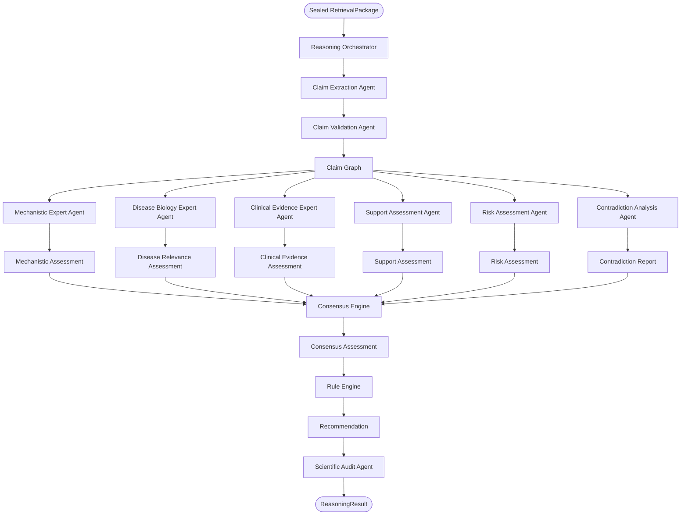
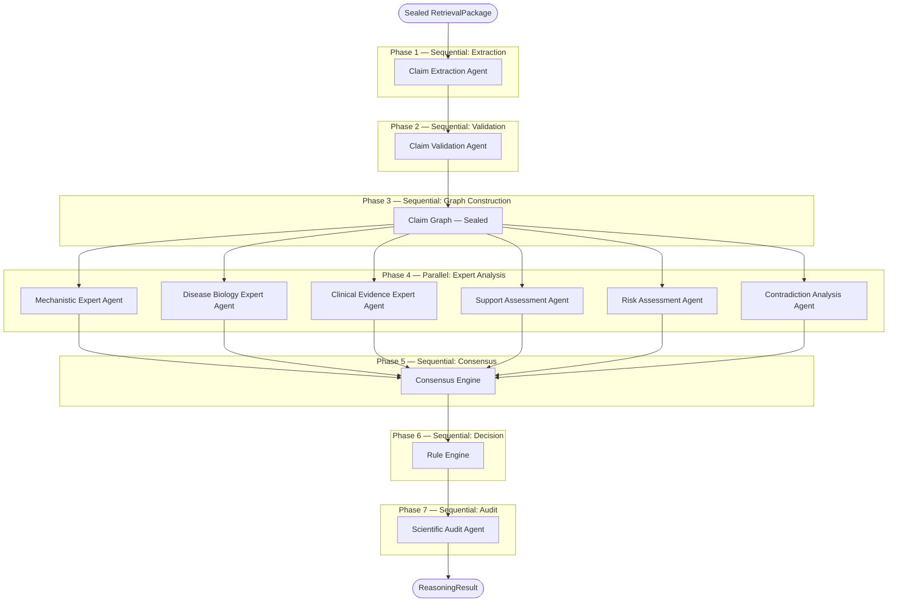

# CYNTHERA: Reasoning Subsystem Specification
## Reference Identifier: 04_REASONING_SPECIFICATION.md

---

## 1. Reasoning Philosophy

### 1.1 The Scientific Intelligence of CYNTHERA

The Reasoning Subsystem is the scientific intelligence of CYNTHERA. It transforms structured, validated evidence into reproducible, explainable scientific conclusions. Everything that precedes it — identifier resolution, API retrieval, normalization, canonical mapping — is infrastructure. This is the novelty.

### 1.2 Core Reasoning Principles

*   **Evidence before conclusions**: No conclusion is drawn without a supporting claim backed by retrieved evidence. The reasoning engine never invents, synthesizes, or infers without a grounded evidence chain.
*   **Mechanism before correlation**: Statistical co-occurrence is not sufficient grounds for a recommendation. A plausible mechanistic pathway connecting the drug to the disease must be traceable. Correlation elevates the prior; it does not establish the conclusion.
*   **Contradictions reduce certainty**: When two pieces of evidence conflict, neither is silently discarded. Both are preserved. The contradiction is registered, scored, and explicitly reported. Its resolution is left to the evidence hierarchy, not to omission.
*   **LLMs assist but never decide**: Large language models are used exclusively to extract structured claims from unstructured text (literature abstracts, mechanism descriptions). They are never used to score evidence, generate recommendations, or resolve contradictions. Every decision-bearing operation is deterministic.
*   **Every conclusion must be reproducible**: Given the same immutable `RetrievalPackage`, the same reasoning rules, and the same version of the Reasoning Engine, the system must produce an identical `ReasoningResult`. Reproducibility is enforced through deterministic pipelines, versioned rule sets, and explicit agent output contracts.
*   **Uncertainty is first-class**: The system does not suppress uncertainty. Missing evidence, sparse literature, unresolved pathways, and conflicting studies are tracked, quantified, and reported in the final Scientific Audit Report. A recommendation with high uncertainty is qualitatively different from one with low uncertainty, and that difference is always visible.

---

## 2. Hybrid Architecture Boundary

### 2.1 CYNTHERA is Not a Fully Agentic Platform

CYNTHERA follows a **Hybrid Architecture**. Engineering operations are deterministic. Scientific interpretation is agentic. This separation is the central design principle of the system and must be preserved at every layer.

The transition point between deterministic engineering and agentic reasoning is the `RetrievalPackage` boundary. Everything upstream of it is pure engineering. Everything downstream of it is coordinated scientific reasoning.

```
ENGINEERING LAYER (Deterministic)
─────────────────────────────────
User
  |
  v
Master Orchestrator
  |
  v
Identifier Resolution Service
  |
  v
Retrieval Planner + Query Optimizer
  |
  v
Retrieval Layer (API Connectors)
  |
  v
Normalization + Mapping Registry
  |
  v
Canonical Domain Object Factory
  |
  v
Quality Gate
  |
  v
Sealed RetrievalPackage

─────────────────────────────────
REASONING LAYER (Coordinated Agentic)
─────────────────────────────────
Reasoning Orchestrator
  |
  v
[Reasoning Agents — see Section 4]
```

The line between these two layers is hard. No reasoning agent may call an external API. No engineering component may perform scientific interpretation.

### 2.2 What the Hybrid Architecture Means in Practice

| Layer | Mode | Example Operations |
| :--- | :--- | :--- |
| Engineering | Deterministic | Identifier resolution, API calls, normalization, canonical mapping, caching |
| Reasoning | Agentic + Deterministic | Claim extraction (agentic), scoring (deterministic), consensus (deterministic), recommendation (deterministic) |

The agentic components of the reasoning layer are the expert agents that produce structured assessments. They may use LLMs for extraction tasks. The deterministic components — the Consensus Engine and Rule Engine — never use LLMs and produce identical outputs for identical inputs.

---

## 3. Multi-Agent Reasoning Philosophy

### 3.1 A Multidisciplinary Research Team in Software

CYNTHERA's Reasoning Subsystem is modeled on a multidisciplinary biomedical research team rather than a single monolithic reasoning engine. Each reasoning agent represents an independent scientific expert with a single, bounded responsibility.

This design choice reflects the reality of how drug repurposing decisions are made in practice: a pharmacologist evaluates mechanism, an oncologist evaluates disease biology, a clinical trialist evaluates human evidence, a toxicologist evaluates risk, and a biostatistician synthesizes the conflicting evidence. No single person makes the decision; consensus does.

In CYNTHERA, the same principle holds:

*   The **Mechanistic Expert Agent** is the pharmacologist.
*   The **Disease Biology Expert Agent** is the clinical scientist.
*   The **Clinical Evidence Expert Agent** is the trialist.
*   The **Support Assessment Agent** is the advocate.
*   The **Risk Assessment Agent** is the devil's advocate.
*   The **Contradiction Analysis Agent** is the skeptic.
*   The **Consensus Engine** is the chair of the committee.
*   The **Rule Engine** is the institutional protocol.

### 3.2 Agent Design Constraints

All reasoning agents operate under the following inviolable constraints:

*   **Single Responsibility**: Each agent owns exactly one scientific question. No agent crosses into another agent's domain.
*   **Structured Output Only**: Agents produce typed, schema-validated output objects. No agent may return free-form text as its scientific conclusion.
*   **No Direct Recommendation**: No individual agent produces a `RecommendationStatus`. That authority belongs exclusively to the Rule Engine after the Consensus Engine has synthesized all agent outputs.
*   **Immutable Inputs**: Agents consume the sealed `ClaimGraph` and `RetrievalPackage`. Neither may be modified by any agent.
*   **Logged Reasoning**: Every agent records its reasoning steps, inputs consumed, and output produced in a structured reasoning log.

### 3.3 The Canonical System Description

CYNTHERA is a **hybrid multi-agent biomedical reasoning platform** in which deterministic engineering components acquire and normalize biomedical evidence, while specialized scientific reasoning agents independently evaluate mechanistic plausibility, disease relevance, clinical evidence, support, risk, and contradictions. Their outputs are synthesized through a deterministic Consensus Engine and Rule Engine to produce an explainable, reproducible recommendation.

---

## 4. Reasoning Architecture

### 4.1 Subsystem Boundary

The Reasoning Subsystem accepts a sealed, immutable `RetrievalPackage` from the Retrieval Layer. It produces a `ReasoningResult` — a structured scientific output containing an immutable `ClaimGraph`, agent assessments, consensus output, scores, a recommendation, an uncertainty report, and a full audit trail.

The Reasoning Subsystem never calls external APIs. It never modifies the `RetrievalPackage`. It reasons exclusively over the canonical objects it receives.

### 4.2 Multi-Agent Reasoning Architecture



---

## 5. Canonical Reasoning Pipeline

### 5.1 Step-by-Step Execution

The multi-agent reasoning pipeline executes in ordered phases. Phases 1 through 3 are sequential. Phase 4 is parallel. Phases 5 through 7 are sequential.



### 5.2 Execution Phase Summary

| Phase | Stage | Mode | Output |
| :--- | :--- | :--- | :--- |
| Phase 1 | Claim Extraction Agent | Sequential | Raw Claim objects |
| Phase 2 | Claim Validation Agent | Sequential | Validated Claim objects |
| Phase 3 | Claim Graph Construction | Sequential | Sealed, immutable ClaimGraph |
| Phase 4 | Six Expert Agents | **Parallel** | Six structured Assessment objects |
| Phase 5 | Consensus Engine | Sequential | Consensus Assessment |
| Phase 6 | Rule Engine | Sequential | RecommendationStatus + reasoning |
| Phase 7 | Scientific Audit Agent | Sequential | ScientificAuditReport + ReasoningResult |

---

## 6. Reasoning Orchestrator

### 6.1 Purpose

The Reasoning Orchestrator is the coordination layer of the Reasoning Subsystem. It does not perform scientific reasoning. It manages the lifecycle of the reasoning session: scheduling agent execution, managing inter-agent dependencies, collecting outputs, validating intermediate objects, handling failures, invoking the Consensus Engine and Rule Engine, and assembling the final `ReasoningResult`.

The Reasoning Orchestrator is the exact analogue of the Master Orchestrator at the engineering layer — its responsibility is coordination, not cognition.

### 6.2 Responsibilities

*   Receive the sealed `RetrievalPackage` from the Master Orchestrator.
*   Instantiate and invoke the Claim Extraction Agent.
*   Receive extracted claims, instantiate and invoke the Claim Validation Agent.
*   Seal the `ClaimGraph` once validation completes.
*   Dispatch all six Expert Agents in parallel against the sealed `ClaimGraph`.
*   Collect and validate all six Assessment objects.
*   Invoke the Consensus Engine with the six Assessment objects.
*   Pass the `ConsensusAssessment` to the Rule Engine.
*   Pass the `RecommendationStatus` and all intermediate objects to the Scientific Audit Agent.
*   Assemble and return the final `ReasoningResult` to the Master Orchestrator.

### 6.3 Failure Handling

| Failure Scenario | Orchestrator Response |
| :--- | :--- |
| Claim Extraction Agent fails completely | Terminate reasoning session; return `REASONING_FAILURE` with reason `CLAIM_EXTRACTION_FAILED`. |
| Claim Validation Agent rejects all claims | Terminate with `INSUFFICIENT_VALIDATED_CLAIMS`. |
| One parallel Expert Agent fails | Mark that Assessment as `UNAVAILABLE`; Consensus Engine proceeds with remaining inputs; warning added to audit. |
| Two or more parallel Expert Agents fail | Terminate with `CONSENSUS_INPUT_INSUFFICIENT`. |
| Consensus Engine fails | Terminate with `CONSENSUS_FAILURE`. |
| Rule Engine fails | Terminate with `RULE_ENGINE_FAILURE`. |
| Scientific Audit Agent fails | Return `ReasoningResult` without audit; flag `audit_unavailable = true`. |

### 6.4 Orchestrator Output

The Reasoning Orchestrator produces a `ReasoningSessionManifest` attached to the `ReasoningResult`, analogous to the `RetrievalManifest` in the Retrieval Layer:

```
ReasoningSessionManifest
|
+-- session_id               (UUID)
+-- retrieval_package_id     (UUID)
+-- started_at               (ISO-8601)
+-- completed_at             (ISO-8601)
+-- duration_ms              (Integer)
+-- agents_invoked           (List[String])
+-- agents_succeeded         (List[String])
+-- agents_failed            (List[String])
+-- claim_extraction_model   (String)   -- LLM model version used
+-- rule_set_version         (String)
+-- reasoning_engine_version (String)
+-- warnings                 (List[String])
```

---

## 7. The Claim Graph

### 7.1 Why a Claim Graph?

The most important architectural decision in the Reasoning Subsystem is the introduction of the **Claim Graph** as the central reasoning object. All downstream reasoning — contradiction detection, mechanistic chain building, score computation, and recommendation logic — operates over the Claim Graph, not directly over raw evidence.

This decision produces three concrete benefits:

*   **Extraction is separated from reasoning**: Claim Extraction is an impure operation (involving an LLM). Claim Validation is deterministic. The Claim Graph is the clean boundary between these two modes. Everything after graph construction is fully deterministic.
*   **Auditability**: The Claim Graph is a persistent, inspectable object. Any conclusion can be traced to the specific graph node (Claim) and edge (relationship) that produced it.
*   **Extensibility**: Future reasoning paradigms — Bayesian inference, graph neural networks, multi-hop traversal, Neo4j integration — all operate naturally over a structured claim graph rather than over unstructured text.

### 7.2 Claim Graph Immutability

The Claim Graph is sealed immediately after Phase 3 (Claim Validation). Once sealed:

*   No agent may add, remove, or modify any node or edge.
*   No agent may alter ERW values on any Claim node.
*   Rejected claims are retained in `ClaimGraph.rejected_claims` as archived nodes with status `REJECTED`.
*   The Claim Graph is transmitted to all six parallel Expert Agents as a read-only reference.

### 7.3 Claim Graph Structure

```
ClaimGraph  [IMMUTABLE after Phase 3]
|
+-- nodes            (List[Claim])         -- All validated, weighted claims
+-- edges            (List[ClaimRelation]) -- Semantic relationships between claims
+-- drug_node        (Reference)           -- Canonical Drug entity (graph root)
+-- disease_node     (Reference)           -- Canonical Disease entity (graph sink)
+-- rejected_claims  (List[Claim])         -- Claims rejected during validation
+-- metadata
    +-- total_claims
    +-- validated_claims
    +-- rejected_claims
    +-- construction_timestamp
    +-- sealed_at              (ISO-8601)
```

### 7.4 Claim Graph Edge Types

| Edge Type | Meaning |
| :--- | :--- |
| **Supports** | Claim A provides supporting evidence for Claim B |
| **Contradicts** | Claim A directly contradicts Claim B (bidirectional) |
| **Precedes** | Claim A must be true for Claim B to follow mechanistically (forms the Mechanistic Chain subgraph) |
| **Amplifies** | Claim A increases the strength of Claim B (independent replication) |

---

## 8. Agent Specifications

---

### 8.1 Claim Extraction Agent

**Purpose**: Convert unstructured biomedical text from the `RetrievalPackage` into structured, typed `Claim` objects. This is the only agent in the Reasoning Subsystem that may use a large language model.

**Scientific Responsibility**: Read literature abstracts, DrugBank MoA descriptions, and trial result narratives. Extract explicit biological relationships as semantic triplets.

**Inputs**:
*   Sealed `RetrievalPackage` (Evidence objects of type `LiteratureRecord`, MoA text fields on `Drug`)

**Outputs**:
*   List of raw `Claim` objects (unvalidated) passed to the Claim Validation Agent

**A Claim is a semantic triplet with metadata**:

```
Claim
|
+-- subject          (Entity)   -- The entity initiating the relationship (e.g., "Sildenafil")
+-- predicate        (Enum)     -- Directional mechanism from PredicateType vocabulary
+-- object           (Entity)   -- The entity receiving the relationship (e.g., "PDE5A")
+-- direction        (Enum)     -- POSITIVE | NEGATIVE | BIDIRECTIONAL | UNKNOWN
+-- confidence       (Float)    -- LLM-assigned extraction confidence (0.0 to 1.0)
+-- negated          (Boolean)  -- Whether the claim is explicitly negated in source text
+-- context          (String)   -- Excerpt from source text supporting the extraction
+-- provenance       (ProvenanceReference) -- Links to parent Evidence object
```

**LLM Authority Boundaries**:

The LLM is a claim extraction tool, not a reasoning participant. Its authority is tightly bounded.

| The LLM May | The LLM May Not |
| :--- | :--- |
| Read the text of an Evidence object | Generate claims not grounded in the source text |
| Extract (subject, predicate, object) triplets explicitly stated in the text | Score, rank, or compare claims against each other |
| Assign an extraction confidence score | Resolve contradictions between claims |
| Flag a claim as negated when source text contains explicit negation | Assign Evidence Reliability Weights |
| Return multiple claims from a single evidence record | Contribute to the Recommendation |
| Decline to extract when text is ambiguous | Modify any object in the RetrievalPackage |

**Extraction Quality Controls**:
*   Claims with confidence below the configured threshold (default: 0.6) are forwarded with a `LOW_CONFIDENCE` flag for the Validation Agent to reject.
*   Every extraction run is logged with the LLM model version, temperature setting, and prompt template version.
*   The agent logs the count of evidence records processed, claims extracted, and claims flagged as low-confidence.

**Failure Handling**: If the LLM API is unavailable, the agent retries up to 3 times with exponential backoff. If all retries fail and no claims are extracted, the agent returns an empty list with status `EXTRACTION_FAILED`. The Orchestrator terminates the reasoning session.

**Future Extensions**: Structured data extraction from ChEMBL assay narratives; multi-language abstract processing; extraction confidence calibration using a held-out benchmark.

---

### 8.2 Claim Validation Agent

**Purpose**: Apply deterministic structural and semantic validation rules to every raw claim before it enters the Claim Graph.

**Scientific Responsibility**: Ensure that every claim entering the Claim Graph is syntactically correct, semantically coherent, and resolvable to canonical domain entities.

**Inputs**:
*   List of raw `Claim` objects from the Claim Extraction Agent
*   Sealed `RetrievalPackage` (used to resolve entity identifiers)

**Outputs**:
*   Validated `Claim` objects (input to Claim Graph construction)
*   Rejected `Claim` objects with rejection reason codes (archived in Claim Graph)

**This agent is fully deterministic. No LLM is used.**

**Validation Rules**:

| Rule | Description | Action on Failure |
| :--- | :--- | :--- |
| **Entity Resolution** | Subject and object must resolve to canonical entity identifiers present in the RetrievalPackage. | Reject; log `UNRESOLVABLE_ENTITY`. |
| **Predicate Validity** | Predicate must be a recognized value from the `PredicateType` controlled vocabulary (02_DOMAIN_MODEL.md §2.1). | Reject; log `INVALID_PREDICATE`. |
| **Direction Consistency** | If the predicate implies a direction (e.g., `INHIBITS` implies NEGATIVE), the `direction` field must agree. | Reject; log `DIRECTION_MISMATCH`. |
| **Self-Referential Rejection** | Subject and object must not be the same entity. | Reject; log `SELF_REFERENTIAL_CLAIM`. |
| **Minimum Confidence** | Extraction confidence must exceed the configured threshold. | Reject; log `LOW_CONFIDENCE_EXTRACTION`. |
| **Negation Inversion** | If `negated = true`, the predicate direction is inverted before graph insertion. | Invert direction; retain claim. |
| **Duplicate Merging** | Claims identical in (subject, predicate, object, direction, source) are merged. | Merge; increment replication count on surviving claim. |

**Failure Handling**: If the Claim Validation Agent rejects 100% of submitted claims (zero validated claims), the Orchestrator terminates the reasoning session with `INSUFFICIENT_VALIDATED_CLAIMS`.

---

### 8.3 Mechanistic Expert Agent

**Purpose**: Construct and evaluate the biological pathway chain connecting the drug to the disease.

**Scientific Responsibility**: Answer the question: *Is there a credible, experimentally supported biological mechanism by which this drug could affect this disease?*

**Inputs**:
*   Sealed `ClaimGraph`
*   `RetrievalPackage` (Pathway, Protein, Target objects)

**Outputs**:
*   `MechanisticAssessment` object containing:
    *   `chain_status` (COMPLETE | PARTIAL | INCOMPLETE | CONTRADICTED)
    *   `validated_chains` (List of `MechanisticChain` objects)
    *   `mechanistic_score_level` (HIGH | MEDIUM | LOW | NONE)
    *   `step_authority_breakdown` (Per-step evidence quality)
    *   `reasoning_log` (Ordered list of decisions made)

**This agent is deterministic. No LLM is used.**

**The Canonical Mechanistic Chain**:

```
Drug
 |
 | [INHIBITS / ACTIVATES / BINDS]
 v
Drug Target (Protein)
 |
 | [PARTICIPATES IN]
 v
Biological Pathway
 |
 | [REGULATES / INVOLVES]
 v
Disease-Implicated Gene / Protein
 |
 | [ASSOCIATED_WITH / CAUSES]
 v
Disease
```

Each arrow corresponds to one or more `Claim` nodes in the Claim Graph connected by `Precedes` edges.

**Chain Construction Algorithm**:
1.  Identify all Claims where the subject is the canonical `Drug` entity.
2.  From drug-target Claims, follow `Precedes` edges through proteins, pathways, and disease-associated genes.
3.  A chain is complete when it reaches a Claim where the object is the canonical `Disease` entity, or a gene/protein explicitly associated with the disease via DisGeNET or MeSH annotation.
4.  A candidate chain is promoted to the `MechanisticChainRegistry` only if it passes all validity criteria.
5.  Incomplete chains (reaching the pathway level but not connecting to a disease gene) are retained as partial evidence.

**Chain Validity Criteria**:

| Criterion | Requirement |
| :--- | :--- |
| Minimum depth | Chain must contain at least three nodes: Drug -> Target -> Pathway or Disease-Gene |
| No disconnected jumps | Each step must be supported by at least one Claim with ERW above minimum threshold |
| Direction consistency | Modulation direction must be biologically coherent across all steps |
| No circular paths | Chain must be a directed acyclic path |
| Source authority | Pathway membership claims must originate from Reactome or an equivalent authority database |

**Mechanistic Score Levels**:

| Level | Condition |
| :--- | :--- |
| **HIGH** | Complete chain constructed. All steps experimentally supported. Primary target is a known disease gene. No STRONG contradictions at any chain step. |
| **MEDIUM** | Chain constructed with at least two experimentally supported steps. Target participates in a disease-relevant pathway. At most one MODERATE contradiction. |
| **LOW** | Chain incomplete or relies primarily on computational steps. No direct target-disease gene link. One or more STRONG contradictions at a chain step. |
| **NONE** | No mechanistic chain could be constructed. No pathway link between drug target and disease. |

**Failure Handling**: If pathway data is unavailable (Reactome failed in retrieval), the agent marks all chain steps that require pathway data as `PATHWAY_DATA_UNAVAILABLE`. The chain is marked `INCOMPLETE` with a warning. Mechanistic score is set to LOW.

**Future Extensions**: Multi-hop mechanistic reasoning beyond five steps; Neo4j Cypher-based chain traversal; structural biology plausibility verification.

---

### 8.4 Disease Biology Expert Agent

**Purpose**: Evaluate the biological relevance of the drug's known mechanism to the target disease's pathophysiology.

**Scientific Responsibility**: Answer the question: *Is the drug acting on a pathway that is actually relevant to how this disease works?*

**Inputs**:
*   Sealed `ClaimGraph`
*   `RetrievalPackage` (Disease object, DisGeNET gene-disease associations, pathway annotations)

**Outputs**:
*   `DiseaseRelevanceAssessment` object containing:
    *   `relevance_level` (HIGH | MEDIUM | LOW | NONE)
    *   `disease_genes_implicated` (List of gene symbols confirmed as disease-associated)
    *   `pathway_overlap_count` (Number of pathways shared between drug target and disease)
    *   `primary_target_is_disease_gene` (Boolean)
    *   `reasoning_log`

**This agent is deterministic. No LLM is used.**

**Relevance Assessment Inputs**:

| Input | Description |
| :--- | :--- |
| DisGeNET GDA scores | Gene-disease association scores for the drug's target proteins |
| MeSH-annotated pathway links | Whether disease-annotated pathways overlap with drug target pathways |
| Reactome disease annotations | Whether the drug target participates in pathways annotated to this disease class |
| Literature claims about disease mechanism | Claims in the Claim Graph asserting the target protein is implicated in this disease |

**Failure Handling**: If DisGeNET data was unavailable during retrieval, the agent proceeds using MeSH pathway annotations and Claim Graph-derived disease associations. The assessment is marked `PARTIAL_DATA`. Relevance level is capped at MEDIUM.

---

### 8.5 Clinical Evidence Expert Agent

**Purpose**: Evaluate the quality and direction of human clinical evidence bearing on the drug-disease hypothesis.

**Scientific Responsibility**: Answer the question: *What does human clinical evidence — trials, systematic reviews, observational studies — say about this drug-disease pair?*

**Inputs**:
*   Sealed `ClaimGraph` (Claims derived from clinical literature)
*   `RetrievalPackage` (ClinicalTrial objects, Evidence objects of type META_ANALYSIS, RCT, OBSERVATIONAL)

**Outputs**:
*   `ClinicalEvidenceAssessment` object containing:
    *   `clinical_evidence_level` (STRONG | MODERATE | WEAK | ABSENT)
    *   `positive_trials` (List of ClinicalTrial references with COMPLETED_SUCCESS outcome)
    *   `negative_trials` (List of ClinicalTrial references with COMPLETED_FAILURE outcome)
    *   `terminated_safety_trials` (List of ClinicalTrial references with TERMINATED_SAFETY outcome)
    *   `terminated_efficacy_trials` (List of ClinicalTrial references with TERMINATED_LACK_OF_EFFICACY)
    *   `highest_erw_clinical_claim` (Reference to the highest-weight clinical Claim in the graph)
    *   `reasoning_log`

**This agent is deterministic. No LLM is used.**

**Clinical Evidence Hierarchy applied by this agent** (identical to the ERW hierarchy in Section 11):

| Rank | Evidence Type | Weight |
| :--- | :--- | :--- |
| 1 | META_ANALYSIS | Highest |
| 2 | RCT | High |
| 3 | OBSERVATIONAL | Medium |

**Failure Handling**: If ClinicalTrials.gov data was unavailable during retrieval, the agent sets `clinical_evidence_level = ABSENT` and flags `trial_data_unavailable = true`. The assessment is returned with a warning. The Consensus Engine and Rule Engine receive this warning and apply the safety lock described in Section 14.

---

### 8.6 Support Assessment Agent

**Purpose**: Aggregate all evidence that favors the drug-disease hypothesis and produce a structured Support Assessment.

**Scientific Responsibility**: Answer the question: *Across all available evidence, how strong is the case for this drug being beneficial for this disease?*

**Inputs**:
*   Sealed `ClaimGraph`
*   `RetrievalPackage`

**Outputs**:
*   `SupportAssessment` object containing:
    *   `support_level` (HIGH | MEDIUM | LOW | ABSENT)
    *   `contributing_claims` (List of Claim references that positively contributed)
    *   `dominant_evidence_type` (The EvidenceType with highest aggregate ERW contribution)
    *   `replication_index` (Number of independent sources corroborating the primary hypothesis claim)
    *   `reasoning_log`

**This agent is deterministic. No LLM is used.**

**This agent does not consider contradictory evidence.** The Contradiction Analysis Agent is the sole owner of contradiction assessment. The Support Assessment Agent intentionally considers only supportive evidence — the Consensus Engine integrates both perspectives.

**What Increases Support**:

| Factor | Mechanism |
| :--- | :--- |
| High-ERW evidence | Claims from RCTs and meta-analyses contribute more than computational predictions |
| Independent replication | Multiple independent studies converging on the same claim multiplicatively increase support |
| Clinical evidence of efficacy | COMPLETED_SUCCESS trial outcomes are the strongest single support signal |
| Multi-database agreement | Multiple registered sources independently asserting the same drug-target relationship |
| Mechanistic chain completeness | Complete validated mechanistic chain provides biological explanation for observed correlation |

**What Limits Support** (recognized by the agent, but not used to reduce the support signal — passed to Consensus Engine):
*   Literature-only evidence without clinical or in-vivo corroboration limits the maximum achievable support level.
*   LOW Retrieval Confidence reduces the effective ceiling of the support level.

---

### 8.7 Risk Assessment Agent

**Purpose**: Evaluate all evidence suggesting the drug may be harmful, ineffective, or clinically contraindicated for the disease.

**Scientific Responsibility**: Answer the question: *Across all available evidence, what is the magnitude of the negative signal against this drug-disease pair?*

**Inputs**:
*   Sealed `ClaimGraph`
*   `RetrievalPackage` (ClinicalTrial objects, adverse event-related Evidence)

**Outputs**:
*   `RiskAssessment` object containing:
    *   `risk_level` (HIGH | MEDIUM | LOW)
    *   `terminated_safety` (Boolean — whether any TERMINATED_SAFETY trial exists for Phase >= 2)
    *   `failed_phase3_count` (Integer)
    *   `adverse_event_claims` (List of Claim references asserting adverse effects)
    *   `mechanistic_gap` (Boolean — whether the mechanistic chain is INCOMPLETE or NONE)
    *   `off_target_risk_proteins` (List of Protein references with adverse-association binding)
    *   `reasoning_log`

**This agent is deterministic. No LLM is used.**

**What Increases Risk**:

| Factor | Mechanism |
| :--- | :--- |
| Terminated clinical trials | Trials terminated for SAFETY or TERMINATED_LACK_OF_EFFICACY are the strongest single Risk signal |
| Adverse event reports | Clinical literature reporting significant adverse events, toxicity, or off-target effects |
| Strong mechanistic contradictions | STRONG contradiction at a critical mechanistic chain step constitutes a mechanistic risk |
| Mechanistic gaps | No pathway connecting drug target to disease increases biological implausibility |
| Negative Phase III evidence | Failed Phase III trials carry disproportionately high Risk weight |
| Off-target protein binding | ChEMBL bioactivity records showing binding to proteins associated with adverse effects |

**What Decreases Risk**:

| Factor | Mechanism |
| :--- | :--- |
| Prior regulatory approval | Approved drug in any indication has partially established safety profile |
| Clean trial record | No terminated or failed trials for this specific drug-disease pair |
| Mechanism-consistent effects | All off-target binding effects are mechanistically consistent with the therapeutic hypothesis |

**Failure Handling**: If ClinicalTrials.gov data was unavailable during retrieval, the agent sets `terminated_safety = UNVERIFIED` and `failed_phase3_count = UNVERIFIED`. Risk level is set to MEDIUM at minimum. The warning propagates to the Consensus Engine and Rule Engine.

---

### 8.8 Contradiction Analysis Agent

**Purpose**: Systematically detect all claim-level and evidence-level contradictions within the Claim Graph and produce a structured Contradiction Report.

**Scientific Responsibility**: Answer the question: *Where does the evidence conflict, how severe are those conflicts, and how are they resolved?*

**Inputs**:
*   Sealed `ClaimGraph`
*   `RetrievalPackage`

**Outputs**:
*   `ContradictionReport` object containing:
    *   `total_contradictions` (Integer)
    *   `strong_contradictions` (Integer)
    *   `moderate_contradictions` (Integer)
    *   `weak_contradictions` (Integer)
    *   `contradiction_registry` (List of `Contradiction` objects — see structure below)
    *   `unresolved_contradictions` (List of Contradiction references where resolution = UNRESOLVED)
    *   `reasoning_log`

**This agent is deterministic. No LLM is used.**

**Contradiction Types**:

#### Direct Mechanistic Contradiction

Two claims assert opposite directions of effect for the same (subject, predicate, object) relationship.

```
Claim A: Sildenafil [INHIBITS] PDE5A   (direction: NEGATIVE)
Claim B: Sildenafil [ACTIVATES] PDE5A  (direction: POSITIVE)
```

Both claims are retained. A `Contradicts` edge is created between them in the Claim Graph. Both are logged.

#### Clinical Contradiction

A drug shows efficacy in one clinical trial and fails to meet endpoints in another for the same indication.

```
Claim A: Sildenafil improves 6-minute walk distance in PAH [RCT, 2005]
Claim B: Sildenafil shows no significant benefit over placebo in PAH [RCT, 2018]
```

The higher-ERW claim is weighted more heavily in scoring, but neither is discarded.

#### Database Contradiction

Two authoritative databases report conflicting values for the same entity property.

```
Source A (ChEMBL): Drug X IC50 for Target Y = 5 nM
Source B (BindingDB): Drug X IC50 for Target Y = 2500 nM
```

The authoritative source (per Source Registry priority in 03_RETRIEVAL_SPECIFICATION.md §3.3) is preferred. The discrepancy is logged.

#### Mechanistic Contradiction

A downstream pathway claim is incompatible with the known direction of the drug's primary mechanism.

```
Primary mechanism: Drug inhibits kinase A
Downstream claim:  Inhibition of kinase A increases pathway B activity
Contradictory claim: Pathway B activity required for disease progression
```

This type of contradiction invalidates the mechanistic chain at the step of the contradiction, forcing the chain to `CONTRADICTED` status.

**Contradiction Object Structure**:

```
Contradiction
|
+-- contradiction_id    (UUID)
+-- type                (Enum: MECHANISTIC | CLINICAL | DATABASE | DIRECTIONAL)
+-- claim_a             (Reference to Claim)
+-- claim_b             (Reference to Claim)
+-- severity            (Enum: STRONG | MODERATE | WEAK)
+-- resolution          (Enum: CLAIM_A_PREFERRED | CLAIM_B_PREFERRED | UNRESOLVED)
+-- resolution_basis    (String: explanation of resolution rule applied)
+-- impact_on_scores    (String: which assessments this contradiction affects)
```

**Contradiction Severity**:

| Severity | Condition |
| :--- | :--- |
| **STRONG** | Both claims carry high ERW (e.g., both are RCTs or both are authoritative database entries) |
| **MODERATE** | One claim carries high ERW; the other carries medium ERW |
| **WEAK** | One or both claims carry low ERW (e.g., one is computational) |

---

## 9. Evidence Reliability Weighting

### 9.1 Purpose

Evidence Reliability Weight (ERW) is the epistemic authority scalar assigned to every validated Claim based on the `EvidenceType` of its source Evidence record. It is not a probability. It is an ordered qualitative scalar that modulates each Claim's contribution to the downstream assessments computed by the Expert Agents.

ERW assignment occurs during Phase 3 (Claim Graph construction), after validation and before sealing. It is a property of every Claim node in the sealed Claim Graph.

### 9.2 Evidence Type Hierarchy

| Rank | Evidence Type | Epistemic Basis |
| :--- | :--- | :--- |
| 1 (Highest) | META_ANALYSIS | Statistical synthesis of multiple controlled trials |
| 2 | RCT | Randomized, double-blind, controlled clinical trial |
| 3 | SYSTEMATIC_REVIEW | Structured qualitative synthesis of primary studies |
| 4 | OBSERVATIONAL | Human cohort, case-control, or epidemiological study |
| 5 | IN_VIVO | Animal model experiment |
| 6 | IN_VITRO | Cell line or molecular assay experiment |
| 7 (Lowest) | COMPUTATIONAL | Machine learning prediction or graph proximity score |

### 9.3 ERW Modifiers

| Modifier | Effect | Rationale |
| :--- | :--- | :--- |
| **Source Authority** | CRITICAL source (ChEMBL, UniProt) -> ERW boost | Authoritative databases carry higher epistemic weight |
| **Replication Count** | Each independent replication adds a fractional ERW increment | Independent replication is strong positive evidence |
| **Recency** | Evidence older than 10 years -> mild ERW reduction | Older evidence may not reflect current biological understanding |
| **Preprint Flag** | Source is a preprint (not peer-reviewed) -> ERW reduction | Preprints have not passed formal peer review |
| **Retrieval Confidence** | LOW Retrieval Confidence -> global ERW reduction applied to all claims | Package completeness affects weight of its evidence |

### 9.4 ERW Propagation Rule

When multiple evidence records support the same claim (identical or near-identical triplets), the ERW of the surviving merged claim is a dampened aggregate that increases with independent replication but respects a ceiling, preventing a hypothesis from being inflated by many low-quality replications of the same finding.

---

## 10. Consensus Engine

### 10.1 Purpose

The Consensus Engine is the synthesis component of the Reasoning Subsystem. It receives the six structured Assessment objects produced by the parallel Expert Agents and integrates them into a unified `ConsensusAssessment`.

The Consensus Engine is the sole component permitted to compare and reconcile the outputs of different Expert Agents. No individual Expert Agent has visibility into another agent's output.

### 10.2 Constraints

*   **The Consensus Engine is fully deterministic.** No LLM is used.
*   It does not perform scientific reasoning of its own. It integrates structured outputs.
*   It does not produce a `RecommendationStatus`. That is the exclusive responsibility of the Rule Engine.
*   It does not modify any Assessment object. It reads them and produces a new, synthesized object.

### 10.3 Consensus Inputs

| Input | Source Agent |
| :--- | :--- |
| MechanisticAssessment | Mechanistic Expert Agent |
| DiseaseRelevanceAssessment | Disease Biology Expert Agent |
| ClinicalEvidenceAssessment | Clinical Evidence Expert Agent |
| SupportAssessment | Support Assessment Agent |
| RiskAssessment | Risk Assessment Agent |
| ContradictionReport | Contradiction Analysis Agent |

### 10.4 Consensus Output

```
ConsensusAssessment
|
+-- support_score_level          (Enum: HIGH | MEDIUM | LOW | ABSENT)
+-- mechanistic_score_level      (Enum: HIGH | MEDIUM | LOW | NONE)
+-- risk_score_level             (Enum: HIGH | MEDIUM | LOW)
+-- disease_relevance_level      (Enum: HIGH | MEDIUM | LOW | NONE)
+-- clinical_evidence_level      (Enum: STRONG | MODERATE | WEAK | ABSENT)
+-- strong_contradiction_count   (Integer)
+-- trial_data_available         (Boolean)
+-- terminated_safety_flag       (Boolean)
+-- uncertainty_level            (Enum: HIGH | MEDIUM | LOW)
+-- consensus_warnings           (List[String])
+-- input_assessments            (References to all six input Assessment objects)
```

### 10.5 Disagreement Resolution

The Consensus Engine applies deterministic resolution rules when agent assessments conflict. Examples:

*   If `SupportAssessment.support_level = HIGH` but `ContradictionReport.strong_contradictions >= 1`, the effective support level passed to the Rule Engine is downgraded to MEDIUM.
*   If `ClinicalEvidenceAssessment.terminated_safety_flag = true`, this is surfaced as a mandatory input to the Rule Engine regardless of other assessment levels.
*   If any Expert Agent returned `UNAVAILABLE`, the Consensus Engine records that gap in `consensus_warnings` and compensates by noting which score dimension is affected.

---

## 11. Scoring Architecture: Internal Numeric vs External Enum

### 11.1 Two-Stage Scoring Model

Scoring in CYNTHERA uses a two-stage model. Internally, all scores are computed as float values (0.0–1.0) by the Expert Agents. These numeric scores are then discretized to enum levels at the Consensus Engine boundary for consumption by the Rule Engine and the external API.

```
Internal (Expert Agents)       Boundary (Consensus Engine)       External (Rule Engine / API)
─────────────────────────      ─────────────────────────────     ──────────────────────────────
SupportScore = 0.82    ───→    Support → 0.70–1.00 = HIGH  ───→  support_level = HIGH
MechanisticScore = 0.65 ──→    Mechanistic → 0.40–0.69 = MEDIUM → mechanistic_level = MEDIUM
RiskScore = 0.22        ──→    Risk → 0.00–0.39 = LOW     ───→  risk_level = LOW
```

### 11.2 Numeric-to-Enum Mapping

| Enum Level | Numeric Range | Interpretation |
| :--- | :--- | :--- |
| HIGH | 0.70 – 1.00 | Strong evidence or high confidence |
| MEDIUM | 0.40 – 0.69 | Moderate evidence or moderate confidence |
| LOW | 0.15 – 0.39 | Weak evidence or low confidence |
| NONE / ABSENT | 0.00 – 0.14 | No evidence or baseline confidence only |

### 11.3 When the Mapping Is Applied

| Stage | Representation | Example |
| :--- | :--- | :--- |
| Expert Agent internal computation | Numeric (float 0.0–1.0) | `risk_score = compute_risk(...)` → `0.22` |
| Assessment object output | Numeric (float 0.0–1.0) | `RiskAssessment.risk_score = 0.22` |
| Consensus Engine discretization | Numeric → Enum | `risk_score (0.22)` → `risk_score_level (LOW)` |
| ConsensusAssessment (Rule Engine input) | Enum only | `ConsensusAssessment.risk_score_level = LOW` |
| API / UI presentation | Enum only | `"risk_level": "LOW"` |

This means the Rule Engine configuration in `01_SYSTEM_ARCHITECTURE.md §12` specifies thresholds as enum levels (e.g., `max_risk: "LOW"`). The mapping between numeric scores and enum levels is defined in §11.2 above and is applied deterministically by the Consensus Engine.

---

## 12. Rule Engine

### 12.1 Purpose

The Rule Engine is the final decision-making component of the Reasoning Subsystem. It receives the `ConsensusAssessment` and applies a versioned, auditable rule set to produce a `RecommendationStatus`.

### 12.2 Constraints

*   **The Rule Engine is fully deterministic.** No LLM is used.
*   Threshold values are configurable via the system configuration file (see `01_SYSTEM_ARCHITECTURE.md §12`).
*   All rule firings are logged. Every recommendation can be traced to the exact rule that produced it.
*   Rule set changes require a version bump. The active rule set version is recorded in the `ReasoningSessionManifest`.

### 12.3 Recommendation Rule Set

Rules are applied in strict priority order. The first matching rule wins.

---

**Rule 1 — Hard Veto: Safety**

```
IF
    ConsensusAssessment.terminated_safety_flag = true
    AND trial.phase >= 2
THEN
    RecommendationStatus = NOT_RECOMMENDED
    Reason = "Safety-terminated clinical trial on record. Safety veto applied."
    STOP
```

---

**Rule 2 — Hard Veto: Multiple High-Power Failures**

```
IF
    count(trials where outcome = COMPLETED_FAILURE and phase = 3) >= 2
THEN
    RecommendationStatus = NOT_RECOMMENDED
    Reason = "Two or more failed Phase III clinical trials. Efficacy veto applied."
    STOP
```

---

**Rule 3 — Hard Veto: No Mechanistic Basis**

```
IF
    ConsensusAssessment.mechanistic_score_level = NONE
THEN
    RecommendationStatus = NOT_RECOMMENDED
    Reason = "No mechanistic pathway connecting drug to disease. Biological plausibility absent."
    STOP
```

---

**Rule 4 — Hard Veto: Low Retrieval Confidence**

```
IF
    RetrievalManifest.retrieval_confidence = LOW
THEN
    RecommendationStatus = UNCERTAIN
    Reason = "Retrieval Confidence is LOW. Evidence base insufficient for confident recommendation."
    STOP
```

---

**Rule 5 — Hard Veto: Clinical Data Unavailable**

```
IF
    ConsensusAssessment.trial_data_available = false
THEN
    RecommendationStatus = UNCERTAIN
    Reason = "Clinical trial data unavailable. Cannot confirm absence of safety or efficacy failures."
    STOP
```

---

**Rule 6 — Strong Consensus: PROMISING**

```
IF
    ConsensusAssessment.support_score_level IN [HIGH, MEDIUM]
    AND ConsensusAssessment.mechanistic_score_level IN [HIGH, MEDIUM]
    AND ConsensusAssessment.risk_score_level = LOW
    AND ConsensusAssessment.strong_contradiction_count = 0
    AND ConsensusAssessment.uncertainty_level != HIGH
THEN
    RecommendationStatus = PROMISING
    STOP
```

---

**Rule 7 — Mixed Evidence: UNCERTAIN**

```
IF
    ConsensusAssessment.support_score_level = LOW
    OR ConsensusAssessment.mechanistic_score_level = LOW
    OR ConsensusAssessment.strong_contradiction_count >= 1
    OR ConsensusAssessment.risk_score_level = MEDIUM
    OR ConsensusAssessment.uncertainty_level = HIGH
THEN
    RecommendationStatus = UNCERTAIN
    STOP
```

---

**Rule 8 — Default**

```
OTHERWISE
    RecommendationStatus = UNCERTAIN
    Reason = "Insufficient evidence to determine recommendation direction."
```

---

### 12.4 Rule Versioning

The active rule set version is recorded in the `ReasoningSessionManifest`. Changes to recommendation rules require a version bump, and the rule diff is preserved in the audit log. This ensures that a recommendation produced under rule version 1.2 can be distinguished from one produced under rule version 1.3 even if the underlying ConsensusAssessment is identical.

---

## 13. Scientific Audit Agent

### 13.1 Purpose

The Scientific Audit Agent generates the final `ScientificAuditReport` and assembles the `ReasoningResult`. It converts the structured outputs of all reasoning stages into a human-readable, fully traceable scientific explanation.

### 13.2 Constraints

*   The Scientific Audit Agent **does not perform reasoning**.
*   It **does not modify scores or assessments**.
*   It **does not change the RecommendationStatus**.
*   It reads, formats, and structures. It explains conclusions; it does not make them.
*   It may use an LLM to generate human-readable summary text for the scientific explanation sections of the audit report, provided that LLM output is clearly labelled as `AI_GENERATED_SUMMARY` and is never used to alter any structured field.

### 13.3 Inputs

*   All six Expert Agent Assessment objects
*   `ConsensusAssessment`
*   `RecommendationStatus` and rule firing record from the Rule Engine
*   Sealed `ClaimGraph`
*   Sealed `RetrievalPackage`
*   `ReasoningSessionManifest`

### 13.4 ScientificAuditReport Structure

```
ScientificAuditReport
|
+-- hypothesis_id               (UUID)
+-- reasoning_session_id        (UUID)
+-- reasoning_engine_version    (String)
+-- rule_set_version            (String)
+-- generated_at                (ISO-8601)
|
+-- input_summary
|   +-- retrieval_package_id
|   +-- retrieval_confidence
|   +-- total_evidence_records
|   +-- total_validated_claims
|
+-- claim_graph_summary
|   +-- total_nodes
|   +-- validated_nodes
|   +-- rejected_nodes
|   +-- contradiction_edges
|
+-- agent_assessments
|   +-- mechanistic_assessment    (MechanisticAssessment reference)
|   +-- disease_relevance         (DiseaseRelevanceAssessment reference)
|   +-- clinical_evidence         (ClinicalEvidenceAssessment reference)
|   +-- support_assessment        (SupportAssessment reference)
|   +-- risk_assessment           (RiskAssessment reference)
|   +-- contradiction_report      (ContradictionReport reference)
|
+-- consensus_summary
|   +-- consensus_assessment      (ConsensusAssessment reference)
|   +-- consensus_warnings        (List[String])
|
+-- mechanistic_chain_summary
|   +-- chain_status              (COMPLETE | PARTIAL | INCOMPLETE | CONTRADICTED)
|   +-- chain_depth
|   +-- chain_steps               (List of Claim references forming the chain)
|   +-- supporting_pathways
|
+-- score_breakdown
|   +-- support_score_level
|   +-- mechanistic_score_level
|   +-- risk_score_level
|   +-- contributing_claims       (List of Claim references)
|
+-- contradiction_summary
|   +-- total_contradictions
|   +-- strong_contradictions
|   +-- unresolved_contradictions (List of Contradiction references)
|
+-- recommendation
|   +-- status                    (RecommendationStatus)
|   +-- rule_fired                (String: which rule produced the recommendation)
|   +-- reason                    (String: human-readable explanation)
|
+-- uncertainty_report            (UncertaintyReport — see Section 14)
```

### 13.5 Audit Traceability Guarantee

The `ScientificAuditReport` is a self-contained, archivable document. Every reference within it (to Claims, Evidence objects, Contradictions, Mechanistic Chain steps, Assessment objects) is a stable identifier that resolves to an object in either the `RetrievalPackage` or the `ReasoningResult`. No external state is required to interpret the audit.

The following questions must be answerable from the `ScientificAuditReport` alone, without re-running the pipeline:

*   **Why was this recommendation made?** Which rule in the Rule Engine fired?
*   **What evidence was used?** Which Claim Graph nodes contributed to each score?
*   **What contradictions were found?** Which claims conflict, and how was the conflict resolved?
*   **What pathway was identified?** Which mechanistic chain was constructed, and which agent validated it?
*   **What was uncertain?** Which evidence was missing, and how did that affect the conclusion?

---

## 14. Uncertainty Model

### 14.1 Philosophy

Scientific uncertainty is not a failure state. It is information. An uncertainty-aware system that reports "this conclusion is based on sparse literature with significant gaps" is more scientifically honest — and more clinically useful — than one that produces a confident-sounding answer regardless of evidence quality.

The Uncertainty Model is a mandatory component of every reasoning run. It is computed by the Consensus Engine and passed to the Rule Engine and Scientific Audit Agent. It becomes part of the `ScientificAuditReport`.

### 14.2 Uncertainty Sources

| Uncertainty Source | Description |
| :--- | :--- |
| **Missing evidence** | Required evidence types (e.g., clinical evidence) are entirely absent from the RetrievalPackage |
| **Missing pathway** | No Reactome pathway connects the drug target to a disease-relevant biological process |
| **Sparse literature** | Fewer than the minimum threshold of literature records were retrieved for the drug-disease pair |
| **API failures** | One or more sources failed or were excluded from retrieval (per RetrievalManifest) |
| **Conflicting studies** | The ContradictionReport contains STRONG or MODERATE contradictions that remain unresolved |
| **Computational-only evidence** | No experimentally validated claims exist; all claims derive from computational predictions |
| **Low Retrieval Confidence** | The RetrievalManifest reports Retrieval Confidence of MEDIUM or LOW |
| **Unresolved identifiers** | One or more canonical identifiers were partially resolved or approximated during retrieval |
| **Old evidence** | The majority of retrieved evidence is older than a configurable recency threshold |
| **Expert Agent unavailable** | One or more parallel Expert Agents returned UNAVAILABLE |

### 14.3 UncertaintyReport Structure

```
UncertaintyReport
|
+-- overall_uncertainty      (Enum: LOW | MEDIUM | HIGH)
+-- uncertainty_sources      (List[UncertaintySource])
|   +-- UncertaintySource
|       +-- type             (String: from the table above)
|       +-- description      (String: human-readable explanation)
|       +-- affected_scores  (List[String]: which assessments are impacted)
+-- missing_evidence_summary (String: what evidence would most reduce uncertainty)
+-- recommended_next_steps   (List[String]: suggested retrieval or validation actions)
```

### 14.4 Uncertainty and the Recommendation

Uncertainty does not automatically change the `RecommendationStatus`. However:

*   **HIGH uncertainty** is passed to the Rule Engine and prevents a `PROMISING` recommendation (Rule 6 requires `uncertainty_level != HIGH`).
*   **HIGH uncertainty** adds a mandatory caveat to the Scientific Audit Report.
*   The `recommended_next_steps` field provides actionable guidance for researchers seeking to reduce uncertainty.

---

## 15. LLM Boundaries

### 15.1 Formal LLM Authority Table

The following table defines, with precision, where LLM involvement is permitted and where it is absolutely forbidden in the Reasoning Subsystem.

| Operation | LLM Permitted |
| :--- | :--- |
| Claim Extraction from literature abstracts | YES |
| Claim Extraction from DrugBank MoA descriptions | YES |
| Evidence Summarization for human-readable audit text | YES (labelled AI_GENERATED_SUMMARY) |
| Scientific explanation of mechanistic chains in audit | YES (labelled AI_GENERATED_SUMMARY) |
| Drug Identification or Name Resolution | **NO** |
| Disease Identification or Name Resolution | **NO** |
| Identifier Resolution (ChEMBL, MeSH, UniProt) | **NO** |
| Assigning Evidence Reliability Weights | **NO** |
| Computing Support Score | **NO** |
| Computing Risk Score | **NO** |
| Computing Mechanistic Score | **NO** |
| Contradiction Detection | **NO** |
| Contradiction Resolution | **NO** |
| Consensus Assessment | **NO** |
| Rule Evaluation | **NO** |
| RecommendationStatus determination | **NO** |
| Database Writes or Cache Operations | **NO** |
| Modifying canonical objects in RetrievalPackage | **NO** |
| Modifying Claim Graph after sealing | **NO** |

### 15.2 Enforcement

LLM operations are confined to:
1.  The Claim Extraction Agent (Phase 1)
2.  The Scientific Audit Agent's human-readable summary generation only

All LLM calls are logged with: model name, model version, temperature, prompt template version, and input token count. LLM output is validated against a strict JSON schema before any downstream component receives it. Free-form text that does not parse against the schema is rejected and the Claim Extraction Agent retries or returns an empty result.

---

## 16. Reasoning Result

### 16.1 ReasoningResult Composition

The `ReasoningResult` is the final output of the Reasoning Subsystem, returned by the Reasoning Orchestrator to the Master Orchestrator.

```
ReasoningResult  [IMMUTABLE once produced]
|
+-- hypothesis_id               (UUID)
+-- reasoning_session_id        (UUID)
+-- reasoning_session_manifest  (ReasoningSessionManifest)
|
+-- claim_graph                 (Sealed ClaimGraph)
+-- agent_assessments
|   +-- mechanistic_assessment
|   +-- disease_relevance_assessment
|   +-- clinical_evidence_assessment
|   +-- support_assessment
|   +-- risk_assessment
|   +-- contradiction_report
|
+-- consensus_assessment        (ConsensusAssessment)
+-- recommendation              (RecommendationStatus)
+-- uncertainty_report          (UncertaintyReport)
+-- scientific_audit_report     (ScientificAuditReport)
```

### 16.2 ReasoningResult Immutability

The `ReasoningResult` is immutable once produced by the Reasoning Orchestrator. The Report Generation Layer (Streamlit or API) may render, format, and present its contents, but may not modify any field within it. This mirrors the `RetrievalPackage` immutability contract defined in `03_RETRIEVAL_SPECIFICATION.md §18.1`.

### 16.3 ReasoningResult Quality Checklist

Before the `ReasoningResult` is returned to the Master Orchestrator, the Reasoning Orchestrator performs a self-consistency check:

| Check | Condition |
| :--- | :--- |
| All Agent Assessments populated | All six Assessment objects must be non-null or flagged UNAVAILABLE |
| ConsensusAssessment present | Must be non-null |
| RecommendationStatus set | Must be one of: PROMISING, UNCERTAIN, NOT_RECOMMENDED |
| Recommendation consistent with Consensus | The fired rule must be consistent with the ConsensusAssessment fields |
| Audit references valid | All Claim, Evidence, and Contradiction references in the audit must resolve to objects in RetrievalPackage or ClaimGraph |
| Uncertainty report present | Must be present, even if overall_uncertainty = LOW |
| Rule set version recorded | Must be a non-empty string |
| Session ID linked to retrieval | reasoning_session_id must reference the retrieval_session_id in the RetrievalManifest |

---

## 17. Cross-Document Consistency Notes

The following notes document how this specification relates to and supersedes references in other specification documents.

### 17.1 Relationship to 01_SYSTEM_ARCHITECTURE.md

Section 3.8 of `01_SYSTEM_ARCHITECTURE.md` describes the Reasoning Layer as containing "Support Calculation Engine, Mechanistic Pathway Tracer, Risk / Falsification Engine." This document expands and supersedes that description. The mapping is:

| 01_SYSTEM_ARCHITECTURE.md (System-Level) | 04_REASONING_SPECIFICATION.md (Agent-Level) |
| :--- | :--- |
| Claim Extraction Layer | Claim Extraction Agent (Phase 1) |
| Support Engine | Support Assessment Agent (Phase 4) |
| Mechanistic Engine | Mechanistic Expert Agent (Phase 4) |
| Risk / Falsification Engine | Risk Assessment Agent + Clinical Evidence Expert Agent (Phase 4) |
| Contradiction Engine | Contradiction Analysis Agent (Phase 4) |
| Recommendation Engine | Consensus Engine + Rule Engine (Phase 5 + Phase 6) |
| Report Generator | Scientific Audit Agent (Phase 7) |

The system-level architecture diagram in `01_SYSTEM_ARCHITECTURE.md` remains accurate at the component label level. This document specifies the internal multi-agent structure of those components.

### 17.2 Relationship to 02_DOMAIN_MODEL.md

The following entity ownership mappings apply under the multi-agent architecture:

| Domain Entity | Created By (02_DOMAIN_MODEL) | Producing Agent (this document) |
| :--- | :--- | :--- |
| Claim | Claim Extraction Agent | Claim Extraction Agent (Phase 1) — unchanged |
| Contradiction | Contradiction Engine | Contradiction Analysis Agent (Phase 4) |
| SupportScore | Support Engine | Support Assessment Agent -> Consensus Engine |
| MechanisticScore | Mechanistic Engine | Mechanistic Expert Agent -> Consensus Engine |
| RiskScore | Risk / Falsification Engine | Risk Assessment Agent -> Consensus Engine |
| Recommendation | Recommendation Engine | Rule Engine (Phase 6) |

The `Hypothesis.lifecycle` state `"Reasoned"` (02_DOMAIN_MODEL §4.2) corresponds to the completion of Phase 4. The state `"Evaluated"` corresponds to the completion of Phase 5 (Consensus Engine). The state `"Completed"` corresponds to Phase 7 (Scientific Audit Agent output).

---

## 18. Future Reasoning Roadmap

The Reasoning Subsystem is designed to support increasingly sophisticated reasoning paradigms without requiring structural changes to its core pipeline. The Claim Graph and the multi-agent architecture both serve as extensibility points for future capabilities.

### 18.1 Near-Term

*   **Bayesian Evidence Integration**: Replace the deterministic ERW summation in Phase 3 with a Bayesian update mechanism. Each new Claim updates a prior probability over the hypothesis, producing a posterior with explicit confidence intervals. The Consensus Engine would integrate posterior distributions rather than discrete level enums.
*   **Temporal Evidence Weighting**: Introduce time-decay into ERW computation, so that older evidence is weighted less than recent evidence for hypotheses where biological understanding is evolving rapidly.
*   **Adversarial Claim Testing**: Add an Adversarial Agent to Phase 4 whose sole responsibility is to construct the strongest possible case against the hypothesis. The Consensus Engine evaluates both the primary reasoning outputs and the adversarial critique before producing its assessment.

### 18.2 Medium-Term

*   **Causal Inference**: Move beyond directional correlation to formal causal inference using causal graphical models (DAGs with do-calculus) to distinguish observed associations from causal effects.
*   **Multi-Hop Reasoning**: Enable the Mechanistic Expert Agent to follow reasoning chains longer than the canonical five-step form, allowing identification of indirect drug repurposing opportunities.
*   **Knowledge Graph Reasoning**: Integrate a locally deployed Neo4j instance. The Claim Graph is persisted into Neo4j. The Mechanistic Expert Agent uses Cypher path queries rather than in-memory graph traversal, enabling sub-second mechanistic chain construction over millions of nodes.

### 18.3 Long-Term

*   **Personalized Genomic Reasoning**: Incorporate patient genomic variant data (ClinVar, GTEx) as Claim modifiers. The Mechanistic Expert Agent adjusts the mechanistic chain based on whether the patient carries variants in the target gene.
*   **Continuous Calibration**: Develop a feedback loop in which recommendations that subsequently receive external validation (new clinical trial results, regulatory decisions) are used to recalibrate ERW values and Rule Engine thresholds over time.
*   **Cross-Hypothesis Claim Sharing**: Enable validated Claim objects from prior reasoning sessions to be retrieved from a vector database, reducing LLM extraction costs and improving claim quality through historical replication tracking.
