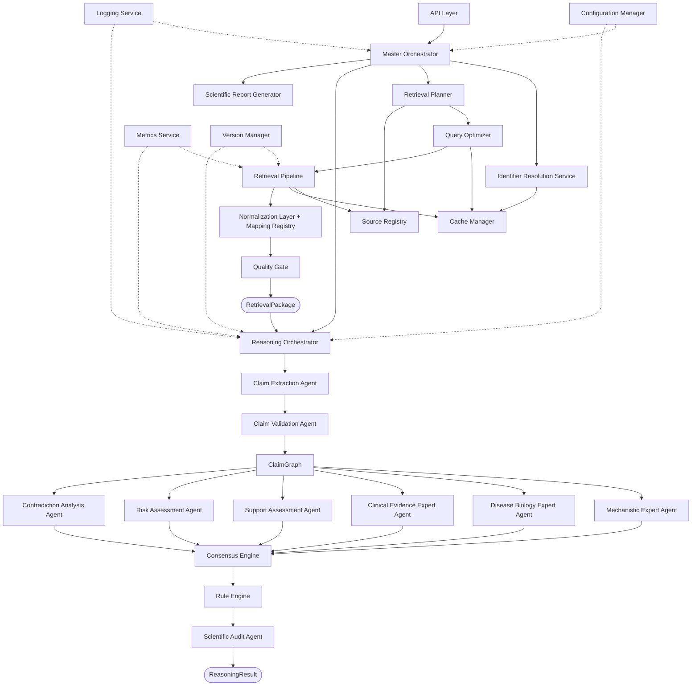

# CYNTHERA: Agent Specifications
## Reference Identifier: 05_AGENT_SPECIFICATIONS.md

---

## 1. Document Purpose

This document defines the engineering specification for every system component in CYNTHERA. It does not redefine scientific reasoning — that is the domain of `04_REASONING_SPECIFICATION.md`. This document explains how each component behaves as software: its lifecycle, execution model, failure modes, configuration, observability surface, and security boundaries.

Every component in this document is classified by its architectural layer as established in `01_SYSTEM_ARCHITECTURE.md`:

*   **Engineering Layer**: Deterministic infrastructure components
*   **Reasoning Layer**: Scientific reasoning components (deterministic engines + agentic extractors)
*   **Infrastructure Layer**: Cross-cutting operational services

---

## 2. Universal Agent Design Principles

Every component in CYNTHERA — whether called an agent, engine, service, or registry — adheres to the following universal design constraints:

*   **Single Responsibility**: Every component owns exactly one bounded domain. No component is permitted to cross its stated boundary.
*   **Deterministic Lifecycle**: Components are initialized, execute, validate, complete, fail, or recover in a defined, predictable sequence.
*   **Immutable Inputs**: No component modifies the object it receives. Inputs are read-only references.
*   **Typed Outputs**: Every component produces a strictly typed, schema-validated output object. Free-form text is never a component output (it may appear inside a labelled field within a typed object).
*   **No Hidden State**: Components do not maintain session state across invocations. All state required for an execution is explicitly passed as input.
*   **Complete Observability**: Every component emits structured log events, performance counters, and trace IDs for every significant lifecycle event.
*   **Communication Through Canonical Objects**: Components exchange only canonical domain objects as defined in `02_DOMAIN_MODEL.md`. Direct method calls, shared memory, or unstructured dictionaries are not permitted crossing a component boundary.

---

## 3. Execution Policy Classifications

Throughout this document, each component declares its **Execution Policy** using the following classification:

| Policy | Definition |
| :--- | :--- |
| **SEQUENTIAL** | Executes in strict order. Must complete before the next component begins. |
| **PARALLEL** | Executes concurrently with sibling components sharing no dependencies. |
| **EVENT_DRIVEN** | Executes in response to a trigger event from an upstream component. |
| **DETERMINISTIC** | Produces identical output for identical inputs. No stochastic elements. |
| **LLM_ASSISTED** | Uses a large language model for one or more operations. Bounded by explicit authority rules. |

---

## 4. Lifecycle State Machine

All components follow a universal lifecycle:

```
UNINITIALIZED
      |
      v
INITIALIZING  ──[Config Error]──> INITIALIZATION_FAILED
      |
      v
READY
      |
      v
EXECUTING  ──[Recoverable Error]──> RETRYING  ──[Max Retries]──> FAILED
      |                                   |
      |                                   v
      |                              RECOVERING
      v
VALIDATING  ──[Validation Error]──> VALIDATION_FAILED
      |
      v
COMPLETED
      |
      v
SHUTDOWN
```

---

## PART 1 — Engineering Layer

---

## 5. Master Orchestrator

### Purpose
The Master Orchestrator is the central workflow manager of CYNTHERA. It coordinates the sequential and parallel execution of every component in the Engineering Layer, manages the full request lifecycle from input validation through to `RetrievalPackage` delivery, and delegates the `RetrievalPackage` to the Reasoning Orchestrator.

### Responsibilities
*   Receive validated request payloads from the API Layer.
*   Initialize a `Hypothesis` entity and a `RetrievalSession` record.
*   Invoke the Identifier Resolution Service and block until canonical IDs are returned.
*   Instantiate the Retrieval Planner with the resolved `Hypothesis`.
*   Receive the sealed `RetrievalPackage` from the Quality Gate.
*   Pass the `RetrievalPackage` to the Reasoning Orchestrator.
*   Receive the `ReasoningResult` from the Reasoning Orchestrator.
*   Pass the `ReasoningResult` to the Scientific Report Generator.
*   Return the compiled `ReportOutput` to the API Layer.

### Inputs
*   Validated `QueryRequest` from the API Layer: `{ drug_name: String, disease_name: String, policy: RetrievalPolicy }`

### Outputs
*   `ReportOutput` object (JSON + Markdown) returned to the API Layer
*   `Hypothesis` entity persisted to the database at lifecycle state `Completed`

### Consumes
`QueryRequest`, `RetrievalPackage`, `ReasoningResult`

### Produces
`Hypothesis`, `RetrievalSession`, `ReportOutput`

### Dependencies
Identifier Resolution Service, Retrieval Planner, Reasoning Orchestrator, Scientific Report Generator, Configuration Manager, Logging Service, Cache Manager

### Execution Policy
SEQUENTIAL | DETERMINISTIC

### Lifecycle
*   **Initialization**: Load configuration. Connect to Cache Manager. Verify all downstream service availability.
*   **Execution**: Initialize `Hypothesis`. Run pipeline in order: ID Resolution → Retrieval → Reasoning → Report.
*   **Validation**: Confirm that the `ReasoningResult` passes the quality checklist before returning.
*   **Completion**: Persist final `Hypothesis` state. Emit completion event.
*   **Failure**: If any critical step fails (ID resolution, retrieval, or reasoning), terminate the pipeline and return a structured `ExecutionFailure` object to the API Layer.
*   **Recovery**: Non-critical failures (single-source retrieval failure) are not fatal. The orchestrator logs the failure and continues.
*   **Shutdown**: Flush all active logs. Release connections.

### Failure Handling
| Error Type | Behavior |
| :--- | :--- |
| ID Resolution failure | Fatal. Return `400 Bad Request` with resolution error detail. |
| All core retrieval sources fail | Fatal. Return `503 Service Unavailable`. |
| Reasoning Orchestrator failure | Fatal. Return `500 Internal Server Error`. |
| Single non-core source failure | Recoverable. Log, continue, flag in RetrievalManifest. |
| Report generation failure | Return raw `ReasoningResult` as JSON. Log report failure. |

### Configuration
```
orchestrator.timeout_seconds: 300
orchestrator.max_concurrent_queries: 10
orchestrator.block_duplicate_queries: true
orchestrator.reasoning_timeout_seconds: 120
orchestrator.report_timeout_seconds: 30
```

### Observability
*   **Metrics**: Total queries initiated, queries completed, queries failed, P50/P95/P99 latency per stage
*   **Logs**: Every lifecycle state transition logged with `hypothesis_id`, `session_id`, timestamp, and duration
*   **Tracing**: Distributed trace ID propagated to all child components
*   **Counters**: Cache hit rate, retry count per execution, source failure count

### Security
*   **Access Level**: API Layer only (internal service boundary)
*   **Permitted**: Initialize hypotheses, coordinate components, read all canonical objects
*   **Forbidden**: Modify canonical objects, call external APIs directly, write reasoning decisions

### Performance Targets
| Metric | Target |
| :--- | :--- |
| Overhead latency (excluding retrieval + reasoning) | < 500ms |
| Max concurrent active queries | 10 |
| Memory footprint per execution | < 256MB |

### Future Extensions
*   Priority queue for concurrent queries
*   Async query execution with webhook callback
*   Query deduplication across concurrent users

### LLM Usage
This component is **deterministic**. No LLM is used.

---

## 6. Identifier Resolution Service

### Purpose
Map ambiguous, free-text drug and disease name inputs into standardized canonical identifier sets before any database client is invoked. This service is a hard prerequisite for all downstream retrieval operations.

### Responsibilities
*   Accept drug name string → resolve to: ChEMBL ID, PubChem CID, DrugBank ID, InChIKey
*   Accept disease name string → resolve to: MeSH ID, UMLS CUI, OMIM ID (where available)
*   Perform cross-reference validation: confirm that resolved IDs refer to the same entity across databases
*   Detect and reject ambiguous inputs that map to multiple non-equivalent entities
*   Return a `ResolvedIdentifierSet` attached to the `Hypothesis` entity

### Inputs
*   `drug_name` (String, validated by API Layer, max 200 chars)
*   `disease_name` (String, validated by API Layer, max 200 chars)

### Outputs
*   `ResolvedIdentifierSet`:
    ```
    ResolvedIdentifierSet
    |
    +-- drug
    |   +-- chembl_id        (String)
    |   +-- pubchem_cid      (String)
    |   +-- drugbank_id      (String)
    |   +-- inchikey         (String)
    |   +-- canonical_name   (String)
    +-- disease
        +-- mesh_id          (String)
        +-- umls_cui         (String)
        +-- omim_id          (String, nullable)
        +-- canonical_name   (String)
    ```

### Consumes
Raw input strings

### Produces
`ResolvedIdentifierSet`, resolution audit log entry

### Dependencies
UniProt cross-reference data, ChEMBL compound search, PubChem synonym API, MeSH vocabulary service, UMLS API (or local vocabulary cache), Configuration Manager, Cache Manager

### Execution Policy
SEQUENTIAL | DETERMINISTIC

### Lifecycle
*   **Initialization**: Load vocabulary caches. Warm identifier mapping tables.
*   **Execution**: Query each identifier namespace in parallel sub-requests. Cross-validate returned IDs. Construct `ResolvedIdentifierSet`.
*   **Validation**: Confirm at least one primary key resolved per entity (ChEMBL for drug, MeSH for disease).
*   **Completion**: Return `ResolvedIdentifierSet` to Master Orchestrator.
*   **Failure**: If drug cannot be resolved to any recognized ID, abort pipeline. If disease cannot be resolved, abort pipeline.
*   **Recovery**: Check identifier cache before querying live APIs. If live API fails, use cached identifier mapping from last successful query.

### Failure Handling
| Error Type | Behavior |
| :--- | :--- |
| No drug ID found | Fatal. Return `DRUG_NOT_RESOLVED` error. |
| No disease ID found | Fatal. Return `DISEASE_NOT_RESOLVED` error. |
| Ambiguous multi-entity match | Return `AMBIGUOUS_INPUT` with candidate list. Let user disambiguate. |
| Identifier cross-reference conflict | Log conflict. Prefer ChEMBL for drug, MeSH for disease. Flag in manifest. |
| API timeout during resolution | Retry 3 times with exponential backoff. Fall back to cache. |

### Configuration
```
identifier_resolution.cache_ttl_days: 30
identifier_resolution.preferred_drug_namespace: "chembl"
identifier_resolution.preferred_disease_namespace: "mesh"
identifier_resolution.max_retries: 3
identifier_resolution.timeout_seconds: 15
```

### Observability
*   **Metrics**: Resolution success rate, resolution latency, cache hit rate, ambiguity rate
*   **Logs**: Per-query: input string, resolved IDs, resolution source (cache vs live), timestamp
*   **Warnings**: Ambiguous resolution, partial resolution, cross-reference conflict

### Security
*   **Access Level**: Master Orchestrator only
*   **Permitted**: Read identifier mapping APIs, read/write identifier cache
*   **Forbidden**: Modify Hypothesis entity directly, call retrieval clients

### Performance Targets
| Metric | Target |
| :--- | :--- |
| P95 resolution latency | < 3 seconds |
| Cache hit latency | < 50ms |
| Ambiguity rate on well-formed inputs | < 5% |

### Future Extensions
*   Local offline vocabulary database (CTD, ChemIDplus) for air-gapped deployments
*   Entity disambiguation via contextual synonyms
*   Resolution confidence scoring

### LLM Usage
This component is **deterministic**. No LLM is used.

---

## 7. Retrieval Planner

### Purpose
The Retrieval Planner translates a resolved `Hypothesis` into a structured `RetrievalPlan` — an ordered, dependency-aware schedule of retrieval tasks to be executed by the Retrieval Pipeline. It is the strategic layer of the Retrieval Subsystem.

### Responsibilities
*   Query the Source Registry for all registered and available sources
*   Apply the configured `RetrievalPolicy` (FAST / STANDARD / COMPREHENSIVE) to determine source scope
*   Determine dependency ordering (e.g., ChEMBL target IDs must be available before UniProt protein lookup)
*   Delegate the `RetrievalPlan` to the Query Optimizer for deduplication and batching
*   Receive the optimized plan and pass it to the Retrieval Pipeline

### Inputs
*   `ResolvedIdentifierSet` (from Identifier Resolution Service)
*   `RetrievalPolicy` (from request configuration)
*   Source Registry (live read at plan time)

### Outputs
*   `RetrievalPlan`:
    ```
    RetrievalPlan
    |
    +-- plan_id             (UUID)
    +-- hypothesis_id       (UUID)
    +-- policy              (RetrievalPolicy)
    +-- phase_1_tasks       (List[SequentialTask])
    +-- phase_2_tasks       (List[ParallelTask])
    +-- estimated_sources   (List[SourceName])
    +-- created_at          (ISO-8601)
    ```

### Dependencies
Source Registry, Query Optimizer, Configuration Manager

### Execution Policy
SEQUENTIAL | DETERMINISTIC

### Failure Handling
If the Source Registry is empty or all sources are marked DEGRADED, the planner aborts and returns `NO_SOURCES_AVAILABLE`.

### Observability
*   **Metrics**: Plan construction latency, sources included per plan, policy distribution
*   **Logs**: Plan summary: policy applied, sources scheduled, phases defined

### LLM Usage
This component is **deterministic**. No LLM is used.

---

## 8. Query Optimizer

### Purpose
The Query Optimizer receives the raw `RetrievalPlan` from the Retrieval Planner and applies a set of deterministic optimization rules to reduce redundant network calls, maximize cache reuse, and improve total retrieval throughput before execution.

### Responsibilities
*   Detect and eliminate duplicate queries targeting the same source with the same identifiers
*   Reorder source execution to maximize cache hit likelihood
*   Batch multiple small requests to the same source where the API supports batch endpoints
*   Mark tasks with valid cache entries as `CACHE_HIT_SKIP` to avoid redundant network calls
*   Produce an `OptimizedRetrievalPlan` guaranteed to be equivalent in output to the original plan

### Inputs
`RetrievalPlan` from Retrieval Planner, Cache Manager (for cache state inspection)

### Outputs
`OptimizedRetrievalPlan` (same structure as `RetrievalPlan` with added optimization metadata per task)

### Execution Policy
SEQUENTIAL | DETERMINISTIC

### Failure Handling
Optimization failure is non-fatal. If the optimizer cannot apply an optimization rule, it passes the original task through unmodified. Optimizer errors are logged as WARN.

### LLM Usage
This component is **deterministic**. No LLM is used.

---

## 9. Source Registry

### Purpose
The Source Registry is the central catalog of all external data sources integrated into CYNTHERA. It is the single source of truth for source configuration, priority, retry policy, and cache policy for every registered source. See `03_RETRIEVAL_SPECIFICATION.md §3` for the full Source Definition contract.

### Responsibilities
*   Maintain an in-memory, configuration-driven registry of all `SourceDefinition` objects
*   Expose a query interface for the Retrieval Planner to enumerate available sources
*   Expose a health interface for the Retrieval Pipeline to check per-source circuit breaker state
*   Emit `SOURCE_DEGRADED` events when a source's health record crosses the degradation threshold
*   Support hot-reload of source configuration without system restart

### Inputs
Source configuration files (YAML, loaded at startup)

### Outputs
`SourceDefinition` objects on query, `SourceHealthRecord` on health check

### Execution Policy
EVENT_DRIVEN | DETERMINISTIC

### Failure Handling
Source Registry is initialized at startup. If a source definition file is malformed, that source is excluded from the registry and an ERROR is logged. The system continues with remaining sources.

### LLM Usage
This component is **deterministic**. No LLM is used.

---

## 10. Retrieval Pipeline

### Purpose
The Retrieval Pipeline executes the `OptimizedRetrievalPlan` by dispatching async connector tasks to registered external sources, collecting raw response payloads, and passing them through the Response Validator and Normalization Layer.

### Responsibilities
*   Execute Phase 1 (sequential) and Phase 2 (parallel) tasks as defined in the `OptimizedRetrievalPlan`
*   Respect per-source rate limits and retry policies as defined in the Source Registry
*   Apply circuit breaker logic: if a source fails repeatedly, mark it `CIRCUIT_OPEN` and skip its tasks
*   Pass raw payloads through the Response Validator before forwarding to the Normalization Layer
*   Record retrieval metadata (latency, status, retry count, cache hit/miss) in the `RetrievalManifest`

### Inputs
`OptimizedRetrievalPlan`, registered `SourceDefinition` objects

### Outputs
Validated raw payloads per source, `RetrievalManifest` (partial, completed after all tasks)

### Dependencies
Source Registry, Cache Manager, Response Validator, Normalization Layer, Logging Service

### Execution Policy
PARALLEL (Phase 2 tasks) | SEQUENTIAL (Phase 1 tasks) | DETERMINISTIC

### Lifecycle
*   **Initialization**: Read `OptimizedRetrievalPlan`. Initialize async worker pool. Set per-source rate-limit buckets.
*   **Execution (Phase 1)**: Execute sequential tasks in dependency order. Block on each until complete.
*   **Execution (Phase 2)**: Dispatch all parallel tasks concurrently. Collect results as futures.
*   **Validation**: Pass each raw payload through Response Validator. Reject malformed responses.
*   **Completion**: Aggregate all validated payloads. Finalize `RetrievalManifest`.
*   **Failure**: If a CRITICAL source fails all retries, abort pipeline. If a non-critical source fails, log and continue.

### Failure Handling
| Error Type | Behavior |
| :--- | :--- |
| CRITICAL source (ChEMBL, UniProt) fails | Fatal. Abort pipeline. |
| Non-critical source fails after retries | Log warning. Mark source FAILED in manifest. Continue. |
| Rate-limit exceeded | Wait per backoff policy. Retry. |
| Response schema invalid | Reject payload. Log `SCHEMA_VIOLATION`. |
| Timeout | Trigger per-source retry. |

### Configuration
```
retrieval_pipeline.worker_pool_size: 20
retrieval_pipeline.phase1_timeout_seconds: 30
retrieval_pipeline.phase2_timeout_seconds: 90
retrieval_pipeline.circuit_breaker_threshold_failures: 5
retrieval_pipeline.circuit_breaker_reset_seconds: 300
```

### Observability
*   **Metrics**: Per-source: request count, success rate, failure rate, latency P50/P95, retry count, cache hit rate
*   **Logs**: Per task: source name, status, duration, retry count, failure reason if applicable
*   **Counters**: Total records retrieved per source, validation rejection count

### LLM Usage
This component is **deterministic**. No LLM is used.

---

## 11. Canonical Mapping Registry

### Purpose
The Canonical Mapping Registry provides a centralized, version-controlled translation layer that transforms source-native field names, identifier formats, and value vocabularies into canonical domain model fields. See `03_RETRIEVAL_SPECIFICATION.md §4` for the full mapping contract.

### Responsibilities
*   Apply field-level mappings from source-typed records to canonical `Drug`, `Disease`, `Target`, `Protein`, `Pathway`, `Evidence`, and `ClinicalTrial` objects
*   Detect and emit `MAPPING_DRIFT_ALERT` when a source field expected by the mapping no longer exists in the payload
*   Support mapping versioning so that schema changes are traceable and auditable
*   Reject unmappable records rather than silently dropping required fields

### Inputs
Validated raw payloads from the Normalization Layer

### Outputs
Canonical domain objects passed to the Canonical Domain Model Factory

### Execution Policy
SEQUENTIAL | DETERMINISTIC

### Failure Handling
If a required field mapping fails (expected field absent from payload), the record is rejected and logged with `MAPPING_FAILURE`. Optional field mapping failures are logged as WARN and the field is set to `null`.

### LLM Usage
This component is **deterministic**. No LLM is used.

---

## 12. Quality Gate

### Purpose
The Quality Gate is the final checkpoint in the Retrieval Subsystem. It inspects the assembled Evidence Store and applies a set of mandatory pass/fail criteria before sealing the `RetrievalPackage`. No package may pass to the Reasoning Layer without clearing the Quality Gate. See `03_RETRIEVAL_SPECIFICATION.md §14` for the full gate contract.

### Responsibilities
*   Apply all Quality Gate checks (source coverage, evidence minimum, critical source availability, schema conformance)
*   Classify each failed check as CRITICAL or WARNING
*   If any CRITICAL check fails, reject the package and return a structured `QualityGateFailure`
*   If only WARNING checks fail, allow the package to proceed with warnings recorded in the `RetrievalManifest`
*   Assign a `RetrievalConfidence` level (HIGH / MEDIUM / LOW) to the package

### Inputs
Assembled Evidence Store, `RetrievalManifest` (partial)

### Outputs
Sealed `RetrievalPackage` + finalized `RetrievalManifest` (on PASS), or `QualityGateFailure` (on CRITICAL fail)

### Execution Policy
SEQUENTIAL | DETERMINISTIC

### Quality Gate Checks

| Check | Severity | Condition |
| :--- | :--- | :--- |
| Drug entity resolved | CRITICAL | Drug canonical object present with valid ChEMBL ID |
| Disease entity resolved | CRITICAL | Disease canonical object present with valid MeSH ID |
| At least one target identified | CRITICAL | Minimum one Target object in Evidence Store |
| Core source returned data | CRITICAL | ChEMBL and UniProt both returned non-empty payloads |
| Minimum evidence count | WARNING | Evidence count < configured minimum threshold |
| Schema conformance | CRITICAL | All canonical objects pass schema validation |
| Provenance completeness | WARNING | All Evidence objects carry citation key |
| ClinicalTrials available | WARNING | ClinicalTrials.gov returned data |

### Failure Handling
CRITICAL failures are fatal to the retrieval session. The Master Orchestrator receives a `QualityGateFailure` and returns a structured error to the API Layer.

### LLM Usage
This component is **deterministic**. No LLM is used.

---

## PART 2 — Reasoning Layer

---

## 13. Reasoning Orchestrator

### Purpose
The Reasoning Orchestrator is the coordination layer of the Reasoning Subsystem. It does not perform scientific reasoning. It manages the lifecycle of the reasoning session: scheduling agent execution, managing inter-agent dependencies, collecting and validating agent outputs, invoking the Consensus Engine and Rule Engine, and assembling the final `ReasoningResult`. See `04_REASONING_SPECIFICATION.md §6` for the full Reasoning Orchestrator contract.

### Responsibilities
*   Receive the sealed `RetrievalPackage` from the Master Orchestrator
*   Invoke the Claim Extraction Agent (Phase 1) and await results
*   Invoke the Claim Validation Agent (Phase 2) and await results
*   Seal the `ClaimGraph` (Phase 3)
*   Dispatch all six Expert Agents in parallel (Phase 4)
*   Collect and validate all six Assessment objects
*   Invoke the Consensus Engine with the six Assessment objects (Phase 5)
*   Pass the `ConsensusAssessment` to the Rule Engine (Phase 6)
*   Pass all intermediate objects to the Scientific Audit Agent (Phase 7)
*   Return the assembled `ReasoningResult` to the Master Orchestrator

### Inputs
Sealed `RetrievalPackage`

### Outputs
`ReasoningResult`, `ReasoningSessionManifest`

### Execution Policy
SEQUENTIAL (Phases 1-3, 5-7) | PARALLEL (Phase 4) | DETERMINISTIC

### Lifecycle
See `04_REASONING_SPECIFICATION.md §6.2` for complete phase-by-phase lifecycle.

### Failure Handling
See `04_REASONING_SPECIFICATION.md §6.3` for failure scenarios and responses.

### Configuration
```
reasoning_orchestrator.claim_extraction_timeout_seconds: 60
reasoning_orchestrator.expert_agent_timeout_seconds: 45
reasoning_orchestrator.consensus_timeout_seconds: 15
reasoning_orchestrator.rule_engine_timeout_seconds: 5
reasoning_orchestrator.audit_agent_timeout_seconds: 30
```

### Observability
*   **Metrics**: Phase duration per phase, agent success/failure rate, total reasoning latency
*   **Logs**: Per phase: start time, end time, agent status, warning count
*   **Tracing**: Trace ID propagated from Master Orchestrator

### LLM Usage
This component is **deterministic**. No LLM is used directly. Delegates LLM calls to the Claim Extraction Agent.

---

## 14. Claim Extraction Agent

### Purpose
Convert unstructured biomedical text from the `RetrievalPackage` into structured, typed `Claim` objects. This is the only agent permitted to use a large language model. See `04_REASONING_SPECIFICATION.md §8.1` for the full scientific contract.

### Responsibilities
*   Read all `Evidence` objects in the `RetrievalPackage` that contain unstructured text (literature abstracts, MoA descriptions)
*   Submit each text to an LLM with a versioned extraction prompt template
*   Parse and validate LLM JSON output against the `Claim` schema
*   Tag each extracted claim with its source `Evidence` provenance reference
*   Return a typed `List[Claim]` to the Reasoning Orchestrator

### Inputs
Sealed `RetrievalPackage` (read-only, specifically Evidence objects with text content)

### Outputs
`List[Claim]` (raw, pre-validation)

### Execution Policy
PARALLEL (abstracts processed concurrently in batches) | LLM_ASSISTED

### LLM Usage
*   **Prompt Ownership**: Claim Extraction Agent owns the versioned extraction prompt template
*   **Temperature**: 0.0 (deterministic sampling mode)
*   **Schema Validation**: Every LLM response validated against `ClaimExtractionResponse` JSON schema before any Claim object is constructed
*   **Retry Policy**: 3 retries on schema validation failure. On third failure, skip the evidence record and log `EXTRACTION_PARSE_FAILURE`
*   **Output Validation**: Claims with confidence < 0.6 are forwarded with a `LOW_CONFIDENCE` flag
*   **Version Tracking**: LLM model name, model version, and prompt template version are recorded in the `ReasoningSessionManifest`
*   **Hallucination Mitigation**: Entities in extracted claims must resolve to canonical identifiers present in the `RetrievalPackage`. Claims referencing entities not in the package are rejected at validation time.

### Failure Handling
| Error Type | Behavior |
| :--- | :--- |
| LLM API unavailable | Retry 3× with exponential backoff. On third failure, return empty claim list with `EXTRACTION_FAILED` status. |
| LLM response fails schema validation | Retry extraction for that evidence record (max 3×). Skip record on final failure. |
| All evidence records produce no claims | Return `EXTRACTION_EMPTY`. Reasoning Orchestrator terminates session. |
| LLM hallucinated entity (not in package) | Reject at Claim Validation Agent. No special handling here. |

### Configuration
```
claim_extraction.model: "gemini-1.5-flash"
claim_extraction.temperature: 0.0
claim_extraction.max_tokens: 2048
claim_extraction.batch_size: 10
claim_extraction.min_confidence_threshold: 0.6
claim_extraction.max_retries: 3
claim_extraction.timeout_seconds: 60
claim_extraction.prompt_template_version: "v1.2"
```

### Observability
*   **Metrics**: Evidence records processed, claims extracted, claims rejected (low confidence), extraction failure rate, LLM latency P50/P95
*   **Logs**: Per evidence record: PMID/DOI, claim count extracted, claim count flagged, LLM call latency
*   **Counters**: Total LLM tokens consumed, total retries, total extraction failures

### Security
*   **Permitted**: Read Evidence text fields, call configured LLM API
*   **Forbidden**: Modify RetrievalPackage, write to database, score claims, produce recommendations

### Performance Targets
| Metric | Target |
| :--- | :--- |
| Throughput | 10 evidence records per batch |
| P95 latency per batch | < 8 seconds |
| Claims extracted per RCT abstract | 2–6 |

---

## 15. Claim Validation Agent

### Purpose
Apply deterministic structural and semantic validation rules to every raw claim produced by the Claim Extraction Agent before it enters the Claim Graph. This is the clean boundary between the LLM-assisted extraction phase and the fully deterministic reasoning phase.

### Responsibilities
*   Apply all seven validation rules (entity resolution, predicate validity, direction consistency, self-reference check, confidence threshold, negation inversion, duplicate merging)
*   Assign Evidence Reliability Weight (ERW) to each validated claim based on its source Evidence type and ERW modifiers
*   Classify claims as VALIDATED or REJECTED
*   Return VALIDATED claims for Claim Graph construction and archive REJECTED claims with reason codes

### Inputs
`List[Claim]` (raw, from Claim Extraction Agent), Sealed `RetrievalPackage` (for entity resolution)

### Outputs
`ValidatedClaimSet`:
```
ValidatedClaimSet
|
+-- validated_claims  (List[Claim])
+-- rejected_claims   (List[RejectedClaim])
    +-- claim         (Claim)
    +-- reason_code   (Enum: UNRESOLVABLE_ENTITY | INVALID_PREDICATE | ...)
    +-- rejection_timestamp (ISO-8601)
```

### Execution Policy
SEQUENTIAL | DETERMINISTIC

### Failure Handling
If 100% of submitted claims are rejected, the agent returns `ALL_CLAIMS_REJECTED`. The Reasoning Orchestrator terminates the session.

### LLM Usage
This component is **deterministic**. No LLM is used.

---

## 16. Mechanistic Expert Agent

### Purpose
Construct and evaluate biological pathway chains connecting the drug to the disease through the sealed `ClaimGraph`. Produce a `MechanisticAssessment`. See `04_REASONING_SPECIFICATION.md §8.3` for full scientific contract.

### Responsibilities
*   Traverse the `ClaimGraph` following `Precedes` edges from the drug node to the disease node
*   Validate candidate chains against the five chain validity criteria
*   Classify chains as COMPLETE, PARTIAL, INCOMPLETE, or CONTRADICTED
*   Assign a `mechanistic_score_level` (HIGH / MEDIUM / LOW / NONE)
*   Record all chain steps and their supporting Claim references in the assessment

### Inputs
Sealed `ClaimGraph`, `RetrievalPackage` (Pathway, Protein, Target objects)

### Outputs
`MechanisticAssessment`

### Execution Policy
PARALLEL (with other Phase 4 agents) | DETERMINISTIC

### Failure Handling
If Reactome pathway data was not retrieved, mark affected chain steps `PATHWAY_DATA_UNAVAILABLE`. Set chain status to `INCOMPLETE`. Set score to LOW. Continue.

### LLM Usage
This component is **deterministic**. No LLM is used.

---

## 17. Disease Biology Expert Agent

### Purpose
Evaluate the biological relevance of the drug's mechanism to the target disease's pathophysiology. Produce a `DiseaseRelevanceAssessment`. See `04_REASONING_SPECIFICATION.md §8.4` for full scientific contract.

### Responsibilities
*   Query the `ClaimGraph` for claims asserting the drug's target proteins are implicated in the target disease
*   Cross-reference drug target proteins against DisGeNET gene-disease association scores
*   Assess Reactome pathway overlap between drug target pathways and disease-annotated pathways
*   Determine `relevance_level` (HIGH / MEDIUM / LOW / NONE)

### Inputs
Sealed `ClaimGraph`, `RetrievalPackage` (Disease, DisGeNET associations, Reactome annotations)

### Outputs
`DiseaseRelevanceAssessment`

### Execution Policy
PARALLEL (with other Phase 4 agents) | DETERMINISTIC

### Failure Handling
If DisGeNET data is unavailable, cap `relevance_level` at MEDIUM. Flag `partial_data = true`.

### LLM Usage
This component is **deterministic**. No LLM is used.

---

## 18. Clinical Evidence Expert Agent

### Purpose
Evaluate the quality and direction of human clinical evidence bearing on the drug-disease hypothesis. Produce a `ClinicalEvidenceAssessment`. See `04_REASONING_SPECIFICATION.md §8.5` for full scientific contract.

### Responsibilities
*   Enumerate all `ClinicalTrial` objects in the `RetrievalPackage` associated with the drug-disease pair
*   Classify each trial by `TrialOutcomeStatus`
*   Identify any TERMINATED_SAFETY trial at Phase ≥ 2 (critical safety flag)
*   Enumerate clinical claims in the `ClaimGraph` and rank by ERW
*   Assign `clinical_evidence_level` (STRONG / MODERATE / WEAK / ABSENT)

### Inputs
Sealed `ClaimGraph`, `RetrievalPackage` (ClinicalTrial objects, clinical Evidence objects)

### Outputs
`ClinicalEvidenceAssessment`

### Execution Policy
PARALLEL (with other Phase 4 agents) | DETERMINISTIC

### Failure Handling
If ClinicalTrials.gov data is unavailable, set `clinical_evidence_level = ABSENT`. Flag `trial_data_unavailable = true`. This warning propagates to the Rule Engine.

### LLM Usage
This component is **deterministic**. No LLM is used.

---

## 19. Support Assessment Agent

### Purpose
Aggregate all supporting evidence across the sealed `ClaimGraph` to produce a structured `SupportAssessment`. This agent exclusively considers evidence in favor of the hypothesis. See `04_REASONING_SPECIFICATION.md §8.6` for full scientific contract.

### Responsibilities
*   Identify all claims in the `ClaimGraph` that directionally support the drug-disease hypothesis
*   Compute aggregate ERW contribution per claim
*   Determine dominant evidence type by ERW weight
*   Count independent replication instances
*   Assign `support_level` (HIGH / MEDIUM / LOW / ABSENT)

### Inputs
Sealed `ClaimGraph`, `RetrievalPackage`

### Outputs
`SupportAssessment`

### Execution Policy
PARALLEL (with other Phase 4 agents) | DETERMINISTIC

### Failure Handling
If the `ClaimGraph` contains zero validated claims, return `SupportAssessment` with `support_level = ABSENT`.

### LLM Usage
This component is **deterministic**. No LLM is used.

---

## 20. Risk Assessment Agent

### Purpose
Evaluate all evidence suggesting the drug may be harmful, ineffective, or contraindicated for the disease. Produce a `RiskAssessment`. See `04_REASONING_SPECIFICATION.md §8.7` for full scientific contract.

### Responsibilities
*   Identify all TERMINATED_SAFETY and TERMINATED_LACK_OF_EFFICACY trials
*   Count COMPLETED_FAILURE Phase III trials
*   Identify claims in the `ClaimGraph` asserting adverse effects or negative outcomes
*   Identify off-target protein binding records from ChEMBL with adverse-association proteins
*   Flag mechanistic gaps (INCOMPLETE or NONE chain status from Mechanistic Expert Agent — but this agent does not read other agent outputs; mechanistic gap is determined from ClaimGraph structure)
*   Assign `risk_level` (HIGH / MEDIUM / LOW)

### Inputs
Sealed `ClaimGraph`, `RetrievalPackage` (ClinicalTrial objects, ChEMBL bioactivity records)

### Outputs
`RiskAssessment`

### Execution Policy
PARALLEL (with other Phase 4 agents) | DETERMINISTIC

### Failure Handling
If ClinicalTrials.gov data is unavailable, set `risk_level` to MEDIUM minimum. Flag `terminated_safety = UNVERIFIED`.

### LLM Usage
This component is **deterministic**. No LLM is used.

---

## 21. Contradiction Analysis Agent

### Purpose
Systematically detect all claim-level and evidence-level contradictions within the sealed `ClaimGraph` and produce a structured `ContradictionReport`. See `04_REASONING_SPECIFICATION.md §8.8` for the full scientific contract.

### Responsibilities
*   Enumerate all claim pairs in the `ClaimGraph` sharing the same (subject, object) tuple
*   Classify contradictions by type (MECHANISTIC, CLINICAL, DATABASE, DIRECTIONAL)
*   Assign severity (STRONG, MODERATE, WEAK) based on ERW of conflicting claims
*   Attempt deterministic resolution per resolution rules
*   Produce the complete `ContradictionReport` including the populated `ContradictionRegistry`

### Inputs
Sealed `ClaimGraph`, `RetrievalPackage` (Source Registry priority for database contradiction resolution)

### Outputs
`ContradictionReport`

### Execution Policy
PARALLEL (with other Phase 4 agents) | DETERMINISTIC

### Failure Handling
If `ClaimGraph` contains fewer than two validated claims, no contradictions are possible. Return `ContradictionReport` with `total_contradictions = 0`.

### LLM Usage
This component is **deterministic**. No LLM is used.

---

## 22. Consensus Engine

### Purpose
The Consensus Engine is the synthesis component of the Reasoning Subsystem. It receives the six structured Assessment objects produced by the parallel Expert Agents and integrates them into a unified `ConsensusAssessment`. See `04_REASONING_SPECIFICATION.md §10` for the full consensus contract.

### Responsibilities
*   Receive all six Assessment objects from the Reasoning Orchestrator
*   Validate that all six assessments are present (or flag UNAVAILABLE for failed agents)
*   Apply deterministic disagreement resolution rules
*   Compute `uncertainty_level` (HIGH / MEDIUM / LOW) from the `UncertaintyModel`
*   Produce the `ConsensusAssessment` and attached `UncertaintyReport`
*   Do not produce a `RecommendationStatus` — that is the Rule Engine's exclusive domain

### Inputs
`MechanisticAssessment`, `DiseaseRelevanceAssessment`, `ClinicalEvidenceAssessment`, `SupportAssessment`, `RiskAssessment`, `ContradictionReport`

### Outputs
`ConsensusAssessment`, `UncertaintyReport`

### Execution Policy
SEQUENTIAL (after Phase 4 completion) | DETERMINISTIC

### Failure Handling
If two or more Expert Agent assessments are UNAVAILABLE, abort with `CONSENSUS_INPUT_INSUFFICIENT`. If one assessment is UNAVAILABLE, record the gap in `consensus_warnings` and proceed with note that the missing dimension may increase uncertainty.

### LLM Usage
This component is **deterministic**. No LLM is used.

---

## 23. Rule Engine

### Purpose
Apply the versioned, auditable deterministic rule set to the `ConsensusAssessment` to produce a `RecommendationStatus`. See `04_REASONING_SPECIFICATION.md §11` for the full rule set.

### Responsibilities
*   Receive the `ConsensusAssessment` from the Consensus Engine
*   Apply rules in strict priority order (Rules 1–8)
*   Return the `RecommendationStatus` and the identity of the fired rule
*   Record the rule set version and the fired rule in the `ReasoningSessionManifest`

### Inputs
`ConsensusAssessment`, `RetrievalManifest` (for Retrieval Confidence check)

### Outputs
```
RuleEngineOutput
|
+-- recommendation_status  (RecommendationStatus)
+-- rule_fired             (String: e.g., "Rule 1 — Hard Veto: Safety")
+-- reason                 (String: human-readable explanation)
+-- rule_set_version       (String)
```

### Execution Policy
SEQUENTIAL | DETERMINISTIC

### Failure Handling
If the Rule Engine throws an internal error, default to `UNCERTAIN` with reason `RULE_ENGINE_FAILURE`. Log ERROR.

### Configuration
```
rule_engine.rule_set_version: "1.0"
rule_engine.promising_min_support: "MEDIUM"
rule_engine.promising_min_mechanism: "MEDIUM"
rule_engine.promising_max_risk: "LOW"
rule_engine.promising_max_strong_contradictions: 0
```

### LLM Usage
This component is **deterministic**. No LLM is used.

---

## 24. Scientific Audit Agent

### Purpose
Generate the final `ScientificAuditReport` and assemble the `ReasoningResult`. Convert the structured outputs of all reasoning stages into a fully traceable scientific explanation. See `04_REASONING_SPECIFICATION.md §12` for the full audit contract.

### Responsibilities
*   Compile all intermediate objects (six assessments, `ConsensusAssessment`, `RuleEngineOutput`, `ClaimGraph`) into the `ScientificAuditReport`
*   Optionally generate human-readable AI summary text for mechanistic chain explanation and recommendation rationale (labelled `AI_GENERATED_SUMMARY`)
*   Verify audit traceability: every reference in the report must resolve to an object in the `RetrievalPackage` or `ClaimGraph`
*   Assemble and return the final `ReasoningResult`

### Inputs
All six Assessment objects, `ConsensusAssessment`, `RuleEngineOutput`, sealed `ClaimGraph`, sealed `RetrievalPackage`, `ReasoningSessionManifest`

### Outputs
`ReasoningResult` (containing sealed `ScientificAuditReport`)

### Execution Policy
SEQUENTIAL | LLM_ASSISTED (optional, for summary text only)

### LLM Usage
*   **Permitted scope**: Generating human-readable summary text for audit report sections only
*   **Explicitly forbidden**: Modifying any Assessment, ConsensusAssessment, RuleEngineOutput, or RecommendationStatus
*   **Temperature**: 0.2 (slightly higher than extraction, as summaries are explanatory, not extraction)
*   **Output validation**: LLM text is inserted into a clearly typed `AI_GENERATED_SUMMARY` field. It does not affect any structured reasoning field.
*   **Fallback**: If LLM is unavailable, the summary field is populated with `"AI summary unavailable."` The `ReasoningResult` is still returned without summary text.

### Performance Targets
| Metric | Target |
| :--- | :--- |
| Audit assembly latency (without LLM summary) | < 2 seconds |
| Audit assembly latency (with LLM summary) | < 15 seconds |

---

## PART 3 — Infrastructure Layer

---

## 25. Cache Manager

### Purpose
A centralized, policy-driven caching service that intercepts retrieval requests and stores raw API responses and resolved identifiers to minimize redundant external network calls and reduce query latency for repeated evaluations.

### Responsibilities
*   Provide a `get(key)` / `set(key, value, ttl)` / `invalidate(key)` interface to all retrieval components
*   Apply per-source cache TTL policies from the Source Registry
*   Support version-keyed cache bypass (force refresh on API version change)
*   Record cache hit/miss events in metrics
*   Operate as an in-memory cache (Phase 1, MVP) and as a Redis-backed distributed cache (Phase 2)

### Execution Policy
EVENT_DRIVEN | DETERMINISTIC

### Configuration
```
cache.default_ttl_seconds: 604800  # 7 days
cache.identifier_cache_ttl_days: 30
cache.max_memory_mb: 512
cache.eviction_policy: "LRU"
cache.force_refresh_header: "X-Cache-Bypass"
```

### LLM Usage
This component is **deterministic**. No LLM is used.

---

## 26. Configuration Manager

### Purpose
Central configuration authority for all system components. Loads, validates, and distributes configuration from YAML files and environment variables. Supports hot-reload for non-critical configuration fields.

### Responsibilities
*   Load and validate the system configuration file at startup
*   Expose a typed configuration object to every component
*   Enforce required fields and valid value ranges
*   Log configuration loading, validation errors, and hot-reload events

### Execution Policy
SEQUENTIAL (startup) | EVENT_DRIVEN (hot-reload)

### LLM Usage
This component is **deterministic**. No LLM is used.

---

## 27. Logging Service

### Purpose
A structured logging service that accepts log events from all system components and routes them to the appropriate log channel (application logs, scientific audit logs, security logs, performance dashboards).

### Responsibilities
*   Accept structured log events (JSON) from all components via a shared logging interface
*   Attach trace ID, component name, hypothesis ID, and session ID to every log entry
*   Route events to the appropriate channel by log level and component type
*   Enforce log retention policies

### Execution Policy
EVENT_DRIVEN

### LLM Usage
This component is **deterministic**. No LLM is used.

---

## 28. Metrics Service

### Purpose
Collect and aggregate performance counters, latency histograms, and health indicators from all system components. Expose metrics to an external monitoring dashboard.

### Responsibilities
*   Accept metric events from all components via a shared metrics interface
*   Maintain rolling P50/P95/P99 latency histograms per component
*   Expose a `/metrics` endpoint in Prometheus-compatible format
*   Trigger `COMPONENT_DEGRADED` alerts when a metric crosses a configured threshold

### Execution Policy
EVENT_DRIVEN

### LLM Usage
This component is **deterministic**. No LLM is used.

---

## 29. Version Manager

### Purpose
Track and record the versions of all external systems, internal components, and rule sets active during each query execution to ensure scientific reproducibility.

### Responsibilities
*   Record active versions at the start of each `RetrievalSession` and `ReasoningSession`: source API versions, LLM model version, prompt template version, rule set version, schema version
*   Provide a version snapshot object that is embedded in the `RetrievalManifest` and `ReasoningSessionManifest`
*   Detect version drift: if a source reports a different API version than the last recorded version, emit `API_VERSION_DRIFT` warning

### Execution Policy
SEQUENTIAL (query initialization) | DETERMINISTIC

### LLM Usage
This component is **deterministic**. No LLM is used.

---

## 30. Component Dependency Map


