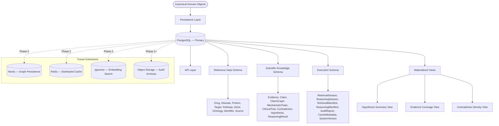
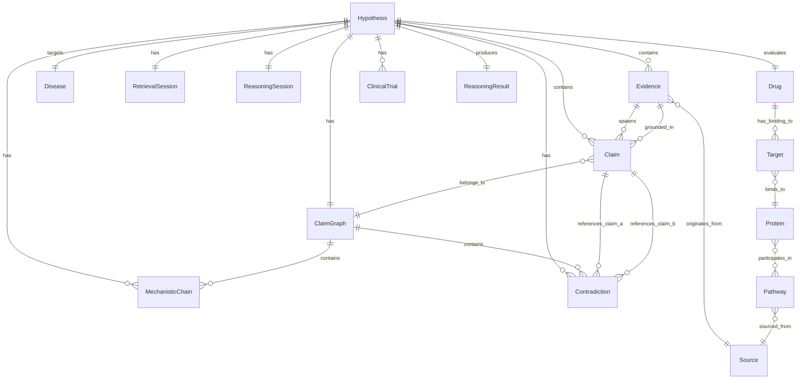
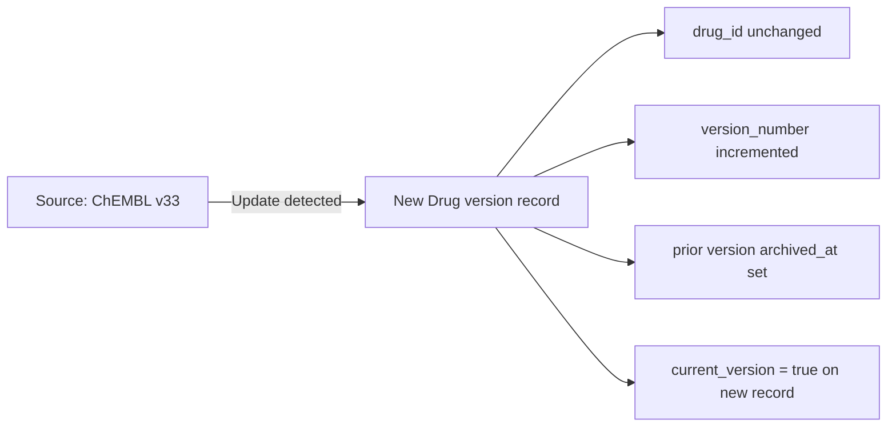

# CYNTHERA: Database Specification
## Reference Identifier: 06_DATABASE_SPECIFICATION.md

---

## 1. Document Purpose

This document defines the persistence architecture for every canonical object in CYNTHERA. It does not specify SQL schemas, ORM models, or REST endpoints. It specifies the persistence philosophy, bounded context separation, entity-level persistence rules, relationship model, versioning strategy, indexing strategy, migration policy, and future database roadmap.

All entities referenced in this document derive from the canonical definitions established in `02_DOMAIN_MODEL.md`. All persistence decisions respect the immutability contracts defined in `03_RETRIEVAL_SPECIFICATION.md §18.1` and `04_REASONING_SPECIFICATION.md §15.2`.

---

## 2. Database Philosophy

### 2.1 Core Persistence Principles

*   **Scientific objects are never overwritten**: Every Evidence record, Claim, MechanisticChain, Contradiction, and ReasoningResult is immutable once written. If new evidence changes a prior assessment, a new Hypothesis evaluation is initiated — the prior record is preserved in full.
*   **Execution objects are auditable but mutable**: Session records, manifest records, and health metrics are operational data. They may be updated as a session progresses, but their history is retained.
*   **Reference data is versioned, not replaced**: Drug, Disease, Protein, Pathway, and Ontology objects represent external biological knowledge. When that knowledge changes (e.g., ChEMBL releases a new version), the old version is archived, not deleted. Both versions are queryable.
*   **Reproducibility is enforced through version coupling**: Every scientific result is coupled to the exact versions of the data sources, reasoning engine, rule set, and LLM that produced it. Re-running the same hypothesis against the same version snapshot must produce an identical result.
*   **Separation of concerns across bounded contexts**: Scientific knowledge, execution data, and reference data are stored in logically isolated contexts with explicit cross-context relationship rules.

### 2.2 Primary Database Choice

**PostgreSQL** is the primary persistence store for CYNTHERA.

| Criterion | Justification |
| :--- | :--- |
| **ACID compliance** | Scientific records cannot be partially written. ACID transactions guarantee all-or-nothing persistence for complex multi-table writes (e.g., Evidence + Claims + Provenance). |
| **JSONB support** | Structured but variable-schema objects (e.g., `ScientificAuditReport`, `ConsensusAssessment`) are stored as validated JSONB columns without sacrificing queryability. |
| **Full-text indexing** | Literature abstracts and MoA descriptions can be indexed for full-text search without a separate search engine in Phase 1. |
| **Mature ecosystem** | Asyncpg for async Python access, Alembic for schema migrations, and extensive operational tooling for backups, replication, and point-in-time recovery. |
| **Extensibility** | pgvector extension enables vector embedding storage in Phase 2. Read replicas support horizontal read scaling in Phase 3. |

---

## 3. Storage Architecture

---

## 4. Bounded Contexts

### 4.1 Reference Data Context

Reference data represents the biological universe that CYNTHERA operates within: drugs, diseases, proteins, pathways, genes, ontology terms, identifier mappings, and source definitions.

**Characteristics**:
*   Populated from external databases (ChEMBL, UniProt, Reactome, MeSH, DisGeNET)
*   Versioned: each update creates a new version record; the prior version is archived
*   Shared across all Hypothesis evaluations
*   Read-intensive: queried on every retrieval operation

**Entities in this context**: Drug, Disease, Protein, Target, Gene, Pathway, OntologyTerm, CanonicalIdentifier, Source

### 4.2 Scientific Knowledge Context

Scientific knowledge represents the retrieved and derived scientific artifacts for a specific Hypothesis evaluation: the evidence collected, the claims extracted, the graph constructed, the chains identified, the contradictions detected, and the reasoning result.

**Characteristics**:
*   Hypothesis-scoped: every record belongs to exactly one Hypothesis evaluation
*   Immutable once written (RetrievalPackage Immutability Contract)
*   Append-only: new evaluations create new records; prior records are never overwritten
*   Write-once-read-many: written during a single evaluation cycle, then queried repeatedly for audit and reporting

**Entities in this context**: Evidence, Claim, ClaimGraph, MechanisticChain, ClinicalTrial, Contradiction, Hypothesis, ReasoningResult, SupportScore, MechanisticScore, RiskScore, Recommendation

### 4.3 Execution Context

Execution data represents the operational metadata of individual retrieval and reasoning sessions: timing, resource usage, component health, cache statistics, version snapshots, and audit records.

**Characteristics**:
*   Session-scoped: every record belongs to exactly one session
*   Mutable during an active session (session records are updated as the session progresses)
*   Retained for audit, performance analysis, and reproducibility verification
*   Time-series in nature: queried by time range for trend analysis

**Entities in this context**: RetrievalSession, ReasoningSession, RetrievalManifest, ReasoningSessionManifest, AuditReport, CacheMetadata, SystemVersion, SourceHealthRecord

---

## 5. Persistence Rules by Entity

The following table defines the persistence policy for every canonical entity.

| Entity | Persist? | Immutable? | Versioned? | Cached? | Audited? | Soft Delete? | Archive? | Lifecycle |
| :--- | :--- | :--- | :--- | :--- | :--- | :--- | :--- | :--- |
| **Drug** | YES | YES | YES | YES | YES | NO | YES | Reference → Versioned on source update |
| **Disease** | YES | YES | YES | YES | YES | NO | YES | Reference → Versioned on source update |
| **Protein** | YES | YES | YES | YES | YES | NO | YES | Reference → Versioned on UniProt update |
| **Target** | YES | YES | NO | YES | YES | NO | NO | Hypothesis-scoped → Immutable once written |
| **Gene** | YES | YES | YES | NO | YES | NO | YES | Reference → Versioned on source update |
| **Pathway** | YES | YES | YES | YES | YES | NO | YES | Reference → Versioned on Reactome update |
| **OntologyTerm** | YES | YES | YES | NO | NO | NO | YES | Reference → Versioned on ontology release |
| **CanonicalIdentifier** | YES | NO | YES | YES | YES | NO | YES | Reference → Updated on cross-reference update |
| **Source** | YES | NO | YES | NO | YES | NO | YES | Reference → Updated on API version change |
| **Evidence** | YES | YES | NO | YES | YES | NO | YES | Scientific → Immutable once written |
| **Claim** | YES | YES | NO | NO | YES | NO | YES | Scientific → Immutable once written |
| **ClaimGraph** | YES | YES | NO | NO | YES | NO | YES | Scientific → Sealed after Phase 3 |
| **MechanisticChain** | YES | YES | NO | NO | YES | NO | YES | Scientific → Immutable once written |
| **ClinicalTrial** | YES | YES | NO | YES | YES | NO | YES | Scientific → Immutable once written |
| **Contradiction** | YES | YES | NO | NO | YES | NO | YES | Scientific → Immutable once written |
| **Hypothesis** | YES | NO | NO | NO | YES | YES | YES | Lifecycle: Initialized → Completed |
| **ReasoningResult** | YES | YES | NO | NO | YES | NO | YES | Scientific → Immutable once produced |
| **SupportScore** | YES | YES | NO | NO | YES | NO | NO | Scientific → Immutable once computed |
| **MechanisticScore** | YES | YES | NO | NO | YES | NO | NO | Scientific → Immutable once computed |
| **RiskScore** | YES | YES | NO | NO | YES | NO | NO | Scientific → Immutable once computed |
| **Recommendation** | YES | YES | NO | NO | YES | NO | YES | Scientific → Immutable once produced |
| **RetrievalSession** | YES | NO | NO | NO | YES | NO | YES | Execution → Active during retrieval |
| **ReasoningSession** | YES | NO | NO | NO | YES | NO | YES | Execution → Active during reasoning |
| **RetrievalManifest** | YES | YES | NO | NO | YES | NO | YES | Execution → Finalized at Quality Gate |
| **ReasoningSessionManifest** | YES | YES | NO | NO | YES | NO | YES | Execution → Finalized at ReasoningResult |
| **AuditReport** | YES | YES | NO | NO | YES | NO | YES | Execution → Immutable scientific archive |
| **CacheMetadata** | YES | NO | NO | NO | NO | YES | NO | Execution → TTL-based eviction |
| **SystemVersion** | YES | YES | NO | NO | YES | NO | YES | Execution → Snapshot per session |

---

## 6. Entity Persistence Specifications

---

### 6.1 Drug

**Purpose**: Canonical representation of a therapeutic compound evaluated in a Hypothesis.

**Primary Key**: `drug_id` (UUID, generated at first resolution)

**Unique Constraints**: `(chembl_id)`, `(inchikey)`

**Foreign Keys**:
*   References zero or many `CanonicalIdentifier` records (1:N)
*   References zero or many `Target` records (1:N)
*   Referenced by many `Hypothesis` records (N:M via junction table)

**Indexes**:
*   B-tree index on `chembl_id` (primary lookup key)
*   B-tree index on `pubchem_cid`
*   B-tree index on `drugbank_id`
*   B-tree index on `inchikey`
*   Full-text index on `canonical_name`, `synonyms`

**Versioning Rules**: When a ChEMBL version update changes any Drug field, a new version record is created with `version_number` incremented. The prior version is archived with `archived_at` timestamp set. The `current_version` flag is set to `true` only on the latest version.

**Immutability**: Once a Drug record is written for a given `drug_id` + `version_number`, it is immutable. Corrections result in new version records.

**Delete Rules**: Drug records are never hard-deleted. Soft delete (`is_deleted = true`) is used only for duplicate records identified post-creation.

**Audit Requirements**: All Drug version changes are logged with the source API version that triggered the change.

**Expected Size**: ~50,000–500,000 rows (ChEMBL licensed compound space)

**Query Frequency**: Very high — queried on every Identifier Resolution and every Hypothesis initialization

---

### 6.2 Disease

**Purpose**: Canonical representation of the target disease in a Hypothesis evaluation.

**Primary Key**: `disease_id` (UUID)

**Unique Constraints**: `(mesh_id)`, `(umls_cui)` where not null

**Indexes**:
*   B-tree on `mesh_id`
*   B-tree on `umls_cui`
*   Full-text on `canonical_name`, `synonyms`
*   GIN index on `ontology_terms` (JSONB array)

**Versioning Rules**: Same as Drug. MeSH releases trigger version increments.

**Delete Rules**: Never hard-deleted.

**Query Frequency**: High — queried on every Identifier Resolution

---

### 6.3 Protein

**Purpose**: Physiological polypeptide participating in biological pathways. Sourced from UniProt.

**Primary Key**: `protein_id` (UUID)

**Unique Constraints**: `(uniprot_accession)`

**Indexes**:
*   B-tree on `uniprot_accession`
*   B-tree on `gene_symbol`
*   Full-text on `protein_name`

**Versioning Rules**: UniProt major releases trigger version increments for updated records.

**Delete Rules**: Never hard-deleted.

**Query Frequency**: High — queried during target mapping and pathway traversal

---

### 6.4 Target

**Purpose**: Drug-Protein interaction relationship record, storing binding affinity and mechanism classification.

**Primary Key**: `target_id` (UUID)

**Foreign Keys**:
*   `drug_id` → Drug (CASCADE DELETE not permitted; Drug records are immutable)
*   `protein_id` → Protein
*   `evidence_id` → Evidence (the source record supporting this target relationship)
*   `hypothesis_id` → Hypothesis (scope)

**Unique Constraints**: `(drug_id, protein_id, hypothesis_id, source_id)` — prevents duplicate target records from the same source within one evaluation

**Indexes**:
*   Composite index on `(drug_id, protein_id)` for target lookup
*   B-tree on `hypothesis_id`

**Immutability**: Immutable once written for a given evaluation.

**Query Frequency**: High — queried during mechanistic chain construction

---

### 6.5 Pathway

**Purpose**: Curated molecular interaction network sourced from Reactome.

**Primary Key**: `pathway_id` (UUID)

**Unique Constraints**: `(reactome_id)`

**Indexes**:
*   B-tree on `reactome_id`
*   Full-text on `pathway_name`
*   GIN on `participant_proteins` (JSONB array of UniProt accessions)
*   GIN on `disease_annotations` (JSONB array of MeSH IDs)

**Versioning Rules**: Reactome releases trigger version increments.

**Query Frequency**: Medium — queried during mechanistic chain construction

---

### 6.6 Evidence

**Purpose**: An empirical observation, assay record, or literature record retrieved from a registered Source. The primary unit of scientific knowledge in CYNTHERA.

**Primary Key**: `evidence_id` (UUID)

**Foreign Keys**:
*   `hypothesis_id` → Hypothesis
*   `source_id` → Source
*   `drug_id` → Drug (nullable — not all Evidence directly concerns the drug)
*   `disease_id` → Disease (nullable)

**Unique Constraints**: `(hypothesis_id, citation_key, source_id)` — prevents duplicate Evidence records from the same source within one evaluation

**Indexes**:
*   B-tree on `hypothesis_id`
*   B-tree on `citation_key` (DOI, PMID, NCT ID)
*   B-tree on `evidence_type` (EvidenceType enum — used for ERW tier queries)
*   B-tree on `source_id`
*   GIN on `provenance_metadata` (JSONB)

**JSONB Fields**:
*   `raw_payload_hash`: SHA-256 hash of the raw API payload (for reproducibility verification)
*   `provenance_metadata`: Full provenance graph entry as defined in `03_RETRIEVAL_SPECIFICATION.md §17`
*   `normalized_fields`: Source-specific normalized fields before canonical mapping

**Immutability**: Evidence records are immutable once written. ERW values are computed at Claim Graph construction time and stored on the Claim, not on the Evidence.

**Delete Rules**: Never hard-deleted. Archive to object storage after configurable retention period.

**Audit Requirements**: Every Evidence record carries `retrieved_at`, `source_api_version`, and `retrieval_session_id`.

**Expected Size**: 1,000–50,000 rows per Hypothesis evaluation; millions of rows total

**Query Frequency**: High during reasoning; lower thereafter (audit access only)

---

### 6.7 Claim

**Purpose**: A structured semantic triplet extracted from Evidence text by the Claim Extraction Agent. The primary reasoning artifact.

**Primary Key**: `claim_id` (UUID)

**Foreign Keys**:
*   `hypothesis_id` → Hypothesis
*   `evidence_id` → Evidence (parent Evidence record)
*   `claim_graph_id` → ClaimGraph

**Indexes**:
*   B-tree on `hypothesis_id`
*   B-tree on `claim_graph_id`
*   Composite index on `(subject_canonical_id, predicate, object_canonical_id)` — for contradiction detection query
*   B-tree on `erw` (float — for ERW threshold queries)
*   B-tree on `status` (VALIDATED | REJECTED)

**JSONB Fields**:
*   `subject`: `{ canonical_id, entity_type, display_name }`
*   `object`: `{ canonical_id, entity_type, display_name }`
*   `extraction_metadata`: `{ model_name, model_version, prompt_template_version, temperature, confidence }`

**Immutability**: Immutable once written.

**Expected Size**: 5,000–200,000 rows per Hypothesis evaluation; hundreds of millions total

**Query Frequency**: Very high during reasoning (contradiction detection, chain traversal, score computation)

---

### 6.8 ClaimGraph

**Purpose**: The sealed, immutable graph structure produced after Claim Validation. The central reasoning object.

**Primary Key**: `claim_graph_id` (UUID)

**Foreign Keys**:
*   `hypothesis_id` → Hypothesis (1:1)
*   `reasoning_session_id` → ReasoningSession

**JSONB Fields**:
*   `metadata`: `{ total_claims, validated_claims, rejected_claims, construction_timestamp, sealed_at }`
*   `edge_list`: Serialized list of `ClaimRelation` objects (edge type + claim references)

**Indexes**:
*   B-tree on `hypothesis_id`
*   B-tree on `sealed_at`

**Immutability**: Immutable once sealed.

**Expected Size**: One record per Hypothesis evaluation

---

### 6.9 MechanisticChain

**Purpose**: A validated directed pathway chain from Drug through biological intermediaries to Disease.

**Primary Key**: `chain_id` (UUID)

**Foreign Keys**:
*   `hypothesis_id` → Hypothesis
*   `claim_graph_id` → ClaimGraph

**JSONB Fields**:
*   `chain_steps`: Ordered list of `{ node_type, canonical_id, claim_reference, erw }` objects
*   `chain_validity_flags`: `{ direction_consistent, no_circular_paths, source_authority_met, minimum_depth_met }`

**Indexes**:
*   B-tree on `hypothesis_id`
*   B-tree on `chain_status`

**Immutability**: Immutable once written.

---

### 6.10 ClinicalTrial

**Purpose**: A registered human clinical study evaluating the therapeutic action of a drug on a disease.

**Primary Key**: `trial_id` (UUID)

**Unique Constraints**: `(nct_id, hypothesis_id)` — trials are linked to their evaluation context

**Foreign Keys**:
*   `hypothesis_id` → Hypothesis
*   `drug_id` → Drug
*   `disease_id` → Disease
*   `source_id` → Source

**Indexes**:
*   B-tree on `nct_id`
*   B-tree on `trial_outcome_status`
*   B-tree on `phase`
*   Composite index on `(drug_id, disease_id, trial_outcome_status)` — for risk scoring queries

**Immutability**: Immutable once written for a given evaluation.

**Expected Size**: 10–1,000 rows per Hypothesis evaluation

---

### 6.11 Contradiction

**Purpose**: An analytical model documenting a directional conflict between two Claim or Evidence records.

**Primary Key**: `contradiction_id` (UUID)

**Foreign Keys**:
*   `hypothesis_id` → Hypothesis
*   `claim_a_id` → Claim
*   `claim_b_id` → Claim
*   `claim_graph_id` → ClaimGraph

**Indexes**:
*   B-tree on `hypothesis_id`
*   B-tree on `severity`
*   B-tree on `resolution`
*   B-tree on `contradiction_type`

**Immutability**: Immutable once written.

---

### 6.12 Hypothesis

**Purpose**: The parent entity representing a single drug-disease repurposing evaluation. Groups all scientific and execution artifacts for one query.

**Primary Key**: `hypothesis_id` (UUID)

**Unique Constraints**: `(drug_id, disease_id, created_at)` — multiple evaluations of the same pair are allowed but not deduplicated

**Foreign Keys**:
*   `drug_id` → Drug
*   `disease_id` → Disease
*   `retrieval_session_id` → RetrievalSession (1:1)
*   `reasoning_session_id` → ReasoningSession (1:1)

**Indexes**:
*   Composite index on `(drug_id, disease_id)` — for hypothesis history lookup
*   B-tree on `lifecycle_state`
*   B-tree on `created_at`

**Lifecycle States**: `INITIALIZED` → `ID_RESOLVED` → `DATA_RETRIEVED` → `NORMALIZED` → `REASONED` → `EVALUATED` → `COMPLETED` (or `FAILED` at any stage)

**Soft Delete**: Hypotheses that are superseded by a re-evaluation are soft-deleted (`is_archived = true`), not hard-deleted.

**Expected Size**: One row per evaluation query; grows unbounded over system lifetime

---

### 6.13 ReasoningResult

**Purpose**: The final immutable output of the Reasoning Subsystem for a given Hypothesis evaluation.

**Primary Key**: `result_id` (UUID)

**Foreign Keys**:
*   `hypothesis_id` → Hypothesis (1:1)
*   `reasoning_session_id` → ReasoningSession (1:1)
*   `claim_graph_id` → ClaimGraph

**JSONB Fields**:
*   `agent_assessments`: Full serialized assessment objects for all six Expert Agents
*   `consensus_assessment`: Full serialized `ConsensusAssessment`
*   `rule_engine_output`: `{ recommendation_status, rule_fired, reason, rule_set_version }`
*   `uncertainty_report`: Full `UncertaintyReport`
*   `scientific_audit_report`: Full `ScientificAuditReport`

**Indexes**:
*   B-tree on `hypothesis_id`
*   B-tree on `recommendation_status`
*   B-tree on `created_at`

**Immutability**: Immutable once written.

**Archive**: ReasoningResult records are archived to object storage after configurable retention period (default: 2 years) but remain queryable via a pointer reference.

---

### 6.14 RetrievalSession

**Purpose**: Operational record of a data retrieval execution, including timing, source outcomes, and cache statistics.

**Primary Key**: `session_id` (UUID)

**Foreign Keys**:
*   `hypothesis_id` → Hypothesis (1:1)

**Indexes**:
*   B-tree on `hypothesis_id`
*   B-tree on `started_at`
*   B-tree on `retrieval_confidence`

**Mutable**: Updated as the session progresses. `completed_at` and `status` fields are set on session completion.

---

### 6.15 SystemVersion

**Purpose**: A version snapshot capturing the active versions of all external systems, internal components, rule sets, and schema versions at the time of a query execution. Enables exact reproducibility verification.

**Primary Key**: `version_snapshot_id` (UUID)

**Foreign Keys**:
*   `retrieval_session_id` → RetrievalSession
*   `reasoning_session_id` → ReasoningSession

**JSONB Fields**:
*   `source_versions`: `{ chembl_version, uniprot_version, reactome_version, clinicaltrials_version, ... }`
*   `component_versions`: `{ retrieval_engine_version, reasoning_engine_version, rule_set_version }`
*   `llm_versions`: `{ model_name, model_version, prompt_template_version }`
*   `schema_version`: Database schema migration version active at time of execution

**Immutability**: Immutable once written.

---

## 7. Relationship Rules

### 7.1 Relationship Taxonomy

| Relationship Type | Definition | Example |
| :--- | :--- | :--- |
| **One-to-One** | Exactly one row in table A maps to exactly one row in table B | Hypothesis ↔ RetrievalSession |
| **One-to-Many** | One row in table A maps to many rows in table B | Hypothesis → Evidence |
| **Many-to-Many** | Many rows in A map to many rows in B via a junction table | Drug ↔ Pathway (via Target) |

### 7.2 Key Relationship Graph

### 7.3 Delete and Cascade Rules

| Relationship | Delete Rule | Rationale |
| :--- | :--- | :--- |
| Hypothesis → Drug | RESTRICT | Drug is reference data shared across hypotheses |
| Hypothesis → Disease | RESTRICT | Same as Drug |
| Hypothesis → Evidence | CASCADE archive | Archiving a Hypothesis archives its Evidence |
| Evidence → Claim | CASCADE archive | Claims are derived from Evidence |
| Claim → Contradiction | CASCADE archive | Contradictions are derived from Claim pairs |
| Drug → Target | RESTRICT | Targets must not be orphaned |
| RetrievalSession → RetrievalManifest | CASCADE | Manifest is session-owned |
| ReasoningSession → ReasoningResult | RESTRICT | ReasoningResult is the primary audit artifact |

### 7.4 Soft Delete Policy

Only the following entities support soft delete:

*   **Hypothesis**: Archived when superseded by a newer evaluation of the same drug-disease pair
*   **CacheMetadata**: Soft-deleted when TTL expires; hard-deleted during next maintenance window

All other entities are immutable and never deleted (only archived to object storage after retention period).

---

## 8. Versioning Strategy

### 8.1 Philosophy

Every scientific result in CYNTHERA is the product of a specific combination of:
*   External data source versions (ChEMBL v33, Reactome v88, etc.)
*   Reasoning engine version
*   Rule set version
*   LLM model version
*   Database schema version

Changing any of these may change the result. The versioning strategy ensures that a result produced under one combination can always be distinguished from a result produced under another, and that re-running the same combination is guaranteed to produce an identical result.

### 8.2 Version Coupling

Every `ReasoningResult` is linked to:
*   `SystemVersion` snapshot (all external + internal versions)
*   `RetrievalManifest.source_api_versions` (per-source API versions at retrieval time)
*   `ReasoningSessionManifest.rule_set_version` (active rule set)
*   `ReasoningSessionManifest.llm_model_version` (LLM used for extraction)

### 8.3 Reference Data Versioning

No prior version is overwritten. Both version records are queryable. Hypothesis evaluations conducted under an older version remain linked to that version.

### 8.4 Scientific Object Versioning

Scientific objects (Evidence, Claim, MechanisticChain, ReasoningResult) are not versioned — they are immutable. A new evaluation of the same Hypothesis produces entirely new scientific objects rather than updating existing ones. The prior evaluation is archived but remains accessible.

---

## 9. JSON vs Relational Strategy

### 9.1 Normalized Relational Tables (Structured, Queryable)

The following data categories are stored in normalized relational columns:

| Data Category | Rationale |
| :--- | :--- |
| All primary keys and foreign keys | Required for referential integrity and join performance |
| Enum fields (EvidenceType, RecommendationStatus, etc.) | Indexed for efficient filtering |
| Scalar metrics (ERW, confidence, latency) | Required for range queries and aggregation |
| Timestamps | Required for time-range queries and ordering |
| Lifecycle state fields | Required for state-based filtering |

### 9.2 JSONB (Semi-Structured, Variable Schema)

The following data categories are stored as validated JSONB:

| Entity + Field | Rationale |
| :--- | :--- |
| `Evidence.provenance_metadata` | Provenance graph is deeply nested and variable per source |
| `Evidence.normalized_fields` | Source-specific fields vary by connector |
| `Claim.subject`, `Claim.object` | Entity references with type-specific sub-fields |
| `Claim.extraction_metadata` | LLM-specific metadata not shared across all claim types |
| `ClaimGraph.metadata` | Graph-level statistics, sealed_at timestamp |
| `ClaimGraph.edge_list` | Graph edges are a variable-length structured list |
| `ReasoningResult.agent_assessments` | Six distinct assessment schemas, each typed differently |
| `ReasoningResult.consensus_assessment` | Complex nested consensus object |
| `ReasoningResult.scientific_audit_report` | Full audit document — large, archivable, rarely queried after write |
| `SystemVersion.source_versions` | Variable set of source name/version pairs |
| `MechanisticChain.chain_steps` | Variable-length ordered step list |

### 9.3 Materialized Views (Pre-Aggregated, High-Performance)

| View | Purpose | Refresh Policy |
| :--- | :--- | :--- |
| `hypothesis_summary_view` | Pre-joined summary of Hypothesis + Recommendation + Score levels for dashboard queries | Refresh on Hypothesis COMPLETED |
| `evidence_coverage_view` | Per-Hypothesis evidence type distribution (count per EvidenceType) | Refresh on Evidence insert |
| `contradiction_density_view` | Per-Hypothesis contradiction count by severity | Refresh on Contradiction insert |
| `drug_evaluation_history_view` | All completed Hypotheses for a given Drug, ordered by evaluation date | Refresh on Hypothesis COMPLETED |

### 9.4 Object Storage (Large, Archive-Quality)

The following objects are written to object storage (e.g., Amazon S3 or equivalent) after the configurable retention period in PostgreSQL:

*   Full `ScientificAuditReport` documents (large JSONB → archived as `.json.gz`)
*   Full `RetrievalManifest` documents
*   Raw API response payloads (stored at retrieval time for reproducibility)

PostgreSQL retains a pointer (`archive_uri`) to the object storage location after archival.

---

## 10. Indexing Strategy

### 10.1 Primary Lookup Indexes

| Query Pattern | Table | Index Type | Columns |
| :--- | :--- | :--- | :--- |
| Drug lookup by name | Drug | Full-text | `canonical_name`, `synonyms` |
| Drug lookup by ChEMBL ID | Drug | B-tree | `chembl_id` |
| Disease lookup by MeSH ID | Disease | B-tree | `mesh_id` |
| Protein lookup by UniProt | Protein | B-tree | `uniprot_accession` |
| Protein lookup by gene symbol | Protein | B-tree | `gene_symbol` |
| Evidence by hypothesis | Evidence | B-tree | `hypothesis_id` |
| Evidence by type | Evidence | B-tree | `evidence_type` |
| Claim by graph | Claim | B-tree | `claim_graph_id` |
| Claim for contradiction detection | Claim | Composite | `(subject_canonical_id, object_canonical_id)` |
| Claim by ERW | Claim | B-tree | `erw` |
| Clinical trial by outcome | ClinicalTrial | B-tree | `trial_outcome_status` |
| Clinical trial by drug+disease | ClinicalTrial | Composite | `(drug_id, disease_id)` |
| Hypothesis history | Hypothesis | Composite | `(drug_id, disease_id, created_at)` |
| Recommendation history | ReasoningResult | B-tree | `recommendation_status` |
| Pathway by Reactome ID | Pathway | B-tree | `reactome_id` |
| Pathway participants (JSONB) | Pathway | GIN | `participant_proteins` |

### 10.2 Session and Audit Indexes

| Query Pattern | Table | Index Type | Columns |
| :--- | :--- | :--- | :--- |
| Retrieval session by hypothesis | RetrievalSession | B-tree | `hypothesis_id` |
| Sessions by time range | RetrievalSession | B-tree | `started_at` |
| Sessions by confidence level | RetrievalSession | B-tree | `retrieval_confidence` |
| System version by session | SystemVersion | B-tree | `retrieval_session_id` |

---

## 11. Migration Strategy

### 11.1 Migration Tool
Alembic is the schema migration tool for CYNTHERA. All schema changes are expressed as versioned migration scripts. No schema change is applied directly to the production database.

### 11.2 Migration Principles

*   **Every schema change has a migration**: No ad-hoc ALTER TABLE statements are permitted outside of a versioned migration file.
*   **Forward migrations are mandatory**: Every migration must include a complete `upgrade()` path.
*   **Rollback migrations are required**: Every migration must include a complete `downgrade()` path unless the migration is explicitly marked `IRREVERSIBLE` (e.g., dropping an entire table with data).
*   **Zero-downtime migrations**: Migrations affecting high-traffic tables (Drug, Disease, Claim) must be designed to allow the old schema to remain functional while the migration completes. Additive changes (new nullable columns, new indexes) do not require downtime.
*   **Scientific data migrations are audited**: Any migration that modifies the structure of tables in the Scientific Knowledge context must be reviewed and approved by the lead architect before execution.

### 11.3 Compatibility Policy

| Change Type | Policy |
| :--- | :--- |
| Add nullable column | Safe. No downtime required. |
| Add new table | Safe. No downtime required. |
| Add index | Safe (create index concurrently). No downtime. |
| Drop column | Requires two-phase: (1) deprecate, (2) drop in next release. |
| Drop table | Requires data archival verification before drop. |
| Rename column | Not permitted directly. Add new column, migrate data, drop old column. |
| Change column type | Not permitted on immutable-record tables. Requires new table. |
| Change enum values | Additive only. New enum values may be added; existing values may not be renamed or removed. |

---

## 12. Backup Strategy

### 12.1 Backup Policy

| Backup Type | Frequency | Retention | Target |
| :--- | :--- | :--- | :--- |
| Continuous WAL archival | Continuous | 30 days | Object storage |
| Full logical backup | Daily | 90 days | Object storage |
| Point-in-time recovery (PITR) | Supported via WAL | 30 days | Recoverable to any second |
| Pre-migration snapshot | Per migration | Indefinite | Object storage |

### 12.2 Scientific Reproducibility Backup

Beyond operational recovery, CYNTHERA requires scientific reproducibility backups:

*   All `SystemVersion` snapshots are archived indefinitely. This allows reconstruction of the exact execution environment for any prior query.
*   All raw API response payloads (stored at retrieval time) are archived to object storage. This allows re-running reasoning against the original retrieved data, verifying that the same result is produced.
*   `RetrievalManifest` and `ReasoningSessionManifest` records are immutable and never purged.

---

## 13. Future Database Roadmap

### 13.1 Phase 2 — Distributed Cache (Redis)

The in-memory `CacheManager` is replaced with a Redis cluster. This enables:

*   Shared cache across multiple application instances
*   Distributed rate-limit token buckets per source
*   Session-level claim cache for repeated LLM extraction requests
*   Redis Sorted Sets for ERW-ranked claim retrieval

### 13.2 Phase 2 — Vector Embedding Store (pgvector)

The pgvector PostgreSQL extension is added to enable:

*   Vector embeddings stored alongside Evidence records (embedding of abstract text)
*   Semantic similarity search across Evidence records (find semantically similar claims without re-running LLM extraction)
*   Nearest-neighbor claim retrieval to reduce extraction costs for repeated similar queries
*   Initial vector model: `text-embedding-3-small` or equivalent, dimension 1536

Schema addition: `evidence.embedding VECTOR(1536)` column + HNSW index.

### 13.3 Phase 3 — Neo4j Graph Persistence

The `ClaimGraph` and `MechanisticChain` objects are persisted into a locally deployed Neo4j instance. This enables:

*   Sub-second mechanistic chain traversal using Cypher path queries
*   Multi-hop reasoning over millions of claim nodes without loading the full graph into memory
*   Visualization of the full drug-disease reasoning graph natively in the Neo4j Browser
*   Knowledge graph integration with PrimeKG or Hetionet for pre-populated biological priors

PostgreSQL remains the primary persistence store. Neo4j serves as a queryable reasoning index. Synchronization: every new sealed `ClaimGraph` is ingested into Neo4j asynchronously after being written to PostgreSQL.

### 13.4 Phase 3 — Read Replicas

A PostgreSQL read replica is added for:

*   Routing all read-heavy reporting queries away from the primary write instance
*   Allowing the Scientific Report Generator and audit queries to operate without impacting the write pipeline
*   Supporting horizontal read scaling as the number of concurrent users grows

### 13.5 Long-Term — Federated Knowledge Graph

In the long-term vision, CYNTHERA's Neo4j instance is populated with a federated knowledge graph combining:

*   All validated, high-ERW Claims from all completed Hypothesis evaluations (building institutional scientific memory)
*   External knowledge graphs: PrimeKG, Hetionet, OpenBioLink
*   Drug-disease association data from OpenTargets

This enables cross-hypothesis reasoning: the system can identify structural patterns across multiple drug-disease evaluations and surface novel repurposing hypotheses without re-running full evaluations.

---

## 14. Bounded Context Isolation Rules

The three bounded contexts (Reference Data, Scientific Knowledge, Execution) maintain the following inter-context relationship rules:

| From Context | To Context | Relationship Rule |
| :--- | :--- | :--- |
| Scientific Knowledge → Reference Data | References only via foreign key (drug_id, disease_id, protein_id) | READ reference. Scientific objects never modify Reference Data objects. |
| Execution → Scientific Knowledge | References only via hypothesis_id, session_id | READ reference. Execution records observe but do not modify Scientific objects. |
| Execution → Reference Data | References only via source_id | READ reference. |
| Reference Data → Scientific Knowledge | No reference. | Reference Data has no knowledge of evaluations. |
| Reference Data → Execution | No reference. | Reference Data has no knowledge of sessions. |

This isolation ensures that Reference Data can be updated independently of any active evaluation, that execution metadata does not contaminate the scientific record, and that Scientific Knowledge objects remain permanently anchored to the Reference Data versions that produced them.
