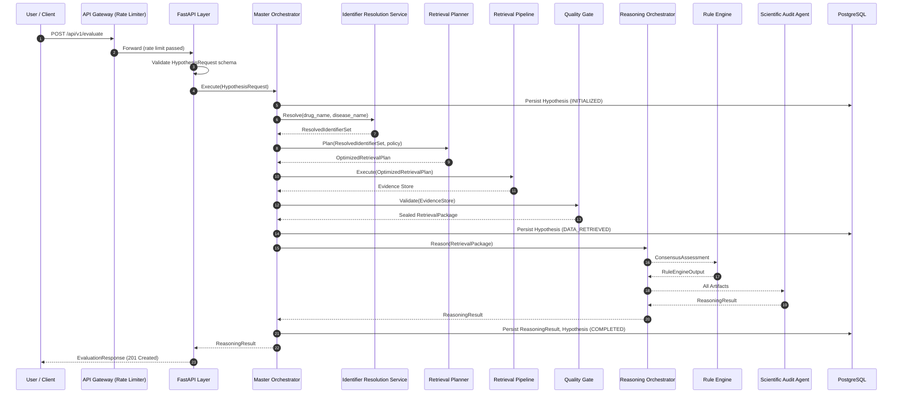
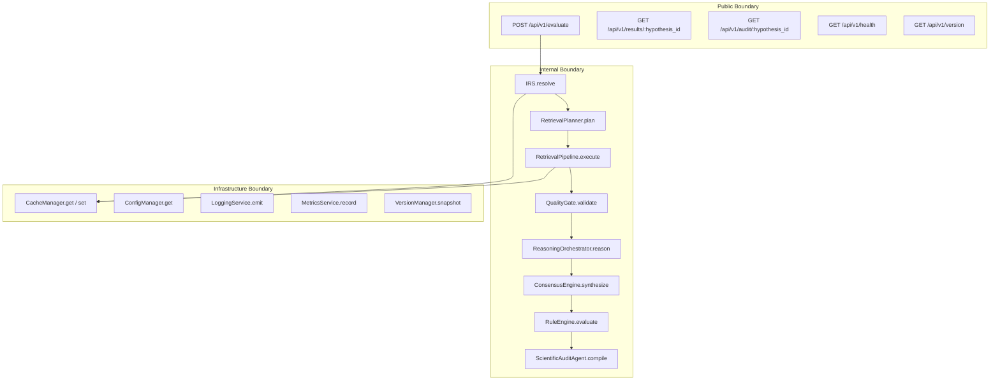

# CYNTHERA: API Contracts Specification
## Reference Identifier: 07_API_CONTRACTS.md

---

## 1. API Philosophy

### 1.1 Foundational Principles

The CYNTHERA API layer is not a thin HTTP wrapper around a function. It is a typed contract boundary. Every endpoint is a formal agreement between the caller and the system, defining the exact shape of every input, the exact shape of every output, and the exact set of errors that may occur.

The following principles govern every API contract in this document:

*   **Contract-First Design**: Request and response schemas are defined and reviewed before any implementation begins. No endpoint is created without a fully specified schema.
*   **Immutable Request Models**: Request payloads are treated as sealed, read-only inputs. No component modifies a request payload after it is received. This mirrors the immutability contracts established for canonical objects in `02_DOMAIN_MODEL.md`.
*   **Strong Typing**: Every field in every request and response model carries an explicit type. Untyped, loosely-typed, or polymorphic fields are not permitted in the public API surface.
*   **Schema Validation at the Boundary**: All input payloads are validated against their schema at the API Layer boundary, before any orchestration component receives them. Invalid payloads are rejected at the edge with a structured `ValidationError` response.
*   **Deterministic Outputs**: Given identical inputs and an identical state of external data (same retrieval session), API endpoints must return identical outputs. Non-determinism is a violation of the scientific reproducibility contract established in `SPECIFICATION.md §8.3`.
*   **Versioned APIs**: All public API routes are prefixed with a version identifier (`/api/v1/`). Breaking changes require a new version prefix.
*   **Traceability**: Every API response carries a `trace_id` field that propagates through all internal components and is recorded in the `RetrievalSession` and `ReasoningSession` manifests. Any response can be traced to its exact execution path.
*   **Idempotent Reads**: All `GET` endpoints are idempotent. `POST /evaluate` is not idempotent by design (each call initiates a new evaluation).

### 1.2 API Scope

This document defines three categories of API contracts:

| Category | Audience | Authentication |
| :--- | :--- | :--- |
| **Public APIs** | End users, external integrators | API Key |
| **Internal APIs** | System components only | Service Token (internal network) |
| **Infrastructure APIs** | Operations, monitoring systems | Internal service, admin API key |

---

## 2. API Architecture

### 2.1 Request Flow



### 2.2 Component API Topology



---

## 3. API Categories

### 3.1 Public APIs

Public APIs are the external interface to CYNTHERA. They are the only endpoints exposed outside the internal network boundary.

| Endpoint | Method | Purpose |
| :--- | :--- | :--- |
| `/api/v1/evaluate` | POST | Submit a drug-disease hypothesis for evaluation |
| `/api/v1/results/{hypothesis_id}` | GET | Retrieve the full ReasoningResult for a completed evaluation |
| `/api/v1/results/{hypothesis_id}/recommendation` | GET | Retrieve only the Recommendation from a completed evaluation |
| `/api/v1/results/{hypothesis_id}/audit` | GET | Retrieve the full ScientificAuditReport |
| `/api/v1/results/{hypothesis_id}/status` | GET | Poll the lifecycle state of an ongoing evaluation |
| `/api/v1/hypotheses` | GET | List all hypothesis evaluations for the authenticated user |
| `/api/v1/health` | GET | System health check (liveness) |
| `/api/v1/ready` | GET | System readiness check (all critical services available) |
| `/api/v1/version` | GET | Active system, rule set, and schema versions |

### 3.2 Internal APIs

Internal APIs define the contracts between system components. They are not exposed to external callers. All calls cross component boundaries via typed function interfaces within the same process, or via internal service calls in future distributed deployments.

| Interface | Caller | Callee |
| :--- | :--- | :--- |
| `IdentifierResolutionService.resolve()` | Master Orchestrator | Identifier Resolution Service |
| `RetrievalPlanner.plan()` | Master Orchestrator | Retrieval Planner |
| `QueryOptimizer.optimize()` | Retrieval Planner | Query Optimizer |
| `RetrievalPipeline.execute()` | Master Orchestrator | Retrieval Pipeline |
| `QualityGate.validate()` | Master Orchestrator | Quality Gate |
| `ReasoningOrchestrator.reason()` | Master Orchestrator | Reasoning Orchestrator |
| `ClaimExtractionAgent.extract()` | Reasoning Orchestrator | Claim Extraction Agent |
| `ClaimValidationAgent.validate()` | Reasoning Orchestrator | Claim Validation Agent |
| `[ExpertAgent].assess()` | Reasoning Orchestrator | Each of the 6 Expert Agents |
| `ConsensusEngine.synthesize()` | Reasoning Orchestrator | Consensus Engine |
| `RuleEngine.evaluate()` | Reasoning Orchestrator | Rule Engine |
| `ScientificAuditAgent.compile()` | Reasoning Orchestrator | Scientific Audit Agent |

### 3.3 Infrastructure APIs

| Interface | Purpose |
| :--- | :--- |
| `CacheManager.get(key)` | Retrieve a cached value |
| `CacheManager.set(key, value, ttl)` | Store a value with TTL |
| `CacheManager.invalidate(key)` | Invalidate a cache entry |
| `ConfigManager.get(key)` | Retrieve a typed configuration value |
| `LoggingService.emit(event)` | Emit a structured log event |
| `MetricsService.record(metric)` | Record a performance counter or histogram sample |
| `VersionManager.snapshot()` | Capture active version snapshot |

---

## 4. Public Endpoint Specifications

---

### 4.1 POST /api/v1/evaluate

**Purpose**: Submit a drug-disease hypothesis evaluation request. Initiates the full Engineering + Reasoning pipeline.

**Method**: POST

**Authentication**: API Key (header: `X-API-Key`)

**Input Schema**: `HypothesisRequest`

```
HypothesisRequest
|
+-- drug_name          (String, required, 1–200 chars)
+-- disease_name       (String, required, 1–200 chars)
+-- retrieval_policy   (Enum: FAST | STANDARD | COMPREHENSIVE, default: STANDARD)
+-- force_refresh      (Boolean, default: false) -- bypass cache for this evaluation
+-- client_reference   (String, optional, max 100 chars) -- caller-supplied idempotency token
```

**Output Schema**: `EvaluationAcceptedResponse`

```
EvaluationAcceptedResponse
|
+-- hypothesis_id      (UUID)
+-- status             (String: "ACCEPTED")
+-- estimated_duration_seconds (Integer: estimated completion time based on policy)
+-- poll_url           (String: /api/v1/results/{hypothesis_id}/status)
+-- trace_id           (UUID)
+-- created_at         (ISO-8601)
```

**Validation**:
*   `drug_name` must not be empty, must not exceed 200 characters, must not contain SQL injection patterns or executable script content
*   `disease_name`: same constraints as `drug_name`
*   `retrieval_policy` must be one of the three enum values
*   `client_reference` if provided must be unique per API key within the last 24 hours (idempotency window)

**Status Codes**:
| Code | Condition |
| :--- | :--- |
| `202 Accepted` | Evaluation accepted and queued |
| `400 Bad Request` | Schema validation failure (drug_name or disease_name invalid) |
| `401 Unauthorized` | Missing or invalid API key |
| `409 Conflict` | `client_reference` matches a recent in-flight request (idempotency guard) |
| `429 Too Many Requests` | Rate limit exceeded |
| `503 Service Unavailable` | Critical downstream service unavailable (core APIs down) |

**Idempotency**: If `client_reference` is provided, a second call with the same token within 24 hours returns the existing `hypothesis_id` rather than initiating a new evaluation.

**Retry Policy**: Callers may retry on `503` with exponential backoff. `202` responses must not be retried.

**Expected Latency**: < 500ms (response is async — evaluation runs in background)

**Dependencies**: Master Orchestrator, Identifier Resolution Service (validation only), Database (Hypothesis initialization)

**Example Request**:
```
POST /api/v1/evaluate
X-API-Key: cyn_live_abc123

{
  "drug_name": "Sildenafil",
  "disease_name": "Pulmonary Arterial Hypertension",
  "retrieval_policy": "STANDARD",
  "force_refresh": false,
  "client_reference": "ref-20260709-001"
}
```

**Example Response**:
```
HTTP 202 Accepted

{
  "hypothesis_id": "a3f4e1b2-9c21-4d80-b3a5-f12e3456789a",
  "status": "ACCEPTED",
  "estimated_duration_seconds": 90,
  "poll_url": "/api/v1/results/a3f4e1b2-9c21-4d80-b3a5-f12e3456789a/status",
  "trace_id": "t-9f8d3c1a-2e4b-5678-90ab-cdef12345678",
  "created_at": "2026-07-09T16:45:00Z"
}
```

---

### 4.2 GET /api/v1/results/{hypothesis_id}/status

**Purpose**: Poll the lifecycle state of an in-flight or completed hypothesis evaluation.

**Method**: GET

**Authentication**: API Key

**Path Parameters**: `hypothesis_id` (UUID)

**Output Schema**: `HypothesisStatusResponse`

```
HypothesisStatusResponse
|
+-- hypothesis_id      (UUID)
+-- lifecycle_state    (Enum: INITIALIZED | ID_RESOLVED | DATA_RETRIEVED |
|                              NORMALIZED | REASONED | EVALUATED | COMPLETED | FAILED)
+-- retrieval_confidence (Enum: HIGH | MEDIUM | LOW | null)
+-- current_phase      (String: human-readable current phase description)
+-- started_at         (ISO-8601)
+-- completed_at       (ISO-8601, null if not complete)
+-- duration_seconds   (Integer, null if not complete)
+-- failure_reason     (String, null if not failed)
+-- trace_id           (UUID)
```

**Status Codes**:
| Code | Condition |
| :--- | :--- |
| `200 OK` | Status returned successfully |
| `404 Not Found` | hypothesis_id does not exist |
| `401 Unauthorized` | Invalid API key |

**Expected Latency**: < 100ms (database read)

---

### 4.3 GET /api/v1/results/{hypothesis_id}

**Purpose**: Retrieve the complete `ReasoningResult` for a completed hypothesis evaluation.

**Method**: GET

**Authentication**: API Key

**Path Parameters**: `hypothesis_id` (UUID)

**Query Parameters**:
*   `include_claim_graph` (Boolean, default: false) — include full serialized ClaimGraph in response
*   `include_evidence` (Boolean, default: false) — include full Evidence record list

**Output Schema**: `EvaluationResponse`

```
EvaluationResponse
|
+-- hypothesis_id         (UUID)
+-- drug
|   +-- canonical_name   (String)
|   +-- chembl_id        (String)
+-- disease
|   +-- canonical_name   (String)
|   +-- mesh_id          (String)
+-- recommendation
|   +-- status           (RecommendationStatus)
|   +-- rule_fired       (String)
|   +-- reason           (String)
+-- scores
|   +-- support_level    (Enum: HIGH | MEDIUM | LOW | ABSENT)
|   +-- mechanistic_level (Enum: HIGH | MEDIUM | LOW | NONE)
|   +-- risk_level       (Enum: HIGH | MEDIUM | LOW)
+-- uncertainty
|   +-- overall_level    (Enum: HIGH | MEDIUM | LOW)
|   +-- sources          (List[String])
+-- mechanistic_chain
|   +-- status           (Enum: COMPLETE | PARTIAL | INCOMPLETE | CONTRADICTED)
|   +-- depth            (Integer)
|   +-- summary          (String: AI_GENERATED_SUMMARY, labelled)
+-- contradictions
|   +-- total            (Integer)
|   +-- strong           (Integer)
|   +-- unresolved       (Integer)
+-- retrieval_metadata
|   +-- retrieval_confidence (Enum)
|   +-- sources_queried  (List[String])
|   +-- sources_failed   (List[String])
|   +-- retrieved_at     (ISO-8601)
+-- claim_graph          (ClaimGraph, only if include_claim_graph=true)
+-- evidence_records     (List[Evidence], only if include_evidence=true)
+-- version_snapshot
|   +-- reasoning_engine_version (String)
|   +-- rule_set_version (String)
|   +-- chembl_version   (String)
+-- trace_id             (UUID)
+-- completed_at         (ISO-8601)
```

**Status Codes**:
| Code | Condition |
| :--- | :--- |
| `200 OK` | Full result returned |
| `202 Accepted` | Evaluation still in progress (result not yet available) |
| `404 Not Found` | hypothesis_id does not exist |
| `401 Unauthorized` | Invalid API key |

**Expected Latency**: < 500ms (database read with JSONB deserialization); < 2s if `include_claim_graph=true`

---

### 4.4 GET /api/v1/results/{hypothesis_id}/recommendation

**Purpose**: Retrieve only the Recommendation and scores from a completed evaluation. Lightweight response for dashboard consumption.

**Method**: GET

**Authentication**: API Key

**Output Schema**: `RecommendationResponse`

```
RecommendationResponse
|
+-- hypothesis_id         (UUID)
+-- drug_name             (String)
+-- disease_name          (String)
+-- recommendation_status (RecommendationStatus)
+-- rule_fired            (String)
+-- reason                (String)
+-- support_level         (Enum)
+-- mechanistic_level     (Enum)
+-- risk_level            (Enum)
+-- uncertainty_level     (Enum)
+-- strong_contradictions (Integer)
+-- completed_at          (ISO-8601)
+-- trace_id              (UUID)
```

**Expected Latency**: < 100ms

---

### 4.5 GET /api/v1/results/{hypothesis_id}/audit

**Purpose**: Retrieve the full `ScientificAuditReport` for a completed evaluation.

**Method**: GET

**Authentication**: API Key

**Output Schema**: `ScientificAuditResponse`

```
ScientificAuditResponse
|
+-- hypothesis_id              (UUID)
+-- reasoning_session_id       (UUID)
+-- reasoning_engine_version   (String)
+-- rule_set_version           (String)
+-- generated_at               (ISO-8601)
+-- input_summary              (Object)
+-- claim_graph_summary        (Object)
+-- agent_assessments          (Object: all six assessment summaries)
+-- consensus_summary          (Object)
+-- mechanistic_chain_summary  (Object)
+-- score_breakdown            (Object)
+-- contradiction_summary      (Object)
+-- recommendation             (Object)
+-- uncertainty_report         (Object)
+-- ai_generated_summaries     (Object: labelled AI-generated text sections)
+-- trace_id                   (UUID)
```

**Expected Latency**: < 1s (large JSONB read)

---

### 4.6 GET /api/v1/hypotheses

**Purpose**: List all hypothesis evaluations for the authenticated user, with filtering and pagination.

**Method**: GET

**Authentication**: API Key

**Query Parameters**:
*   `page` (Integer, default: 1)
*   `page_size` (Integer, default: 20, max: 100)
*   `status` (Enum: COMPLETED | FAILED | IN_PROGRESS, optional filter)
*   `recommendation` (Enum: PROMISING | UNCERTAIN | NOT_RECOMMENDED, optional filter)
*   `drug_name` (String, partial match filter)
*   `disease_name` (String, partial match filter)
*   `from_date` (ISO-8601 date, optional)
*   `to_date` (ISO-8601 date, optional)

**Output Schema**: `HypothesisListResponse`

```
HypothesisListResponse
|
+-- total          (Integer)
+-- page           (Integer)
+-- page_size      (Integer)
+-- items          (List[HypothesisSummary])
    +-- HypothesisSummary
        +-- hypothesis_id         (UUID)
        +-- drug_name             (String)
        +-- disease_name          (String)
        +-- lifecycle_state       (Enum)
        +-- recommendation_status (RecommendationStatus, null if not completed)
        +-- retrieval_confidence  (Enum, null if not completed)
        +-- created_at            (ISO-8601)
        +-- completed_at          (ISO-8601, null if not completed)
```

**Expected Latency**: < 200ms (materialized view query)

---

### 4.7 GET /api/v1/health

**Purpose**: Liveness probe. Confirms the API server is running and able to accept requests.

**Method**: GET

**Authentication**: None

**Output Schema**: `HealthResponse`

```
HealthResponse
|
+-- status    (String: "OK")
+-- timestamp (ISO-8601)
+-- version   (String: application version)
```

**Status Codes**: `200 OK` always if the server is alive.

---

### 4.8 GET /api/v1/ready

**Purpose**: Readiness probe. Confirms all critical dependencies are available before the server accepts traffic.

**Method**: GET

**Authentication**: None

**Output Schema**: `ReadinessResponse`

```
ReadinessResponse
|
+-- ready       (Boolean)
+-- checks      (List[ServiceCheck])
|   +-- ServiceCheck
|       +-- service  (String: "database" | "cache" | "chembl" | "uniprot" | ...)
|       +-- status   (Enum: OK | DEGRADED | DOWN)
|       +-- latency_ms (Integer)
+-- timestamp   (ISO-8601)
```

**Status Codes**: `200 OK` if ready, `503 Service Unavailable` if any critical service is DOWN.

---

### 4.9 GET /api/v1/version

**Purpose**: Retrieve the active versions of all system components, rule sets, and data sources.

**Method**: GET

**Authentication**: API Key

**Output Schema**: `VersionResponse`

```
VersionResponse
|
+-- application_version        (String)
+-- api_version                (String: "v1")
+-- reasoning_engine_version   (String)
+-- rule_set_version           (String)
+-- database_schema_version    (String)
+-- data_source_versions
|   +-- chembl                 (String)
|   +-- uniprot                (String)
|   +-- reactome               (String)
|   +-- clinicaltrials         (String)
|   +-- disgenet               (String)
+-- llm_model_version          (String)
+-- prompt_template_version    (String)
+-- timestamp                  (ISO-8601)
```

---

## 5. Internal Interface Contracts

---

### 5.1 IdentifierResolutionService.resolve()

**Caller**: Master Orchestrator
**Callee**: Identifier Resolution Service

**Input**:
```
ResolutionRequest
|
+-- drug_name       (String)
+-- disease_name    (String)
+-- session_id      (UUID)
+-- trace_id        (UUID)
```

**Output**:
```
ResolutionResult
|
+-- status              (Enum: SUCCESS | PARTIAL | FAILED)
+-- resolved_identifiers (ResolvedIdentifierSet, null if FAILED)
+-- failure_reason      (String, null if SUCCESS)
+-- cache_hit           (Boolean)
+-- duration_ms         (Integer)
```

**Error States**: `DRUG_NOT_RESOLVED`, `DISEASE_NOT_RESOLVED`, `AMBIGUOUS_INPUT`

---

### 5.2 RetrievalPipeline.execute()

**Caller**: Master Orchestrator
**Callee**: Retrieval Pipeline

**Input**:
```
PipelineExecutionRequest
|
+-- plan            (OptimizedRetrievalPlan)
+-- session_id      (UUID)
+-- trace_id        (UUID)
```

**Output**:
```
PipelineExecutionResult
|
+-- status              (Enum: SUCCESS | PARTIAL | FAILED)
+-- evidence_store      (EvidenceStore, null if FAILED)
+-- retrieval_manifest  (RetrievalManifest, partial)
+-- duration_ms         (Integer)
```

---

### 5.3 ReasoningOrchestrator.reason()

**Caller**: Master Orchestrator
**Callee**: Reasoning Orchestrator

**Input**:
```
ReasoningRequest
|
+-- retrieval_package   (Sealed RetrievalPackage)
+-- session_id          (UUID)
+-- trace_id            (UUID)
```

**Output**:
```
ReasoningResponse
|
+-- status              (Enum: SUCCESS | FAILED)
+-- reasoning_result    (ReasoningResult, null if FAILED)
+-- failure_reason      (String, null if SUCCESS)
+-- duration_ms         (Integer)
```

---

### 5.4 [ExpertAgent].assess()

**Caller**: Reasoning Orchestrator
**Callee**: Each of the 6 Expert Agents

Each Expert Agent exposes an identical interface signature:

**Input**:
```
AgentAssessmentRequest
|
+-- claim_graph         (Sealed ClaimGraph)
+-- retrieval_package   (Sealed RetrievalPackage)
+-- session_id          (UUID)
+-- trace_id            (UUID)
```

**Output** (varies by agent, but always typed):
```
AgentAssessmentResult
|
+-- status              (Enum: SUCCESS | UNAVAILABLE | PARTIAL)
+-- assessment          (Typed Assessment Object specific to the agent)
+-- warnings            (List[String])
+-- duration_ms         (Integer)
```

The typed `assessment` field is one of: `MechanisticAssessment`, `DiseaseRelevanceAssessment`, `ClinicalEvidenceAssessment`, `SupportAssessment`, `RiskAssessment`, or `ContradictionReport`.

---

### 5.5 ConsensusEngine.synthesize()

**Caller**: Reasoning Orchestrator
**Callee**: Consensus Engine

**Input**:
```
ConsensusSynthesisRequest
|
+-- mechanistic_assessment          (MechanisticAssessment)
+-- disease_relevance_assessment    (DiseaseRelevanceAssessment)
+-- clinical_evidence_assessment    (ClinicalEvidenceAssessment)
+-- support_assessment              (SupportAssessment)
+-- risk_assessment                 (RiskAssessment)
+-- contradiction_report            (ContradictionReport)
+-- retrieval_manifest              (RetrievalManifest)
+-- session_id                      (UUID)
```

**Output**:
```
ConsensusSynthesisResult
|
+-- consensus_assessment    (ConsensusAssessment)
+-- uncertainty_report      (UncertaintyReport)
+-- duration_ms             (Integer)
```

---

### 5.6 RuleEngine.evaluate()

**Caller**: Reasoning Orchestrator
**Callee**: Rule Engine

**Input**:
```
RuleEvaluationRequest
|
+-- consensus_assessment    (ConsensusAssessment)
+-- retrieval_manifest      (RetrievalManifest)
+-- rule_set_version        (String)
+-- session_id              (UUID)
```

**Output**:
```
RuleEvaluationResult
|
+-- recommendation_status   (RecommendationStatus)
+-- rule_fired              (String)
+-- reason                  (String)
+-- rule_set_version        (String)
+-- duration_ms             (Integer)
```

---

## 6. Request and Response Models

### 6.1 Core Request Models

| Model | Used By | Key Fields |
| :--- | :--- | :--- |
| `HypothesisRequest` | POST /evaluate | drug_name, disease_name, retrieval_policy, force_refresh, client_reference |
| `ResolutionRequest` | IRS internal | drug_name, disease_name, session_id, trace_id |
| `PipelineExecutionRequest` | Retrieval Pipeline internal | plan, session_id, trace_id |
| `ReasoningRequest` | Reasoning Orchestrator internal | retrieval_package, session_id, trace_id |
| `AgentAssessmentRequest` | All Expert Agents | claim_graph, retrieval_package, session_id, trace_id |
| `ConsensusSynthesisRequest` | Consensus Engine | six assessment objects, retrieval_manifest |
| `RuleEvaluationRequest` | Rule Engine | consensus_assessment, retrieval_manifest, rule_set_version |

### 6.2 Core Response Models

| Model | Returned By | Key Fields |
| :--- | :--- | :--- |
| `EvaluationAcceptedResponse` | POST /evaluate | hypothesis_id, status, poll_url, trace_id |
| `EvaluationResponse` | GET /results/:id | hypothesis_id, recommendation, scores, mechanistic_chain, contradictions |
| `RecommendationResponse` | GET /results/:id/recommendation | recommendation_status, rule_fired, reason, score levels |
| `ScientificAuditResponse` | GET /results/:id/audit | full audit structure per §12 of 04_REASONING_SPECIFICATION.md |
| `HypothesisStatusResponse` | GET /results/:id/status | lifecycle_state, current_phase, completed_at |
| `HypothesisListResponse` | GET /hypotheses | paginated list of HypothesisSummary objects |
| `HealthResponse` | GET /health | status, timestamp, version |
| `ReadinessResponse` | GET /ready | ready, checks per service |
| `VersionResponse` | GET /version | all component and data source versions |

### 6.3 Error Response Model

All error responses — regardless of error type — return a consistent `ErrorResponse`:

```
ErrorResponse
|
+-- error_code      (String: machine-readable code, e.g., "DRUG_NOT_RESOLVED")
+-- error_class     (String: "VALIDATION" | "RESOLUTION" | "RETRIEVAL" | "REASONING" | "AUTH" | "RATE_LIMIT" | "INTERNAL")
+-- message         (String: human-readable error description)
+-- detail          (Object, nullable: structured detail for validation errors)
|   +-- field       (String: the field that failed)
|   +-- constraint  (String: the constraint that was violated)
|   +-- value       (String: the value that was rejected)
+-- hypothesis_id   (UUID, nullable: present if hypothesis was created before error occurred)
+-- trace_id        (UUID)
+-- timestamp       (ISO-8601)
```

---

## 7. Error Handling

### 7.1 Error Taxonomy

| HTTP Code | Error Class | Common Causes |
| :--- | :--- | :--- |
| `400 Bad Request` | VALIDATION | Missing required field, field too long, invalid enum value, injection pattern detected |
| `401 Unauthorized` | AUTH | Missing API key, invalid API key, expired API key |
| `403 Forbidden` | AUTH | Valid API key but insufficient permissions |
| `404 Not Found` | VALIDATION | hypothesis_id does not exist or does not belong to caller |
| `409 Conflict` | VALIDATION | Duplicate client_reference within idempotency window |
| `422 Unprocessable Entity` | VALIDATION | Syntactically valid but semantically invalid (e.g., ambiguous drug name) |
| `429 Too Many Requests` | RATE_LIMIT | Rate limit exceeded per API key |
| `500 Internal Server Error` | INTERNAL | Unexpected exception in orchestration or reasoning layer |
| `503 Service Unavailable` | RETRIEVAL | Core external API (ChEMBL, UniProt) unavailable after all retries |

### 7.2 Error Codes Reference

| Error Code | Meaning |
| :--- | :--- |
| `DRUG_NOT_RESOLVED` | Drug name could not be mapped to any recognized identifier |
| `DISEASE_NOT_RESOLVED` | Disease name could not be mapped to any recognized identifier |
| `AMBIGUOUS_DRUG` | Drug name resolves to multiple non-equivalent compounds |
| `AMBIGUOUS_DISEASE` | Disease name resolves to multiple non-equivalent conditions |
| `CORE_SOURCE_UNAVAILABLE` | ChEMBL or UniProt unavailable after all retry attempts |
| `QUALITY_GATE_FAILED` | Retrieved evidence did not pass required Quality Gate checks |
| `CLAIM_EXTRACTION_FAILED` | LLM extraction returned zero usable claims |
| `INSUFFICIENT_VALIDATED_CLAIMS` | All extracted claims rejected during validation |
| `REASONING_FAILURE` | Reasoning Orchestrator encountered a fatal internal error |
| `CONSENSUS_INPUT_INSUFFICIENT` | Two or more Expert Agents returned UNAVAILABLE |
| `EVALUATION_IN_PROGRESS` | Result requested but evaluation not yet complete |
| `RATE_LIMIT_EXCEEDED` | Too many requests from this API key in the current window |

### 7.3 Partial Results

CYNTHERA never returns a partial `ReasoningResult`. If the evaluation cannot complete with sufficient evidence, the result carries `recommendation_status = UNCERTAIN` with a populated `UncertaintyReport` explaining the gaps. Partial results are surfaced through structured uncertainty reporting, not through partial response payloads.

---

## 8. API Versioning

### 8.1 Version Strategy

All public API routes are prefixed with `/api/v1/`. The version number is a major version: it increments only on breaking changes.

A breaking change is defined as:
*   Removing a field from a response model
*   Changing the type of an existing field
*   Changing the meaning of an existing field
*   Changing a status code for an existing error condition
*   Removing an endpoint

A non-breaking change is:
*   Adding a new optional field to a request or response
*   Adding a new endpoint
*   Adding a new error code
*   Adding a new enum value to an enum field that is not used in request validation

### 8.2 Backward Compatibility Policy

*   Non-breaking changes are deployed without a version bump.
*   Breaking changes result in a new version prefix (`/api/v2/`).
*   The prior version (`/api/v1/`) remains available for a minimum of 6 months after a new version is released.
*   Deprecation notices are included in response headers: `Deprecation: true`, `Sunset: <ISO-8601 date>`.

### 8.3 Internal API Versioning

Internal component interfaces do not carry HTTP version prefixes. They are versioned through the component version recorded in the `ReasoningSessionManifest` and `SystemVersion` snapshot. Interface changes between components require coordinated deployment — both caller and callee must be updated together.

---

## 9. Security

### 9.1 Authentication

All public API endpoints (except `/health` and `/ready`) require a valid API key passed in the request header:

```
X-API-Key: cyn_live_<key>
```

API keys are issued per user/application. They are stored as hashed values in the database (never in plaintext). Keys are prefixed with environment indicators: `cyn_live_` for production, `cyn_test_` for development/testing.

### 9.2 Authorization

In the MVP, all API key holders have equivalent read/write access to the public API. Future versions will introduce:
*   Role-based access (researcher, viewer, admin)
*   Per-user hypothesis isolation (callers may only access their own hypotheses)
*   Admin-only access to infrastructure endpoints

### 9.3 Input Validation and Injection Protection

*   All string fields are validated for maximum length at the API boundary
*   String inputs are checked for patterns consistent with SQL injection, HTML injection, and prompt injection before being passed to any downstream component
*   Prompt injection protection: drug and disease name strings are never interpolated directly into LLM prompts. The Claim Extraction Agent uses templated prompts where user-supplied text is inserted as a bounded, escaped content field — not as a prompt instruction

### 9.4 Rate Limiting

| Tier | Limit |
| :--- | :--- |
| Default | 10 requests per minute, 100 per day per API key |
| Evaluation endpoint | 3 concurrent in-flight evaluations per API key |
| Read endpoints | 60 requests per minute per API key |
| Health/Ready | Unlimited |

Rate limit headers are included in all responses:
```
X-RateLimit-Limit: 10
X-RateLimit-Remaining: 7
X-RateLimit-Reset: 1720528200
```

### 9.5 Secret Management

*   API keys for external services (NCBI, LLM providers) are injected via environment variables at runtime
*   No secrets are stored in source code, configuration files, or version control
*   LLM API keys are rotated on a configurable schedule
*   Database credentials are managed via environment variables with restricted filesystem access

### 9.6 Audit Logging

Every authenticated API request is logged with: API key identifier (hashed), endpoint, method, hypothesis_id (if applicable), response status code, response latency, and trace_id. Audit logs are immutable and retained per the backup strategy in `06_DATABASE_SPECIFICATION.md §12`.

---

## 10. Performance Targets

| Endpoint | P50 Latency | P95 Latency | Notes |
| :--- | :--- | :--- | :--- |
| POST /evaluate | < 300ms | < 800ms | Response is async — evaluation runs in background |
| GET /status | < 80ms | < 200ms | Database read only |
| GET /results/:id | < 400ms | < 1200ms | Includes JSONB deserialization |
| GET /results/:id/recommendation | < 100ms | < 300ms | Small payload |
| GET /results/:id/audit | < 800ms | < 2000ms | Large JSONB payload |
| GET /hypotheses | < 150ms | < 500ms | Materialized view query |
| GET /health | < 20ms | < 50ms | No database call |
| GET /ready | < 200ms | < 500ms | Pings all critical services |

**Evaluation Pipeline Latency** (internal, not API response latency):

| Policy | P50 Total | P95 Total |
| :--- | :--- | :--- |
| FAST | < 45 seconds | < 90 seconds |
| STANDARD | < 90 seconds | < 180 seconds |
| COMPREHENSIVE | < 180 seconds | < 300 seconds |

**Maximum Payload Sizes**:
*   Request payload: 10 KB
*   Standard response payload: 500 KB
*   Audit report response: 5 MB
*   Full result with claim graph: 20 MB

### 10.1 Long-Running Operations

The evaluation pipeline (POST /evaluate) is an asynchronous operation. The API returns a `202 Accepted` immediately and the client polls `/status` or receives a webhook notification on completion. This design prevents HTTP timeout issues for long-running evaluations under COMPREHENSIVE policy.

---

## 11. Future API Roadmap

### 11.1 REST Enhancements (Near-Term)

*   `POST /api/v1/evaluate/batch` — submit multiple drug-disease pairs in a single request, returning a list of hypothesis IDs
*   `GET /api/v1/drugs/{chembl_id}` — retrieve canonical Drug entity with all resolved identifiers
*   `GET /api/v1/diseases/{mesh_id}` — retrieve canonical Disease entity
*   `DELETE /api/v1/hypotheses/{hypothesis_id}` — soft-delete (archive) a hypothesis evaluation
*   Webhook support: `POST /api/v1/webhooks` — register a callback URL to be called on evaluation completion

### 11.2 Streaming API (Medium-Term)

A Server-Sent Events (SSE) endpoint to stream evaluation progress in real time:

```
GET /api/v1/evaluate/{hypothesis_id}/stream
```

Emits structured events as each pipeline phase completes:
```
event: phase_complete
data: { "phase": "DATA_RETRIEVED", "retrieval_confidence": "HIGH", ... }
```

### 11.3 GraphQL (Medium-Term)

A GraphQL endpoint for flexible, client-driven querying of hypothesis results. Particularly useful for dashboard applications that need to query different subsets of the ReasoningResult across many hypotheses without fetching full payloads.

### 11.4 gRPC (Long-Term)

For high-throughput batch processing scenarios where HTTP/JSON overhead is unacceptable, a gRPC API surface over Protocol Buffers will be provided. This is particularly relevant for the distributed agent architecture described in `01_SYSTEM_ARCHITECTURE.md §14`.

### 11.5 SDK Generation

OpenAPI schema auto-generated from the FastAPI application will be used to generate client SDKs in Python, TypeScript, and R for computational biology workbench integration.
