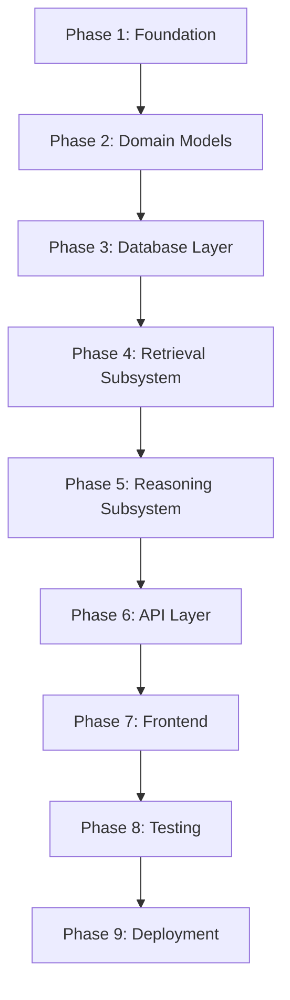

# CYNTHERA: Implementation Guide
## Reference Identifier: 08_IMPLEMENTATION_GUIDE.md

---

## 1. Engineering Philosophy

### 1.1 How This Guide Should Be Read

This document is the engineering handbook for CYNTHERA. A new contributor should be able to read this document — without reading any prior specification — and understand:

*   What they are building and why the architecture is designed the way it is
*   What technologies are used and why each was chosen
*   Where every module lives and what it is responsible for
*   In what order to implement the system and what the acceptance criteria are at each stage
*   What the testing and quality standards are

The prior architecture documents (`01` through `07`) define *what* to build. This document defines *how* to build it.

### 1.2 Foundational Engineering Principles

**Incremental Implementation**
The system is built in phases, each of which produces a fully working, testable system increment. No phase leaves the system in a broken state. Each phase is mergeable to main independently.

**Contract-First Development**
The Pydantic schema for every canonical object (`Drug`, `Disease`, `Claim`, `ReasoningResult`, etc.) is written and reviewed before any implementation code that consumes or produces that object. No component is implemented until the input and output contracts are fully defined.

**Determinism by Default**
Every component is deterministic unless it explicitly declares LLM usage. Stochastic behavior is isolated to the Claim Extraction Agent. Every other component must produce identical output for identical input.

**Strong Typing Throughout**
Python type hints are mandatory on every function signature, class field, and module-level variable. `mypy` runs in strict mode as part of CI. Untyped code does not merge.

**Clean Architecture**
The codebase follows layered clean architecture:
*   Domain layer (entities, value objects) — no external dependencies
*   Repository layer (data access) — depends on domain only
*   Service layer (business logic / agents) — depends on domain and repository
*   Infrastructure layer (HTTP clients, LLM, cache) — external integrations
*   API layer (FastAPI) — depends on service layer only

No lower layer may import from a higher layer. The domain layer imports nothing from any other layer.

**SOLID Principles**
*   **Single Responsibility**: Every class and function has one reason to change
*   **Open/Closed**: Components are open for extension (new agents, new sources) without modification of existing code
*   **Liskov Substitution**: All Source connectors are interchangeable; all Expert Agents share a common base interface
*   **Interface Segregation**: No component is forced to depend on interfaces it does not use
*   **Dependency Inversion**: High-level modules (orchestrators) depend on abstractions; concrete implementations are injected

**Dependency Injection**
No component constructs its dependencies directly. All dependencies are passed via constructor injection or a configured DI container. This makes every component independently testable with mocked dependencies.

**Domain-Driven Design**
The codebase uses the vocabulary of `02_DOMAIN_MODEL.md` exactly. Class names, field names, and enum values match the canonical domain model. No synonyms or abbreviations are introduced without a documented mapping.

---

## 2. Technology Stack

### 2.1 Backend

| Technology | Role | Why Chosen |
| :--- | :--- | :--- |
| **Python 3.12+** | Primary language | Scientific ecosystem (asyncio, httpx, numpy); strong typing via mypy; Pydantic v2 support |
| **FastAPI** | HTTP API framework | Native async, automatic OpenAPI schema generation, Pydantic integration, minimal boilerplate |
| **Pydantic v2** | Schema definition and validation | Canonical domain models are Pydantic BaseModel classes; v2 provides 5–50× validation speedup over v1 |
| **SQLAlchemy 2.0 (async)** | Database ORM and query builder | Native async support; declarative models; compatible with Alembic |
| **asyncpg** | PostgreSQL async driver | Highest-throughput Python async PostgreSQL driver; SQLAlchemy 2.0 native support |
| **Alembic** | Database migrations | Tight SQLAlchemy integration; auto-generation of migration scripts from model diffs |
| **httpx** | Async HTTP client | All external API calls (ChEMBL, UniProt, PubMed, etc.) use httpx with async context managers |
| **asyncio** | Concurrency model | Phase 2 (parallel evidence retrieval) and Phase 4 (parallel Expert Agents) use asyncio gather |
| **tenacity** | Retry logic | Configurable retry policies with exponential backoff for all Source connectors and LLM calls |
| **structlog** | Structured logging | JSON-formatted log events consumable by ELK/Datadog; trace ID propagation |
| **prometheus-client** | Metrics | Prometheus-compatible metrics endpoint for Grafana dashboards |
| **pytest + pytest-asyncio** | Testing | Async test support; fixture-based dependency injection; parametrize for scientific validation |

### 2.2 Frontend (MVP)

| Technology | Role | Why Chosen |
| :--- | :--- | :--- |
| **Streamlit** | Interactive UI | Rapid development for scientific data visualization; built-in data tables, charts, markdown rendering; no frontend build toolchain required for MVP |

### 2.3 Frontend (Production)

| Technology | Role | Why Chosen |
| :--- | :--- | :--- |
| **React + TypeScript** | UI framework | Component model; type safety; SDK auto-generation from OpenAPI schema |
| **Recharts / D3.js** | Scientific visualization | Mechanistic chain graph visualization, ERW heatmaps, contradiction network diagrams |

### 2.4 Infrastructure

| Technology | Role | Why Chosen |
| :--- | :--- | :--- |
| **Docker + Docker Compose** | Containerization | Reproducible development and deployment environments; all services defined in compose |
| **Poetry** | Dependency management | Lockfile-based reproducible installs; dev/test/prod dependency groups |
| **GitHub Actions** | CI/CD | Native GitHub integration; matrix testing; environment-based secrets management |
| **PostgreSQL 16** | Primary database | ACID, JSONB, full-text search, pgvector-ready, Alembic-compatible |
| **Redis 7** (Phase 2) | Distributed cache | Shared cache across API instances; rate-limit token buckets; async Python client (redis-py) |
| **Neo4j 5** (Phase 3) | Graph reasoning | Cypher-based mechanistic chain traversal; native graph persistence of ClaimGraph |
| **pgvector** (Phase 2) | Vector embeddings | In-database semantic similarity search over Evidence abstracts |

---

## 3. Project Structure

```
cynthera/
|
+-- backend/                         # All server-side application code
|   |
|   +-- api/                         # FastAPI application layer
|   |   +-- v1/                      # API version 1 routes
|   |   |   +-- routes/              # Route handler modules
|   |   |   |   +-- evaluate.py      # POST /evaluate, GET /results/:id
|   |   |   |   +-- hypotheses.py    # GET /hypotheses, DELETE /hypotheses/:id
|   |   |   |   +-- system.py        # GET /health, /ready, /version
|   |   |   +-- dependencies.py      # FastAPI dependency injection providers
|   |   |   +-- middleware.py        # Auth, rate limiting, trace ID injection
|   |   +-- main.py                  # FastAPI app factory + lifespan manager
|   |
|   +-- core/                        # Domain layer — no external dependencies
|   |   +-- domain/                  # Canonical domain entity models
|   |   |   +-- drug.py              # Drug entity (Pydantic BaseModel)
|   |   |   +-- disease.py           # Disease entity
|   |   |   +-- protein.py           # Protein entity
|   |   |   +-- target.py            # Target entity
|   |   |   +-- pathway.py           # Pathway entity
|   |   |   +-- evidence.py          # Evidence entity (EvidenceType enum, ERW)
|   |   |   +-- claim.py             # Claim entity (subject, predicate, object, ERW)
|   |   |   +-- claim_graph.py       # ClaimGraph + ClaimRelation
|   |   |   +-- contradiction.py     # Contradiction entity
|   |   |   +-- clinical_trial.py    # ClinicalTrial entity
|   |   |   +-- hypothesis.py        # Hypothesis entity + LifecycleState enum
|   |   |   +-- retrieval_package.py # Sealed RetrievalPackage
|   |   |   +-- reasoning_result.py  # ReasoningResult + all assessment types
|   |   +-- enums/                   # All controlled vocabularies
|   |   |   +-- predicate_type.py    # PredicateType enum
|   |   |   +-- evidence_type.py     # EvidenceType enum + ERW base weights
|   |   |   +-- recommendation.py    # RecommendationStatus enum
|   |   |   +-- retrieval_policy.py  # RetrievalPolicy enum
|   |   |   +-- lifecycle.py         # HypothesisLifecycleState enum
|   |   +-- value_objects/           # Immutable value types
|   |   |   +-- identifier.py        # ResolvedIdentifierSet, CanonicalIdentifier
|   |   |   +-- erw.py               # ERW computation rules and modifiers
|   |   |   +-- provenance.py        # ProvenanceReference
|   |   +-- exceptions.py            # All domain-level exception types
|   |
|   +-- engineering/                 # Engineering layer — deterministic retrieval
|   |   +-- orchestrator/
|   |   |   +-- master_orchestrator.py  # MasterOrchestrator class
|   |   +-- identity/
|   |   |   +-- resolution_service.py   # IdentifierResolutionService
|   |   |   +-- identifier_cache.py     # Cache wrapper for identifier lookups
|   |   +-- retrieval/
|   |   |   +-- planner.py              # RetrievalPlanner
|   |   |   +-- optimizer.py            # QueryOptimizer
|   |   |   +-- pipeline.py             # RetrievalPipeline (async execution engine)
|   |   |   +-- registry/
|   |   |   |   +-- source_registry.py  # SourceRegistry
|   |   |   |   +-- source_definition.py # SourceDefinition dataclass
|   |   |   +-- connectors/             # One module per registered source
|   |   |   |   +-- base.py             # BaseConnector abstract class
|   |   |   |   +-- chembl.py           # ChEMBLConnector
|   |   |   |   +-- uniprot.py          # UniProtConnector
|   |   |   |   +-- pubmed.py           # PubMedConnector
|   |   |   |   +-- reactome.py         # ReactomeConnector
|   |   |   |   +-- clinicaltrials.py   # ClinicalTrialsConnector
|   |   |   |   +-- disgenet.py         # DisGeNETConnector
|   |   |   |   +-- drugbank_open.py    # DrugBankOpenConnector
|   |   |   +-- parsers/                # One parser per source
|   |   |   |   +-- base.py
|   |   |   |   +-- chembl_parser.py
|   |   |   |   +-- uniprot_parser.py
|   |   |   |   +-- ... (one per source)
|   |   |   +-- validators/             # One validator per source
|   |   |   |   +-- base.py
|   |   |   |   +-- chembl_validator.py
|   |   |   |   +-- ... (one per source)
|   |   |   +-- normalization/
|   |   |       +-- mapping_registry.py # CanonicalMappingRegistry
|   |   |       +-- factory.py          # CanonicalDomainModelFactory
|   |   +-- quality_gate/
|   |       +-- quality_gate.py         # QualityGate
|   |       +-- gate_checks.py          # Individual check implementations
|   |
|   +-- reasoning/                   # Reasoning layer
|   |   +-- orchestrator/
|   |   |   +-- reasoning_orchestrator.py  # ReasoningOrchestrator
|   |   +-- extraction/
|   |   |   +-- claim_extraction_agent.py  # ClaimExtractionAgent (LLM-assisted)
|   |   |   +-- extraction_prompt.py       # Versioned prompt template
|   |   |   +-- extraction_schema.py       # LLM output JSON schema
|   |   +-- validation/
|   |   |   +-- claim_validation_agent.py  # ClaimValidationAgent (deterministic)
|   |   |   +-- validation_rules.py        # Each validation rule as a callable
|   |   +-- graph/
|   |   |   +-- claim_graph_builder.py     # ClaimGraph construction + ERW assignment
|   |   |   +-- graph_sealer.py            # ClaimGraph immutability enforcement
|   |   +-- agents/
|   |   |   +-- base_agent.py              # BaseExpertAgent abstract class
|   |   |   +-- mechanistic_agent.py       # MechanisticExpertAgent
|   |   |   +-- disease_biology_agent.py   # DiseaseBiologyExpertAgent
|   |   |   +-- clinical_evidence_agent.py # ClinicalEvidenceExpertAgent
|   |   |   +-- support_agent.py           # SupportAssessmentAgent
|   |   |   +-- risk_agent.py              # RiskAssessmentAgent
|   |   |   +-- contradiction_agent.py     # ContradictionAnalysisAgent
|   |   +-- consensus/
|   |   |   +-- consensus_engine.py        # ConsensusEngine (deterministic)
|   |   |   +-- uncertainty_model.py       # UncertaintyReport computation
|   |   |   +-- disagreement_resolver.py   # Deterministic disagreement rules
|   |   +-- rules/
|   |   |   +-- rule_engine.py             # RuleEngine (deterministic)
|   |   |   +-- rule_set_v1.py             # Rule set version 1.0 implementation
|   |   +-- audit/
|   |       +-- scientific_audit_agent.py  # ScientificAuditAgent
|   |       +-- audit_assembler.py         # ReasoningResult assembly
|   |
|   +-- infrastructure/              # Cross-cutting infrastructure services
|   |   +-- llm/
|   |   |   +-- llm_client.py           # LLM API client (abstraction layer)
|   |   |   +-- llm_response_parser.py  # JSON schema validation of LLM output
|   |   +-- cache/
|   |   |   +-- cache_manager.py        # CacheManager interface + implementations
|   |   |   +-- in_memory_cache.py      # Phase 1: in-memory dict cache
|   |   |   +-- redis_cache.py          # Phase 2: Redis-backed cache
|   |   +-- config/
|   |   |   +-- config_manager.py       # ConfigManager: load + validate YAML config
|   |   |   +-- settings.py             # Pydantic settings model (env var binding)
|   |   +-- logging/
|   |   |   +-- logging_service.py      # Structured logging service (structlog)
|   |   |   +-- log_schemas.py          # Typed log event models
|   |   +-- metrics/
|   |   |   +-- metrics_service.py      # Prometheus metrics service
|   |   |   +-- metric_definitions.py   # All metric names, types, labels
|   |   +-- versioning/
|   |       +-- version_manager.py      # SystemVersion snapshot generation
|   |
|   +-- database/                    # Database layer
|   |   +-- models/                  # SQLAlchemy ORM models
|   |   |   +-- base.py              # DeclarativeBase + common mixins (id, timestamps)
|   |   |   +-- reference/           # Reference Data context models
|   |   |   |   +-- drug_model.py
|   |   |   |   +-- disease_model.py
|   |   |   |   +-- protein_model.py
|   |   |   |   +-- pathway_model.py
|   |   |   |   +-- source_model.py
|   |   |   +-- scientific/          # Scientific Knowledge context models
|   |   |   |   +-- hypothesis_model.py
|   |   |   |   +-- evidence_model.py
|   |   |   |   +-- claim_model.py
|   |   |   |   +-- claim_graph_model.py
|   |   |   |   +-- mechanistic_chain_model.py
|   |   |   |   +-- clinical_trial_model.py
|   |   |   |   +-- contradiction_model.py
|   |   |   |   +-- reasoning_result_model.py
|   |   |   +-- execution/           # Execution context models
|   |   |       +-- retrieval_session_model.py
|   |   |       +-- reasoning_session_model.py
|   |   |       +-- system_version_model.py
|   |   |       +-- cache_metadata_model.py
|   |   +-- repositories/            # Data access objects
|   |   |   +-- base_repository.py   # Generic CRUD base repository
|   |   |   +-- hypothesis_repo.py
|   |   |   +-- evidence_repo.py
|   |   |   +-- claim_repo.py
|   |   |   +-- reasoning_result_repo.py
|   |   |   +-- session_repo.py
|   |   +-- migrations/              # Alembic migration scripts
|   |   |   +-- env.py               # Alembic environment configuration
|   |   |   +-- versions/            # Individual migration files
|   |   +-- connection.py            # async SQLAlchemy engine + session factory
|   |
|   +-- schemas/                     # Pydantic request/response models (API contracts)
|   |   +-- requests/
|   |   |   +-- hypothesis_request.py
|   |   |   +-- resolution_request.py
|   |   +-- responses/
|   |   |   +-- evaluation_response.py
|   |   |   +-- recommendation_response.py
|   |   |   +-- audit_response.py
|   |   |   +-- status_response.py
|   |   |   +-- health_response.py
|   |   |   +-- error_response.py
|   |   +-- internal/                # Internal component interface schemas
|   |       +-- agent_schemas.py
|   |       +-- consensus_schemas.py
|   |       +-- rule_engine_schemas.py
|   |
+-- frontend/                        # Streamlit MVP frontend
|   +-- app.py                       # Streamlit entry point
|   +-- pages/
|   |   +-- evaluate.py              # Drug-disease evaluation form
|   |   +-- results.py               # Recommendation + score visualization
|   |   +-- audit.py                 # Full scientific audit report viewer
|   |   +-- history.py               # Hypothesis evaluation history
|   +-- components/
|   |   +-- score_cards.py           # Support/Mechanism/Risk score display
|   |   +-- chain_viz.py             # Mechanistic chain step visualization
|   |   +-- contradiction_table.py   # Contradiction registry table
|   |   +-- evidence_list.py         # Evidence record browser
|   +-- utils/
|       +-- api_client.py            # Streamlit → CYNTHERA API client wrapper
|
+-- tests/                           # All tests
|   +-- unit/
|   |   +-- core/                    # Domain model unit tests
|   |   +-- engineering/             # Engineering layer unit tests
|   |   +-- reasoning/               # Reasoning layer unit tests
|   |   +-- infrastructure/          # Infrastructure service unit tests
|   +-- integration/
|   |   +-- retrieval/               # End-to-end retrieval pipeline tests
|   |   +-- reasoning/               # End-to-end reasoning pipeline tests
|   |   +-- api/                     # API endpoint integration tests
|   |   +-- database/                # Repository and migration tests
|   +-- scientific/                  # Scientific validation fixtures and cases
|   |   +-- fixtures/                # Known drug-disease pairs with expected outputs
|   |   +-- test_sildenafil_pah.py   # Canonical validation case: Sildenafil / PAH
|   |   +-- test_metformin_cancer.py # Canonical validation case: Metformin / Cancer
|   +-- conftest.py                  # Shared pytest fixtures and test database setup
|
+-- docs/                            # Specification documents
|   +-- 00_PROJECT_VISION.md
|   +-- 01_SYSTEM_ARCHITECTURE.md
|   +-- 02_DOMAIN_MODEL.md
|   +-- 03_RETRIEVAL_SPECIFICATION.md
|   +-- 04_REASONING_SPECIFICATION.md
|   +-- 05_AGENT_SPECIFICATIONS.md
|   +-- 06_DATABASE_SPECIFICATION.md
|   +-- 07_API_CONTRACTS.md
|   +-- 08_IMPLEMENTATION_GUIDE.md
|
+-- scripts/                         # Operational scripts
|   +-- seed_sources.py              # Populate Source Registry from config
|   +-- run_migrations.py            # Run Alembic migrations
|   +-- health_check.py              # External health check script
|   +-- archive_old_hypotheses.py    # Archival maintenance job
|
+-- config/                          # Configuration files
|   +-- settings.yaml                # Application configuration (non-secret)
|   +-- sources.yaml                 # Source Registry definitions
|   +-- rules_v1.yaml                # Rule Engine rule set version 1.0
|   +-- logging.yaml                 # Logging configuration
|
+-- docker/
|   +-- Dockerfile.backend
|   +-- Dockerfile.frontend
|   +-- docker-compose.yml           # Development stack
|   +-- docker-compose.prod.yml      # Production overrides
|
+-- pyproject.toml                   # Poetry project definition
+-- .env.example                     # Environment variable template
+-- .github/
|   +-- workflows/
|       +-- ci.yml                   # CI pipeline
|       +-- release.yml              # Release pipeline
+-- README.md
```

---

## 4. Coding Standards

### 4.1 Naming Conventions

| Element | Convention | Example |
| :--- | :--- | :--- |
| Modules | `snake_case` | `claim_extraction_agent.py` |
| Classes | `PascalCase` | `ClaimExtractionAgent` |
| Functions and methods | `snake_case` | `extract_claims()` |
| Constants | `UPPER_SNAKE_CASE` | `MIN_ERW_THRESHOLD` |
| Enum members | `UPPER_SNAKE_CASE` | `EvidenceType.META_ANALYSIS` |
| Private methods | `_snake_case` (single underscore) | `_validate_entity_resolution()` |
| Type aliases | `PascalCase` | `ClaimList = List[Claim]` |

All names must match the vocabulary of `02_DOMAIN_MODEL.md` exactly. No abbreviations that are not defined in the domain model.

### 4.2 Type Hints

*   All function parameters and return types are annotated
*   All class attributes are annotated (using `ClassVar` or instance annotation)
*   `Optional[T]` is written as `T | None` (Python 3.10+ union syntax)
*   `Any` is forbidden except in test fixtures and infrastructure adapters with explicit justification
*   Generics are fully parameterized: `List[Claim]`, not `list`
*   `mypy --strict` must pass with zero errors on every module

### 4.3 Docstrings

Every public class and public function must have a Google-style docstring:

```python
def validate_claim(self, claim: Claim, package: RetrievalPackage) -> ValidationResult:
    \'\'\'Apply all seven validation rules to a raw extracted claim.

    Args:
        claim: The raw Claim object produced by the ClaimExtractionAgent.
        package: The sealed RetrievalPackage used for entity resolution.

    Returns:
        ValidationResult with status VALIDATED or REJECTED and a reason code.

    Raises:
        ClaimValidationError: If an unexpected structural error occurs during validation.
    \'\'\'
```

Private methods do not require docstrings but must have inline comments for non-obvious logic.

### 4.4 Structured Logging

Every component emits log events using the `LoggingService`. Log events are structured JSON objects — never bare string messages.

```python
logger.info(
    "claim_extraction_complete",
    hypothesis_id=str(hypothesis_id),
    evidence_records_processed=len(evidence_records),
    claims_extracted=len(claims),
    claims_flagged_low_confidence=low_confidence_count,
    llm_model=settings.claim_extraction.model,
    duration_ms=duration_ms,
    trace_id=str(trace_id),
)
```

Log levels: `DEBUG` for internal state; `INFO` for lifecycle events; `WARNING` for degraded operation; `ERROR` for recoverable failures; `CRITICAL` for fatal errors that require immediate attention.

### 4.5 Error Handling

*   Domain-level exceptions are defined in `backend/core/exceptions.py` and are raised by domain and service layer code
*   Infrastructure-level exceptions (httpx errors, asyncpg errors) are caught and re-raised as domain exceptions at the component boundary
*   No bare `except Exception` clauses. Always catch specific exception types.
*   All exceptions carry: message, context dict, optional cause (for exception chaining), trace_id

```python
raise DrugNotResolvedException(
    drug_name=drug_name,
    attempted_sources=["chembl", "pubchem"],
    trace_id=trace_id,
) from original_exception
```

### 4.6 Async Guidelines

*   All I/O-bound operations (database, HTTP, LLM) are async
*   Phase 4 (Expert Agent parallel execution) uses `asyncio.gather()` with `return_exceptions=True`
*   Async functions are named identically to their sync equivalents — no `async_` prefix
*   `asyncio.run()` is called only at the entry point (`main.py`) — never inside a component
*   No `asyncio.sleep()` for retry delays — use `tenacity` async retry decorators

### 4.7 Dependency Injection

All component dependencies are injected via `__init__` constructor parameters:

```python
class MechanisticExpertAgent:
    def __init__(
        self,
        config: MechanisticAgentConfig,
        logger: LoggingService,
        metrics: MetricsService,
    ) -> None:
        self._config = config
        self._logger = logger
        self._metrics = metrics
```

FastAPI endpoints receive dependencies via `Depends()`. No global singletons (except the configuration object and the database connection pool, which are managed by the lifespan context manager).

### 4.8 Code Quality Tools

| Tool | Purpose | Configuration |
| :--- | :--- | :--- |
| `ruff` | Linting + formatting | `pyproject.toml [tool.ruff]` |
| `mypy --strict` | Static type checking | `pyproject.toml [tool.mypy]` |
| `pytest` | Test runner | `pyproject.toml [tool.pytest.ini_options]` |
| `coverage.py` | Coverage measurement | `pyproject.toml [tool.coverage]` |

---

## 5. Development Workflow

### 5.1 Phase Sequence Overview



### 5.2 Phase 1 — Foundation

**Objective**: Establish the project scaffold, tooling, configuration, and infrastructure services. No domain logic.

**Deliverables**:
*   `pyproject.toml` with all dependencies locked
*   `.env.example` with all required environment variables documented
*   `ConfigManager` loading and validating `settings.yaml` at startup
*   `LoggingService` emitting structured JSON to stdout
*   `MetricsService` exposing a `/metrics` endpoint
*   `VersionManager` computing a static version snapshot
*   `docker-compose.yml` starting PostgreSQL and Redis locally
*   GitHub Actions CI pipeline running `ruff`, `mypy`, and `pytest`

**Acceptance Criteria**:
*   `docker compose up` starts all services without errors
*   `python -m pytest tests/` exits 0 with at least infrastructure service tests passing
*   `mypy backend/` exits 0 in strict mode

### 5.3 Phase 2 — Canonical Domain Models

**Objective**: Implement all Pydantic domain entity models and enums as defined in `02_DOMAIN_MODEL.md`. These are the canonical objects that every other component consumes.

**Deliverables**:
*   All entities in `backend/core/domain/`: `Drug`, `Disease`, `Protein`, `Target`, `Pathway`, `Evidence`, `Claim`, `ClaimGraph`, `Contradiction`, `ClinicalTrial`, `Hypothesis`, `RetrievalPackage`, `ReasoningResult`, and all Assessment types
*   All enums in `backend/core/enums/`
*   All value objects in `backend/core/value_objects/` (including ERW computation rules)
*   All domain exceptions in `backend/core/exceptions.py`
*   Unit tests for all domain model construction, validation, and serialization

**Key Constraint**: No component outside `backend/core/` is implemented in this phase. The domain layer imports nothing from infrastructure, database, or API layers.

**Acceptance Criteria**:
*   All domain model unit tests pass
*   `mypy` passes on `backend/core/`
*   A `Drug`, `Disease`, `Claim`, and `ReasoningResult` can be constructed, serialized to JSON, and deserialized from JSON with full fidelity

### 5.4 Phase 3 — Database Layer

**Objective**: Implement the SQLAlchemy ORM models, Alembic migration infrastructure, and all repositories.

**Deliverables**:
*   All SQLAlchemy models in `backend/database/models/`
*   Initial Alembic migration creating all tables
*   All repositories in `backend/database/repositories/`
*   Database connection factory (`backend/database/connection.py`)
*   Integration tests for all repositories against a test PostgreSQL instance (using Docker)

**Key Constraint**: Repositories accept and return domain entities, not ORM models. The repository layer is the translation boundary between the ORM model and the domain model.

**Acceptance Criteria**:
*   `alembic upgrade head` runs without errors on a fresh database
*   All repository integration tests pass (CRUD for Hypothesis, Evidence, Claim, ReasoningResult)
*   Writing an immutable entity (Evidence, Claim) and attempting to update it raises an `ImmutableObjectError`

### 5.5 Phase 4 — Retrieval Subsystem

**Objective**: Implement the full Engineering Layer: Identifier Resolution Service, Source Registry, all connectors and parsers, Retrieval Planner, Query Optimizer, Retrieval Pipeline, Canonical Mapping Registry, and Quality Gate.

**Deliverables** (in implementation order):
1.  `SourceRegistry` and `SourceDefinition` (populated from `sources.yaml`)
2.  `BaseConnector` abstract class
3.  All seven source connectors (start with ChEMBL and UniProt)
4.  All source parsers and validators (matching the connector order)
5.  `CanonicalMappingRegistry` and mapping rules for all sources
6.  `CanonicalDomainModelFactory`
7.  `IdentifierResolutionService`
8.  `RetrievalPlanner` and `QueryOptimizer`
9.  `RetrievalPipeline` (async, parallel Phase 2 execution)
10. `QualityGate` with all gate checks

**Key Constraint**: The Retrieval Subsystem has no knowledge of the Reasoning Subsystem. It produces a sealed `RetrievalPackage` and returns it. That is its only concern.

**Acceptance Criteria**:
*   `MasterOrchestrator.retrieve("Sildenafil", "Pulmonary Arterial Hypertension")` produces a `RetrievalPackage` with `retrieval_confidence = HIGH`
*   The `RetrievalPackage` contains at least one `ClinicalTrial`, at least five `Evidence` records, at least one `Pathway`, and a populated `Target` list
*   The `Quality Gate` correctly rejects a package for a fictional drug (no valid ChEMBL ID)
*   All connector unit tests pass with mocked HTTP responses (no live API calls in CI)

### 5.6 Phase 5 — Reasoning Subsystem

**Objective**: Implement the full Reasoning Layer: Claim Extraction Agent, Claim Validation Agent, ClaimGraph construction, all six Expert Agents, Consensus Engine, Rule Engine, and Scientific Audit Agent.

**Deliverables** (in implementation order):
1.  `ClaimExtractionAgent` with versioned prompt template and LLM response schema validation
2.  `ClaimValidationAgent` with all seven validation rules
3.  `ClaimGraphBuilder` (graph construction + ERW assignment)
4.  `BaseExpertAgent` abstract class
5.  All six Expert Agents (can be implemented in parallel by different developers)
6.  `ConsensusEngine` with `UncertaintyModel`
7.  `RuleEngine` with rule set v1.0 from `rules_v1.yaml`
8.  `ScientificAuditAgent`
9.  `ReasoningOrchestrator`

**Key Constraint**: Only the `ClaimExtractionAgent` and `ScientificAuditAgent` (for summary text only) may call the LLM. Any LLM call in any other component is a bug.

**Acceptance Criteria**:
*   Given the `RetrievalPackage` from Phase 4 (Sildenafil/PAH), the full reasoning pipeline produces a `ReasoningResult` with `recommendation_status = PROMISING`
*   The `ScientificAuditReport` contains references to at least three specific Claim IDs supporting the recommendation
*   The Rule Engine fires Rule 6 (PROMISING) for the Sildenafil/PAH case
*   The `ClaimGraph` is immutable after sealing (mutation attempt raises `SealedGraphMutationError`)
*   All Expert Agent unit tests pass with a fixture `ClaimGraph`

### 5.7 Phase 6 — API Layer

**Objective**: Implement the FastAPI application with all public endpoints, authentication middleware, rate limiting, and request/response schema validation.

**Deliverables**:
*   `main.py` with lifespan manager (database pool, cache, configuration initialization)
*   All route modules in `backend/api/v1/routes/`
*   Authentication middleware (`X-API-Key` validation)
*   Rate limiting middleware
*   Trace ID injection middleware
*   All request and response Pydantic schemas in `backend/schemas/`
*   API integration tests for all endpoints

**Acceptance Criteria**:
*   `POST /api/v1/evaluate` with valid input returns `202 Accepted` and a `hypothesis_id`
*   `GET /api/v1/results/{hypothesis_id}` returns a fully populated `EvaluationResponse` after evaluation completes
*   Invalid drug name input returns `400 Bad Request` with structured `ErrorResponse`
*   Missing API key returns `401 Unauthorized`
*   Exceeding rate limit returns `429 Too Many Requests`
*   `GET /api/v1/ready` returns `503` when PostgreSQL is stopped

### 5.8 Phase 7 — Streamlit Frontend

**Objective**: Build the MVP Streamlit UI with evaluation form, results dashboard, and audit report viewer.

**Deliverables**:
*   Evaluation form page with drug name input, disease name input, policy selector
*   Status polling with auto-refresh during in-flight evaluation
*   Results page: score cards (Support / Mechanism / Risk), recommendation badge, mechanistic chain display, contradiction table
*   Audit report page: full structured audit report with collapsible sections
*   History page: paginated table of past evaluations

**Acceptance Criteria**:
*   A user can submit a drug-disease pair, see real-time status updates, and view the full ReasoningResult without touching the API directly

### 5.9 Phase 8 — Testing and Scientific Validation

**Objective**: Achieve full test coverage and validate scientific correctness against known drug-disease pairs.

**Deliverables**:
*   All unit tests (target: > 90% line coverage on domain and reasoning modules)
*   All integration tests
*   Scientific validation test suite (see Section 8 for details)
*   Performance benchmark suite

### 5.10 Phase 9 — Deployment

**Objective**: Deploy the system to a production environment with monitoring, backup, and CI/CD.

**Deliverables**:
*   Production `docker-compose.prod.yml`
*   Environment-based configuration (dev / staging / prod)
*   Grafana dashboard for API latency, source failure rate, reasoning throughput
*   Automated PostgreSQL backup (pg_dump to object storage, nightly)
*   GitHub Actions release pipeline

---

## 6. Sprint Plan

### Sprint 1 — Foundation and Domain Models (2 weeks)

**Objectives**: Runnable project scaffold. All domain models implemented and tested.

**Deliverables**:
*   Fully configured `pyproject.toml`, `docker-compose.yml`, CI pipeline
*   All domain entity models (`backend/core/domain/`)
*   All enums and value objects
*   All domain exceptions
*   Domain model unit tests (> 95% coverage on `backend/core/`)

**Acceptance Criteria**: `mypy --strict backend/core/` passes. All domain unit tests pass. Docker Compose brings up PostgreSQL and Redis.

**Dependencies**: None. This sprint has no upstream dependencies.

**Risks**: Enum and domain model design decisions must be locked before Sprint 2 begins. Design changes after Sprint 2 starts create cascade refactoring.

---

### Sprint 2 — Database Layer (1.5 weeks)

**Objectives**: All ORM models, migrations, and repositories implemented.

**Deliverables**:
*   All SQLAlchemy models
*   Initial Alembic migration (clean schema)
*   All repositories with CRUD methods
*   Repository integration tests (Docker test database)

**Dependencies**: Sprint 1 domain models must be complete.

**Acceptance Criteria**: `alembic upgrade head` creates all tables. All repository integration tests pass.

---

### Sprint 3 — Identifier Resolution and Source Registry (1.5 weeks)

**Objectives**: Identifier resolution working end-to-end. Source Registry populated. All source connectors implemented.

**Deliverables**:
*   `SourceRegistry` and `SourceDefinition`
*   `IdentifierResolutionService` (with mocked API in CI, live in dev)
*   All connectors, parsers, and validators
*   `CanonicalMappingRegistry`

**Dependencies**: Sprint 2 database layer for identifier cache persistence.

**Acceptance Criteria**: `IdentifierResolutionService.resolve("Sildenafil", "PAH")` returns a populated `ResolvedIdentifierSet`.

---

### Sprint 4 — Retrieval Pipeline and Quality Gate (2 weeks)

**Objectives**: Full retrieval pipeline operational. `RetrievalPackage` produced from end to end.

**Deliverables**:
*   `RetrievalPlanner` and `QueryOptimizer`
*   `RetrievalPipeline` with async parallel Phase 2
*   `QualityGate` with all checks
*   `MasterOrchestrator` retrieval-only flow
*   Retrieval integration tests

**Dependencies**: Sprint 3 connectors and identity resolution.

**Acceptance Criteria**: Full retrieval for Sildenafil/PAH produces a `RetrievalPackage` with `retrieval_confidence = HIGH`.

---

### Sprint 5 — Claim Extraction and Graph Construction (2 weeks)

**Objectives**: LLM-assisted claim extraction, deterministic validation, and sealed ClaimGraph.

**Deliverables**:
*   `ClaimExtractionAgent` with versioned prompt and schema validation
*   `ClaimValidationAgent` with all seven rules
*   `ClaimGraphBuilder` with ERW assignment
*   `GraphSealer`
*   Extraction and graph unit tests

**Dependencies**: Sprint 4 `RetrievalPackage`.

**Acceptance Criteria**: For the Sildenafil/PAH `RetrievalPackage`, extraction produces > 20 validated claims covering Drug→Target, Pathway, and Disease relationships.

---

### Sprint 6 — Expert Agents and Consensus Engine (2 weeks)

**Objectives**: All six Expert Agents implemented. Consensus Engine operational.

**Deliverables**:
*   All six Expert Agent implementations
*   `ConsensusEngine` with `UncertaintyModel`
*   Agent and consensus unit tests with fixture `ClaimGraph`

**Dependencies**: Sprint 5 sealed `ClaimGraph`.

**Acceptance Criteria**: All six agents produce typed Assessment objects for the Sildenafil/PAH ClaimGraph. Consensus Engine produces a `ConsensusAssessment` consistent with expected scores.

---

### Sprint 7 — Rule Engine, Audit Agent, and Reasoning Orchestrator (1.5 weeks)

**Objectives**: Full reasoning pipeline end-to-end.

**Deliverables**:
*   `RuleEngine` with rule set v1.0
*   `ScientificAuditAgent`
*   `ReasoningOrchestrator`
*   Reasoning integration test (full pipeline)

**Dependencies**: Sprint 6 Consensus Engine.

**Acceptance Criteria**: Full pipeline for Sildenafil/PAH produces `recommendation_status = PROMISING`. `ScientificAuditReport` is fully populated.

---

### Sprint 8 — API Layer (1.5 weeks)

**Objectives**: All public API endpoints implemented and tested.

**Deliverables**:
*   All FastAPI route handlers
*   Auth, rate limit, trace middleware
*   All request/response schemas
*   API integration tests

**Dependencies**: Sprint 7 full reasoning pipeline.

**Acceptance Criteria**: End-to-end API test: submit evaluation via `POST /evaluate`, poll `/status` until COMPLETED, retrieve result via `GET /results/:id`, retrieve audit via `GET /results/:id/audit`.

---

### Sprint 9 — Frontend, Testing, and Deployment (2 weeks)

**Objectives**: MVP Streamlit UI. Full test suite. Production deployment.

**Deliverables**:
*   Streamlit application (all four pages)
*   Scientific validation test cases (Sildenafil/PAH, Metformin/Cancer, negative control)
*   Performance benchmarks
*   Production Docker configuration
*   CI/CD release pipeline

**Dependencies**: Sprint 8 API layer.

**Acceptance Criteria**: Complete end-to-end user journey via Streamlit. All scientific validation cases produce expected recommendation statuses. CI pipeline green.

---

## 7. Development Standards

### 7.1 Git Workflow

*   **Branching strategy**: GitHub Flow (single main branch with feature branches)
*   Branch naming: `feature/<ticket-id>-short-description`, `fix/<ticket-id>-description`, `chore/<description>`
*   All changes merged via pull request — no direct commits to `main`
*   `main` is always in a deployable state

### 7.2 Commit Messages

Conventional Commits format:
```
<type>(<scope>): <description>

feat(retrieval): add ChEMBL bioactivity connector
fix(reasoning): correct ERW dampening formula for replicated claims
chore(ci): add mypy strict mode to GitHub Actions
docs(domain): update Claim entity docstring
test(agents): add fixture ClaimGraph for Expert Agent tests
```

Types: `feat`, `fix`, `chore`, `docs`, `test`, `refactor`, `perf`, `ci`

### 7.3 Pull Requests

*   Every PR must reference a GitHub issue
*   PR description must include: What changed, Why it changed, How to test it
*   PR must pass all CI checks before review
*   Minimum one approval required to merge
*   No self-merges

### 7.4 Code Review Checklist

*   [ ] Type hints present on all new public functions
*   [ ] Docstrings on all new public classes and functions
*   [ ] No bare `except Exception` blocks
*   [ ] No LLM calls outside `ClaimExtractionAgent` and `ScientificAuditAgent`
*   [ ] No domain layer importing from infrastructure or database layers
*   [ ] No mutable default arguments in function signatures
*   [ ] Structured logging (not bare print statements) for all significant events
*   [ ] Unit tests covering the happy path and at least one failure path per new function

---

## 8. Testing Strategy

### 8.1 Unit Tests

Unit tests are fast, isolated, and dependency-injected. All external dependencies (LLM, HTTP, database) are mocked via `pytest-mock` or `unittest.mock`.

| Test Category | Location | Coverage Target |
| :--- | :--- | :--- |
| Domain model construction | `tests/unit/core/domain/` | > 95% |
| ERW computation | `tests/unit/core/value_objects/` | 100% |
| Validation rules | `tests/unit/reasoning/validation/` | 100% |
| Expert Agent logic | `tests/unit/reasoning/agents/` | > 90% |
| Rule Engine rules | `tests/unit/reasoning/rules/` | 100% |
| Consensus Engine resolution | `tests/unit/reasoning/consensus/` | > 90% |
| Quality Gate checks | `tests/unit/engineering/quality_gate/` | 100% |

### 8.2 Integration Tests

Integration tests run against real infrastructure (Docker Compose test stack). They test component boundaries, not internal logic.

*   Repository tests: write domain entities, read them back, verify serialization fidelity
*   Retrieval connector tests: run against live external APIs (gated behind `--integration` flag in CI — run nightly, not on every PR)
*   Reasoning pipeline tests: run the full reasoning pipeline on a fixture `RetrievalPackage` (no live API calls needed)
*   API endpoint tests: start full FastAPI server, submit requests, verify responses

### 8.3 Scientific Validation Tests

Scientific validation tests verify that CYNTHERA produces scientifically correct outputs for known drug-disease pairs. These are not automated unit tests — they are canonically defined expected-output fixtures reviewed by domain experts.

| Test Case | Drug | Disease | Expected Recommendation | Expected Mechanistic Level |
| :--- | :--- | :--- | :--- | :--- |
| `test_sildenafil_pah` | Sildenafil | Pulmonary Arterial Hypertension | PROMISING | HIGH |
| `test_metformin_t2d` | Metformin | Type 2 Diabetes | PROMISING | HIGH |
| `test_fictional_drug` | NonexistentDrug | Alzheimer's Disease | (resolution error) | — |
| `test_negative_control` | Aspirin | Pancreatic Cancer | NOT_RECOMMENDED or UNCERTAIN | LOW or NONE |

Scientific validation tests are run against live APIs (nightly in CI) and manually before each release.

### 8.4 Regression Tests

After any change to the Rule Engine rule set or ERW computation logic, all scientific validation cases are re-run. A regression is defined as a case where the `RecommendationStatus` changes without an intentional rule set version bump.

### 8.5 Performance Tests

Measure and track:
*   Full evaluation latency (P50, P95) under STANDARD policy
*   Claim Extraction Agent throughput (claims/second)
*   Database read latency for `GET /results/:id`
*   Concurrent query handling (10 simultaneous evaluations)

---

## 9. Quality Gates

No code merges to `main` unless all of the following pass:

| Gate | Tool | Threshold |
| :--- | :--- | :--- |
| Static analysis | `ruff check .` | Zero violations |
| Formatting | `ruff format --check .` | Zero diffs |
| Type checking | `mypy --strict backend/` | Zero errors |
| Unit tests | `pytest tests/unit/` | All pass |
| Coverage | `coverage report` | > 85% line coverage overall; 100% on rules and validation |
| Integration tests | `pytest tests/integration/` | All pass |
| Documentation | All new public APIs have docstrings | Enforced by ruff rule |
| Architecture validation | No cross-layer imports | Enforced by `ruff` `import-rules` configuration |

---

## 10. Deployment Strategy

### 10.1 Environments

| Environment | Purpose | Database | Cache | LLM |
| :--- | :--- | :--- | :--- | :--- |
| **Development** | Local development | Local Docker PostgreSQL | In-memory | Real LLM (test API key) |
| **CI** | Automated testing | Docker PostgreSQL (ephemeral) | In-memory | Mocked |
| **Staging** | Pre-production validation | Shared PostgreSQL instance | Shared Redis | Real LLM (staging API key) |
| **Production** | Live system | Managed PostgreSQL (with PITR) | Managed Redis | Real LLM (production API key) |

### 10.2 Environment Variables

All sensitive configuration (API keys, database credentials, LLM API keys) is injected via environment variables. The `.env.example` file documents every required variable. Secrets are never committed to version control.

Key environment variables:
```
DATABASE_URL=postgresql+asyncpg://...
REDIS_URL=redis://...
LLM_PROVIDER=google
LLM_API_KEY=...
LLM_MODEL=gemini-1.5-flash
NCBI_API_KEY=...
CYNTHERA_ENV=production
LOG_LEVEL=INFO
RULE_SET_VERSION=1.0
```

### 10.3 Docker

The production stack is defined in `docker-compose.prod.yml`:
*   `backend`: FastAPI application (workers: `uvicorn --workers 4`)
*   `frontend`: Streamlit application
*   `db`: PostgreSQL 16 with persistent volume
*   `cache`: Redis 7 with persistent volume
*   `nginx`: Reverse proxy + TLS termination

---

## 11. CI/CD Pipeline


**On every PR**: Ruff, mypy, unit tests, coverage, integration tests, Docker build
**On merge to main**: All above + deploy to staging + smoke tests
**On release tag**: Deploy to production

---

## 12. Long-Term Implementation Roadmap

### Phase A — Graph Database (Neo4j)

Integrate Neo4j as the ClaimGraph persistence and traversal layer. Every sealed `ClaimGraph` is asynchronously ingested into Neo4j after being written to PostgreSQL. The `MechanisticExpertAgent` switches from in-memory graph traversal to Cypher path queries.

**Trigger**: When average ClaimGraph sizes exceed 500 nodes, or when mechanistic chain construction latency exceeds 5 seconds.

### Phase B — Vector Semantic Search (pgvector)

Add vector embeddings to all Evidence records. Implement semantic similarity search to find Evidence records related to a new query without re-running LLM extraction. Reduces LLM token consumption significantly for repeated or related queries.

**Trigger**: When LLM extraction costs exceed acceptable per-query budget.

### Phase C — Batch Processing API

Implement `POST /api/v1/evaluate/batch` for bulk drug-disease hypothesis evaluation. Use a task queue (Celery + Redis, or equivalent) for managing large batch jobs without blocking the API server.

**Trigger**: When research use cases require evaluating > 10 drug-disease pairs in a single session.

### Phase D — Distributed Agents

Decouple the Expert Agents from in-process execution into independent microservices communicating via an internal message queue. This allows horizontal scaling of compute-intensive agents (Mechanistic Expert Agent, Contradiction Analysis Agent) independently of the orchestration layer.

**Trigger**: When concurrent evaluation volume consistently saturates single-instance CPU/memory limits.

### Phase E — Personalized Genomic Reasoning

Integrate patient genomic data (ClinVar variants, GTEx expression) as claim modifiers. The `MechanisticExpertAgent` adjusts mechanistic chain scores based on patient-specific variant burden in target genes.

**Trigger**: Clinical partnership establishing access to de-identified genomic data.
